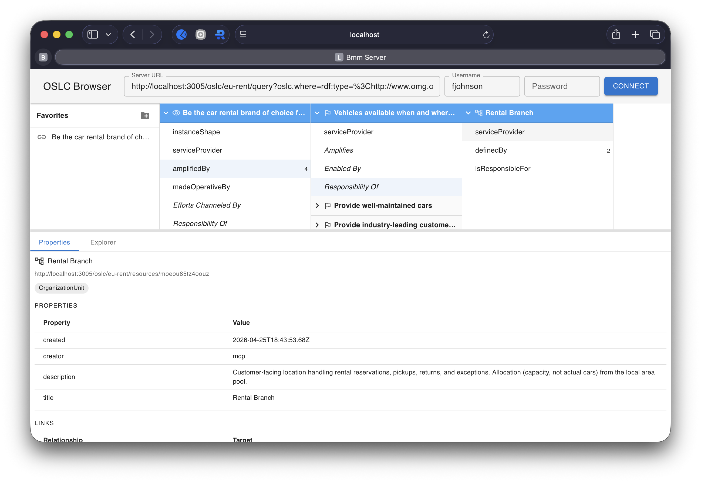

# bmm-server

An [OSLC 3.0](https://docs.oasis-open-projects.org/oslc-op/core/v3.0/oslc-core.html) server for the [OMG Business Motivation Model (BMM) 1.3](https://www.omg.org/spec/BMM/1.3/) built with Node.js and Express. It uses the **oslc-service** Express middleware for OSLC operations, backed by **Apache Jena Fuseki** for RDF persistence.

BMM provides a scheme for developing, communicating, and managing business plans in an organized manner. It captures the relationships between an enterprise's Ends (what it wants to achieve) and its Means (how it intends to achieve them), along with the Influencers and Assessments that shape business motivation. BMM provides the business motivation that can guide the ALM, PLM and SSE initiativities, activities and deliverables.

This server manages the following BMM resource types: **Vision**, **Goal**, **Objective**, **Mission**, **Strategy**, **Tactic**, **Business Policy**, **Business Rule**, **Influencer**, **Assessment**, **Potential Impact**, **Organization Unit**, **Business Process**, **Asset**.

This is a complete demonstration of **AI Assisted Knowledge Integration (AAKI)**, realized through its Define / Instantiate / Activate stages over OSLC linked data and AI-addressable knowledge stores via MCP — see the [AAKI framework](../docs/AAKI.md) and the [BMM-grounded walkthrough](../docs/AAKI-Example.md):

  **Define** — BMM.ttl vocabulary (25 classes, 49 properties), BMM-Shapes.ttl (14 ResourceShapes), and a catalog template — all declarative, no application code. Claude was used to create the BMM OSLC vocabulary and resource shapes directly from the OMG specification at: https://www.omg.org/spec/BMM/1.3/PDF. 

  **Instantiate** — create-oslc-server.ts scaffolds a working server from the vocabulary and resource shape constraints. The embedded MCP endpoint lets an AI assistant populate server resources from the examples in https://www.omg.org/spec/BMM/1.3/PDF, or other documents. An AI assistant reads the BMM 1.3 specification and populates the EU-Rent example via MCP tool calls.

  **Activate** — AI assistants query, analyze, and extend the model through natural language. The oslc-browser provides human navigation. OSLC services provide programmatic access. Multiple servers can cross-link by URI.

And the bmm-server gets a generic, reusable OSLC browser that can be used to view and navigate those BMM sample resources:



None of this is BMM-specific. The same toolchain works for any domain — swap the vocabulary and shapes, run the scaffolding script, and you have a working OSLC server with
an AI-accessible MCP endpoint and a generic, usable and consistent UI. The barrier between domain knowledge and a working, AI-integrated tool is now just three Turtle files that can often be generated from your existing documentation.

## Architecture

bmm-server is built from several modules in the oslc4js workspace:

- **bmm-server** -- Express application entry point and static assets
- **oslc-service** -- Express middleware providing OSLC 3.0 services
- **ldp-service** -- Express middleware implementing the W3C LDP protocol
- **storage-service** -- Abstract storage interface
- **jena-storage-service** -- Storage backend using Apache Jena Fuseki

## Running

### Prerequisites

- [Node.js](http://nodejs.org) v22 or later
- [Apache Jena Fuseki](https://jena.apache.org/documentation/fuseki2/) running with a `bmm` dataset configured with tdb2:unionDefaultGraph true 

### Setup

Install dependencies from the workspace root:

    $ npm install

Build the TypeScript source:

    $ cd bmm-server
    $ npm run build

### Configuration

Edit `config.json` to match your environment (initial values creqted by the creat-oslc-server.ts script):

```json
{
  "scheme": "http",
  "host": "localhost",
  "port": 3005,
  "context": "/",
  "jenaURL": "http://localhost:3030/bmm/"
}
```

- **port** -- The port to listen on (3005 by default)
- **context** -- The URL path prefix for OSLC/LDP resources
- **jenaURL** -- The Fuseki dataset endpoint URL

### Start

Start Fuseki with your `bmm` dataset, then:

    $ npm start

The server starts on port 3005. Note that the fuseki datasets need to use unionDefaultGraph true in the fuseki configuration file:
```
:dataset4 rdf:type tdb2:DatasetTDB2 ;
    tdb2:location "../bmm" ;
    tdb2:unionDefaultGraph true ;
    .
```

### Web UI

bmm-server includes the [oslc-browser](../oslc-browser) web application, served from `public/`. To build the UI:

    $ cd bmm-server/ui
    $ npm install
    $ npm run build

Then open your browser to `http://localhost:3005/`.

## Customization

After scaffolding, you should:

1. **Review or extend the domain definitions** in `config/domain/` — both vocabularies and resource shapes live here
2. **Review or update the catalog template** in `config/catalog-template.ttl` to define your service provider's creation factories, query capabilities, and dialogs
3. **Update the Fuseki dataset name** in `config.json` (`jenaURL`) to match your Fuseki configuration

## Example: EU-Rent (from BMM 1.3 Specification)

EU-Rent is a fictitious European car rental company used as the running example throughout the BMM 1.3 specification (Annex C provides background). Rather than hand-crafted `.http` files, the EU-Rent domain data is populated by an AI assistant that reads the spec and creates resources via the MCP endpoint.

The spec PDF is included at `docs/BMM-formal-15-05-19.pdf`.

**To populate the EU-Rent example:**

There are two equivalent paths. Both exercise the same MCP create/query tools that an AI assistant uses — one interactively, one scripted.

*Path A — AI-driven (demonstrates the AAKI vision):*

1. Start bmm-server and Fuseki as described above.
2. Connect an AI assistant (e.g., Claude Desktop) to the MCP endpoint at `http://localhost:3005/mcp`.
3. Ask the assistant to read the BMM 1.3 specification and create the EU-Rent example artifacts.

*Path B — Scripted (fast reload for development):*

After starting bmm-server, run the populator:

```bash
./testing/populate-eurent.sh
```

The script opens an MCP session, creates the EU-Rent ServiceProvider (if not already present), and creates 72 linked resources — one Vision, four Goals and Objectives, one Mission, three Strategies, five Tactics, five Business Policies, six Business Rules, twenty Influencers, six SWOT Assessments, five Potential Impacts, four Business Processes, four Assets, and four Organization Units. All examples are sourced from OMG BMM 1.3 Chapter 8 and Annex C.

The `testing/` folder also contains raw-OSLC `.http` files for API verification (not dependent on MCP):

| File | Purpose |
|------|---------|
| `01-catalog.http` | Read the ServiceProviderCatalog |
| `02-create-service-provider.http` | Create a ServiceProvider (smoke test; uses a `SolarTech` slug, independent of EU-Rent) |
| `08-query-resources.http` | Query templates for all BMM resource types |

**What the spec contains for EU-Rent:**

| BMM Type | EU-Rent Content |
|----------|----------------|
| Vision | "Be the car rental brand of choice for business users in the countries in which we operate." |
| Goals | Premium brand positioning (top 6/9 in operating countries), industry-leading customer service, well-maintained cars, vehicle availability |
| Objectives | A C Nielsen top 6 in EC countries by year-end, top 9 in other countries, 85% customer satisfaction score, less than 1% mechanical breakdown replacements |
| Mission | "Provide car rental service across Europe and North America for both business and personal customers." |
| Strategies | Operate nation-wide focusing on major airports, manage car purchase/disposal at local area level, join established third-party rewards scheme |
| Tactics | Encourage rental extensions, outsource maintenance for small branches, create standard car model specifications, equalize car usage, comply with maintenance schedules |
| Business Policies | Minimize depreciation, guarantee rental payments in advance, prohibit car export, contracts under pick-up country law, comply with laws and regulations |
| Business Rules | Cars must match standard specification, assign lowest-mileage car, require valid driver's license, schedule service by odometer reading, drivers must be over 21 |
| External Influencers | Competitor mergers, Hertz/Avis, budget airlines, customers/market research, car parking costs, Eastern Europe growth, on-airport environment, EC-Lease, laws/regulations, car manufacturers, insurers, vehicle tracking tech, electric/LPG cars, internet self-service |
| Internal Influencers | Business expansion assumption, loyalty rewards assumption, manager promotion habit, branch staff training habit, branch clustering infrastructure, car ownership by local area, internet software limitations, outsourcing issue, Eastern Europe board priority, manager discount authority, car models/quality, staff quality, environment-friendly values, quality/service/value values, supportive staff, car care values |
| Assessments (SWOT) | Strengths: geographical distribution, environment-friendly values, branch managers. Weaknesses: internet software for corporate agreements, high counter staff turnover. Opportunities: room in premium market, depreciation management. Threats: budget airlines at secondary airports, budget airlines as alternative, congestion charges |
| Risks | Failure to position as premium risks 15% customer loss, unrented cars at weekends, Scandinavian emission penalties |
| Potential Rewards | 12% average increase on rental rates, replace 15% of customers moving upmarket, 3% depreciation cost reduction |

## AI via MCP

bmm-server includes a built-in MCP endpoint at `/mcp` using the [Streamable HTTP](https://modelcontextprotocol.io/docs/concepts/transports#streamable-http) transport. When the server starts, it automatically discovers the BMM vocabulary, shapes, and catalog, and exposes them as MCP tools that an AI assistant can call.

**Tools exposed (33 total):**
- 14 `create_*` tools — one per BMM resource type (create_visions, create_goals, create_strategies, etc.)
- 14 `query_*` tools — one per BMM resource type
- 5 generic tools — get_resource, update_resource, delete_resource, list_resource_types, query_resources

**To connect an AI assistant (e.g., Claude Desktop):**

Configure the MCP server URL as `http://localhost:3005/mcp` in your AI assistant's MCP settings. No separate process is needed.

**Multi-server scenario:**

An AI assistant can connect to multiple OSLC servers simultaneously — each exposes its own `/mcp` endpoint. For example, Claude Desktop can connect to both bmm-server (`http://localhost:3005/mcp`) and mrm-server (`http://localhost:3002/mcp`) to work across BMM strategies and MRM programs.

**Third-party OSLC servers:**

For OSLC servers that don't embed MCP (e.g., IBM EWM, DOORS Next), the standalone [oslc-mcp-server](../oslc-mcp-server/) module provides a separate MCP server that connects via HTTP discovery.

### AI-Driven Population from Documents

An AI assistant connected to bmm-server's MCP endpoint can read a document (such as a specification, strategy paper, or business plan) and automatically populate the BMM model with the artifacts and relationships it finds. For example:

> "Read the BMM 1.3 specification at docs/BMM-formal-15-05-19.pdf and create all the EU-Rent example artifacts and relationships described in the document."

From the user's perspective, the assistant reads the document, reports what it found, creates the resources, and provides a link to browse the result. Behind the scenes, the agent follows a systematic process:

**1. Learn the domain model.** The agent reads three reflective resources that bmm-server exposes through the MCP `resources/read` protocol. These are MCP resource URIs (not HTTP URLs) — the AI reads them automatically when it connects to the `/mcp` endpoint:
- `oslc://vocabulary` — what BMM types exist and how they relate
- `oslc://shapes` — the exact properties for each type (required vs. optional, links vs. literals, cardinality)
- `oslc://catalog` — which ServiceProviders and creation/query endpoints are available

These resources return human-readable markdown descriptions of the server's domain model. The AI reads them before any user interaction, so it already understands the BMM schema and knows how to create and link resources.

**2. Read the source document.** The agent reads the provided document and identifies concrete instances — named Visions, Goals, Objectives, Strategies, etc. — along with the relationships between them (e.g., "Goal X is quantified by Objective Y").

**3. Plan creation order.** Because resources can only link to things that already exist, the agent plans a dependency-ordered creation sequence: leaf resources first (Influencers, Assets), then resources that link to them (Assessments, Rules), then mid-level (Objectives, Tactics), then top-level (Goals, Strategies, Vision).

**4. Create resources via MCP tools.** For each artifact, the agent calls the appropriate tool (e.g., `create_goals`) with a JSON object containing the properties and link URIs. The tool converts this to RDF, posts it to the OSLC creation factory, and returns the new resource's URI for use in subsequent links.

**5. Verify and report.** The agent queries the created resources to confirm they are linked correctly and reports a summary.

**Why this is generic.** The agent never uses BMM-specific code. It learns the domain at runtime from the MCP resources the server provides. The same agent, connected to an mrm-server instead, would create Municipal Reference Model resources — Programs, Services, Processes — using the same pattern. Any OSLC server with a vocabulary, shapes, and catalog can be populated this way.

### Example Prompts

Once the EU-Rent BMM model is populated, here are prompts you can use with an AI assistant connected to the bmm-server MCP endpoint:

**Populating from the spec:**

- "Read docs/BMM-formal-15-05-19.pdf and create all EU-Rent BMM artifacts described in the specification."
- "Create the EU-Rent Vision, Goals, and Objectives from the BMM 1.3 spec."
- "Populate the EU-Rent Influencers, Assessments, and Potential Impacts from the spec's SWOT analysis."

**Exploring the model:**

- "What is EU-Rent's Vision?"
- "List all of EU-Rent's Goals and the Objectives that quantify each one."
- "What Strategies does EU-Rent have, and which Goals does each Strategy channel efforts toward?"
- "Show me the complete Ends hierarchy — Vision, Goals, and Objectives — as an outline."
- "What Tactics implement the 'operate nation-wide focusing on major airports' Strategy?"

**Analysis and insight:**

- "Which Goals have no Strategies channeling efforts toward them? Are there any gaps in the Means-to-Ends alignment?"
- "What external Influencers has EU-Rent identified, and what Assessments have been made about each one?"
- "Show the SWOT analysis: list all Assessments categorized as Strengths, Weaknesses, Opportunities, and Threats."
- "What Business Processes are governed by Business Rules, and which Business Policies are those Rules based on?"
- "Trace the chain from the 'minimize depreciation' Business Policy through the Tactics and Business Rules that implement it."

**Impact analysis:**

- "If budget airlines expand to secondary airports, which Goals and Strategies would be affected? Trace the impact through the Assessments."
- "Competitor mergers in the premium market could change EU-Rent's positioning. What Goals, Strategies, and Tactics are at risk?"
- "How does the 'room in premium market' Opportunity connect to the premium brand Goal? Show the full chain from Influencer through Assessment to Ends and Means."

Here is an example of the kind of chain analysis an AI assistant can perform. Based on section 8.5.8 of the BMM 1.3 spec, the prompt "How did EU-Rent decide to position as a premium brand, and what chain of decisions followed?" produces a response like:

  The Premium Brand Positioning Chain (BMM 1.3, Section 8.5.8)
```
  Influencers: Competitors (Hertz/Avis), Customers/Market Research
      |
      v assessed by
  Assessment: Opportunity — room in premium market
      |
      v provides impetus for
  Goal: To be a 'premium brand' car rental company,
        positioned alongside companies such as Hertz and Avis
      |
      v channeled by
  Strategy: Operate nation-wide in each country of operation,
            focusing on major airports, competing head-to-head,
            on-airport, with other premium car rental companies
      |
      v constrained by
  Assessment: Weakness — on-airport pricing is high
      |
      v leads to
  Assessment: Opportunity — depreciation management
      |
      v provides impetus for
  Business Policy: Depreciation of rental cars must be minimized
      |
      v implemented by
  Tactics: Create standard specifications of car models,
           Equalize use of cars across rentals,
           Comply with car manufacturers' maintenance schedules
      |
      v govern
  Business Rules: Each Car purchased must match the standard
                  specification of its Car Model,
                  The Car assigned to a Rental must be the one
                  with the lowest mileage,
                  Cars must be scheduled for service based on
                  odometer reading
```
  This chain shows how external competitive pressures led EU-Rent to identify a market opportunity, set a strategic goal, adopt a head-to-head competitive strategy, and then address the resulting cost constraint through a depreciation policy implemented by specific tactics and enforced by concrete business rules. The full chain from Influencer to Business Rule is traceable in the BMM model.

  Risks and Rewards

  - Risk: Failure to position as premium risks 15% customer loss
  - Potential Reward: 12% average increase on rental rates
  - Potential Reward: 3% depreciation cost reduction from the tactics above

**Modification and extension:**

- "Add a new Goal: 'Expand into Eastern European markets' with an Objective to operate in 5 new Eastern European countries by year-end. Link the Goal to the Vision."
- "Create an Assessment for the 'electric/LPG cars' Influencer that identifies it as an Opportunity, and add a Potential Impact describing the environmental brand advantage it creates."
- "Add a new Business Rule: 'All rental cars must carry a GPS tracking device' with enforcement level 'Strictly enforced', and link it to the vehicle tracking technology Influencer."
- "EU-Rent's board has decided to establish a new Tactic: 'Offer weekend discount rates to reduce idle fleet'. Create it and link it to the vehicle availability Goal."

**Cross-server (if mrm-server is also connected):**

- "Which MRM Programs in the City of Ottawa could be linked to EU-Rent's 'comply with relevant laws and regulations' Business Policy?"
- "Create a link from EU-Rent's 'contracts under pick-up country law' policy to the relevant MRM regulatory compliance Process."

## REST API

See the [oslc-server README](../oslc-server/README.md) for full REST API documentation. The API is identical since both servers use oslc-service middleware.

## License

Licensed under the Apache License, Version 2.0.
