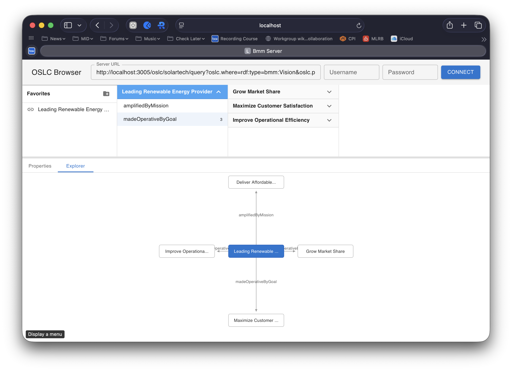

# bmm-server

An [OSLC 3.0](https://docs.oasis-open-projects.org/oslc-op/core/v3.0/oslc-core.html) server for the [OMG Business Motivation Model (BMM) 1.3](https://www.omg.org/spec/BMM/1.3/) built with Node.js and Express. It uses the **oslc-service** Express middleware for OSLC operations, backed by **Apache Jena Fuseki** for RDF persistence.

BMM provides a scheme for developing, communicating, and managing business plans in an organized manner. It captures the relationships between an enterprise's Ends (what it wants to achieve) and its Means (how it intends to achieve them), along with the Influencers and Assessments that shape business motivation.

This server manages the following BMM resource types: **Vision**, **Goal**, **Objective**, **Mission**, **Strategy**, **Tactic**, **Business Policy**, **Business Rule**, **Influencer**, **Assessment**, **Potential Impact**, **Organization Unit**, **Business Process**, **Asset**.

This is a complete demonstration of the Define-Instantiate-Activate pattern from the architecture document (../docs/Define-Instantiate-Activate.md):

  **Define** — BMM.ttl vocabulary (25 classes, 49 properties), BMM-Shapes.ttl (14 ResourceShapes), and a catalog template — all declarative, no application code. Claude was used to create the BMM OSLC vocabulary and resource shapes directly from the OMG specification at: https://www.omg.org/spec/BMM/1.3/PDF. 

  **Instantiate** — create-oslc-server.ts scaffolds a working server from the vocabulary and resource shape constraints. The embedded MCP endpoint lets an AI assistant populate server resources from the examples in https://www.omg.org/spec/BMM/1.3/PDF, or other documents. 38 linked SolarTech resources are created via MCP tool calls.

  **Activate** — AI assistants query, analyze, and extend the model through natural language. The oslc-browser provides human navigation. OSLC services provide programmatic access. Multiple servers can cross-link by URI.

And the bmm-server gets a generic, reusable OSLC browser that can be used to view and navigate those BMM sample resources:



None of this is BMM-specific. The same toolchain works for any domain — swap the vocabulary and shapes, run the scaffolding script, and you have a working OSLC server with
an AI-accessible MCP endpoint and a generic, usable and consistent UI. The barrier between domain knowledge and a working, AI-integrated tool is now just three Turtle files that can often be generated from your existing documentation.

## Architecture

bmm-server is built from several modules in the oslc4js workspace:

- **bmm-server** -- Express application entry point and static assets
- **oslc-service** -- Express middleware providing OSLC 3.0 services
- **ldp-service** -- Express middleware implementing the W3C LDP protocol
- **storage-service** -- Abstract storage interface
- **ldp-service-jena** -- Storage backend using Apache Jena Fuseki

## Running

### Prerequisites

- [Node.js](http://nodejs.org) v22 or later
- [Apache Jena Fuseki](https://jena.apache.org/documentation/fuseki2/) running with a `bmm` dataset configured with tdb2:unionDefaultGraph true 

### Setup

Install dependencies from the workspace root:

    $ npm install

Build the TypeScript source:

    $ cd bmm-server
    $ npm run build

### Configuration

Edit `config.json` to match your environment (initial values creqted by the creat-oslc-server.ts script):

```json
{
  "scheme": "http",
  "host": "localhost",
  "port": 3005,
  "context": "/",
  "jenaURL": "http://localhost:3030/bmm/"
}
```

- **port** -- The port to listen on (3005 by default)
- **context** -- The URL path prefix for OSLC/LDP resources
- **jenaURL** -- The Fuseki dataset endpoint URL

### Start

Start Fuseki with your `bmm` dataset, then:

    $ npm start

The server starts on port 3005. Note that the fuseki datasets need to use unionDefaultGraph true in the fuseki configuration file:
```
:dataset4 rdf:type tdb2:DatasetTDB2 ;
    tdb2:location "../bmm" ;
    tdb2:unionDefaultGraph true ;
    .
```

### Web UI

bmm-server includes the [oslc-browser](../oslc-browser) web application, served from `public/`. To build the UI:

    $ cd bmm-server/ui
    $ npm install
    $ npm run build

Then open your browser to `http://localhost:3005/`.

## Customization

After scaffolding, you should:

1. **Review or extend the vocabularies** in `config/vocab/` with your domain vocabulary definitions
2. **Review or extend the resource shapes** in `config/shapes/` to describe your domain resources
3. **Review or update the catalog template** in `config/catalog-template.ttl` to define your service provider's creation factories, query capabilities, and dialogs
4. **Update the Fuseki dataset name** in `config.json` (`jenaURL`) to match your Fuseki configuration

## Example: SolarTech Inc.

The `testing/` folder contains `.http` request files that populate a complete BMM example based on a fictional renewable energy company, SolarTech Inc described in the  OMG Business Motivation Model (BMM) 1.3 specification. The example illustrates the full BMM metamodel with interconnected resources and how to use the server's OSLC REST API:

| File | Creates | Description |
|------|---------|-------------|
| `01-catalog.http` | — | Read the ServiceProviderCatalog |
| `02-create-service-provider.http` | 1 ServiceProvider | "SolarTech Inc." enterprise |
| `03-create-ends.http` | 1 Vision, 3 Goals, 3 Objectives | Vision to be the leading solar energy provider; Goals for market share, customer satisfaction, and operational efficiency; Objectives with measurable targets and deadlines |
| `04-create-means.http` | 1 Mission, 3 Strategies, 3 Tactics, 2 Policies, 3 Rules | Mission to deliver affordable solar solutions; Strategies for product innovation, customer experience, and supply chain integration; Tactics implementing each strategy; Policies for quality and data protection; Rules with enforcement levels |
| `05-create-influencers-assessments.http` | 4 Influencers, 3 Assessments, 2 PotentialImpacts | External influencers (tax credits, import competition) and internal influencers (labor shortage, technology breakthrough); SWOT-style assessments; potential impacts identifying risks and rewards |
| `06-create-organization.http` | 4 OrgUnits, 3 Processes, 3 Assets | Executive, R&D, Manufacturing, and Customer Operations divisions; product development, order-to-installation, and warranty processes; manufacturing facility, patent portfolio, and monitoring platform |
| `07-link-resources.http` | — | Templates for adding cross-references between resources (requires ETags from the server) |
| `08-query-resources.http` | — | OSLC queries to retrieve resources by type |

To load the example, run the files in order (02 through 06) using a REST client such as the VS Code REST Client extension. Then browse the populated model at `http://localhost:3005/`.

## AI via MCP

bmm-server includes a built-in MCP endpoint at `/mcp` using the [Streamable HTTP](https://modelcontextprotocol.io/docs/concepts/transports#streamable-http) transport. When the server starts, it automatically discovers the BMM vocabulary, shapes, and catalog, and exposes them as MCP tools that an AI assistant can call.

**Tools exposed (33 total):**
- 14 `create_*` tools — one per BMM resource type (create_visions, create_goals, create_strategies, etc.)
- 14 `query_*` tools — one per BMM resource type
- 5 generic tools — get_resource, update_resource, delete_resource, list_resource_types, query_resources

**To connect an AI assistant (e.g., Claude Desktop):**

Configure the MCP server URL as `http://localhost:3005/mcp` in your AI assistant's MCP settings. No separate process is needed.

**Multi-server scenario:**

An AI assistant can connect to multiple OSLC servers simultaneously — each exposes its own `/mcp` endpoint. For example, Claude Desktop can connect to both bmm-server (`http://localhost:3005/mcp`) and mrm-server (`http://localhost:3002/mcp`) to work across BMM strategies and MRM programs.

**Third-party OSLC servers:**

For OSLC servers that don't embed MCP (e.g., IBM EWM, DOORS Next), the standalone [oslc-mcp-server](../oslc-mcp-server/) module provides a separate MCP server that connects via HTTP discovery.

### AI-Driven Population from Documents

An AI assistant connected to bmm-server's MCP endpoint can read a document (such as a specification, strategy paper, or business plan) and automatically populate the BMM model with the artifacts and relationships it finds. For example:

> "Read the BMM 1.3 specification and create all the example artifacts and relationships described in the document."

From the user's perspective, the assistant reads the document, reports what it found, creates the resources, and provides a link to browse the result. Behind the scenes, the agent follows a systematic process:

**1. Learn the domain model.** The agent reads three reflective resources that bmm-server exposes through the MCP `resources/read` protocol. These are MCP resource URIs (not HTTP URLs) — the AI reads them automatically when it connects to the `/mcp` endpoint:
- `oslc://vocabulary` — what BMM types exist and how they relate
- `oslc://shapes` — the exact properties for each type (required vs. optional, links vs. literals, cardinality)
- `oslc://catalog` — which ServiceProviders and creation/query endpoints are available

These resources return human-readable markdown descriptions of the server's domain model. The AI reads them before any user interaction, so it already understands the BMM schema and knows how to create and link resources.

**2. Read the source document.** The agent reads the provided document and identifies concrete instances — named Visions, Goals, Objectives, Strategies, etc. — along with the relationships between them (e.g., "Goal X is quantified by Objective Y").

**3. Plan creation order.** Because resources can only link to things that already exist, the agent plans a dependency-ordered creation sequence: leaf resources first (Influencers, Assets), then resources that link to them (Assessments, Rules), then mid-level (Objectives, Tactics), then top-level (Goals, Strategies, Vision).

**4. Create resources via MCP tools.** For each artifact, the agent calls the appropriate tool (e.g., `create_goals`) with a JSON object containing the properties and link URIs. The tool converts this to RDF, posts it to the OSLC creation factory, and returns the new resource's URI for use in subsequent links.

**5. Verify and report.** The agent queries the created resources to confirm they are linked correctly and reports a summary.

**Why this is generic.** The agent never uses BMM-specific code. It learns the domain at runtime from the MCP resources the server provides. The same agent, connected to an mrm-server instead, would create Municipal Reference Model resources — Programs, Services, Processes — using the same pattern. Any OSLC server with a vocabulary, shapes, and catalog can be populated this way.

### Example Prompts

Once the SolarTech BMM model is populated, here are prompts you can use with an AI assistant connected to the bmm-server MCP endpoint:

**Exploring the model:**

- "What is SolarTech's Vision?"
- "List all of SolarTech's Goals and the Objectives that quantify each one."
- "What Strategies does SolarTech have, and which Goals does each Strategy channel efforts toward?"
- "Show me the complete Ends hierarchy — Vision, Goals, and Objectives — as an outline."
- "What Tactics implement the Product Innovation Leadership strategy?"

**Analysis and insight:**

- "Which Goals have no Strategies channeling efforts toward them? Are there any gaps in the Means-to-Ends alignment?"
- "What Influencers has SolarTech identified, and what Assessments have been made about each one?"
- "Trace the chain from the Perovskite Tandem Cell Breakthrough influencer through its Assessment to the Potential Impact it identifies. What Directive does that impact provide impetus for?"
- "Which Organization Units are responsible for which Ends? Is every Goal covered?"
- "What Business Processes are governed by Business Rules, and which Business Policies are those Rules based on?"

**Impact analysis:**

- "If the Federal Solar Investment Tax Credit is not renewed after 2032, which Goals and Objectives would be affected? Trace the impact through the Assessments."
- "The Certified Installer Shortage constrains growth. What Tactics, Strategies, and Goals are at risk? What is SolarTech doing to address it?"
- "How does the Vertical Supply Chain Integration strategy connect to the cost reduction Objective? Show the full chain."

Here's an example prompt: If the Federal Solar Investment Tax Credit is not renewed after 2032, which Goals and Objectives would be affected? Trace the impact through the Assessments?

Response from the SolarTech model:

 If the Federal Solar Investment Tax Credit is not renewed after 2032:

  The Chain
```
  Influencer: Federal Solar Investment Tax Credit Extension (Regulation)
      │
      ▼ assessed by
  Assessment: Tax Credit Drives Residential Demand Growth
      │  "The ITC extension is projected to increase residential solar
      │   adoption by 25-30% through 2030, creating a significant
      │   window for market share capture."
      │
      ▼ identifies
  Potential Impact: 5-Year Market Expansion Window
      "The ITC extension creates a 5-year window of accelerated
       residential solar demand. Companies that scale fastest
       will capture durable market share."
```
  Goals Affected

  Directly at risk: Grow Market Share
  - The entire demand growth projection (25-30% increase through 2030) is predicated on the ITC. Without renewal, residential solar adoption stalls, closing the market expansion window.
  - Quantified by Objective: Achieve 15% Residential Market Share by 2027-12-31 (measured by quarterly installed capacity as percentage of total market)
  - This objective's target date falls before 2032, but the durability of any market share gained depends on sustained demand. Post-2032, without the credit, customer acquisition costs rise and adoption rates drop.

  Indirectly at risk: Maximize Customer Satisfaction
  - Reduced demand means fewer installations, which reduces the installer network's utilization. The Certified Installer Network tactic depends on volume to sustain partner economics.
  - Quantified by Objective: Achieve NPS Score of 70+ by 2026-06-30

  Least affected: Improve Operational Efficiency
  - The Vertical Supply Chain Integration strategy and cost reduction objective are supply-side, not demand-driven. These remain valid regardless of the tax credit.
  - Quantified by Objective: Reduce Manufacturing Cost per Watt by 20% by 2027-06-30

  Recommendation

  The Assessment identifies this as an opportunity while the credit exists — but it's also a risk if SolarTech builds capacity assumptions around credit-driven demand that evaporates in 2032. The BMM model suggests
  SolarTech should pursue the market share objective aggressively before 2032 while hedging through the Product Innovation strategy (differentiation that doesn't depend on subsidies).

**Modification and extension:**

- "Add a new Goal: 'Expand into Commercial Markets' with an Objective to achieve 10% commercial market share by 2028. Link the Goal to the Vision."
- "Create an Assessment for the Perovskite breakthrough Influencer that identifies it as a Strength, and add a Potential Impact describing the competitive advantage it creates."
- "Add a new Business Rule: 'All installations must include monitoring system activation' with enforcement level 'Strictly enforced', and link it to the Order-to-Installation Business Process."
- "The Executive Leadership Team has decided to establish a new Tactic: 'Partner with Regional Utilities for Bundled Offerings'. Create it and link it to the End-to-End Customer Experience strategy."

**Cross-server (if mrm-server is also connected):**

- "Which MRM Programs in the City of Ottawa could be linked to SolarTech's Vertical Supply Chain Integration strategy?"
- "Create a link from SolarTech's Product Quality Standards policy to the relevant MRM regulatory compliance Process."

## REST API

See the [oslc-server README](../oslc-server/README.md) for full REST API documentation. The API is identical since both servers use oslc-service middleware.

## License

Licensed under the Apache License, Version 2.0.
