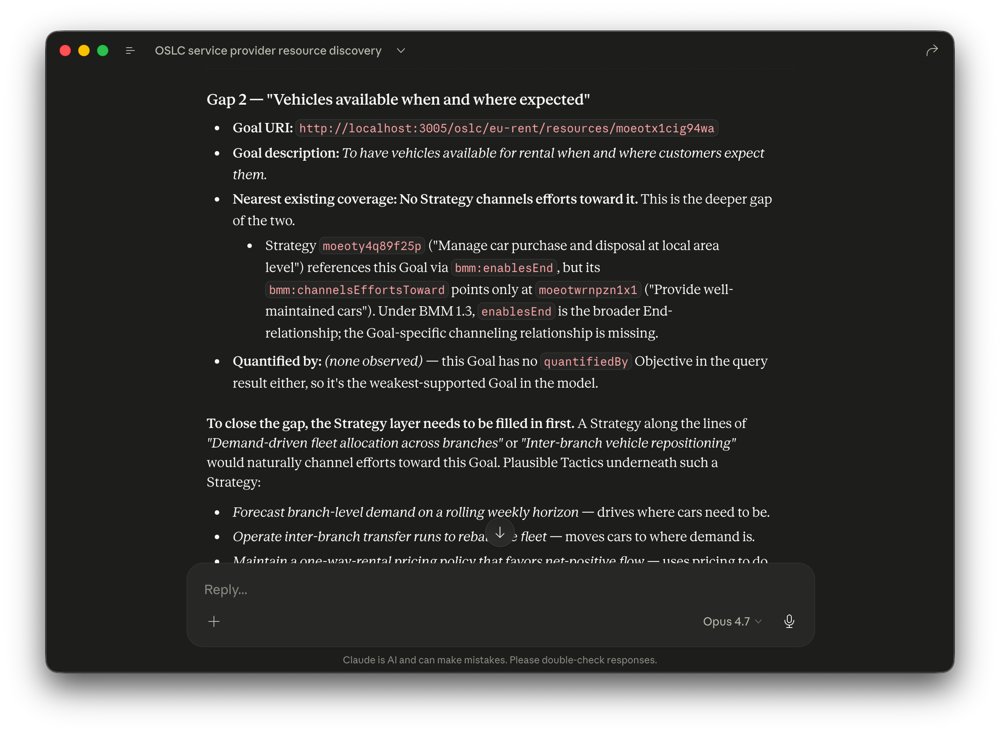

# AAKI: A BMM Worked Example

## End-to-end walkthrough of AI Assisted Knowledge Integration using the OMG Business Motivation Model

> **AI Assisted Knowledge Integration (AAKI)** is the practice of making domain knowledge actionable across an enterprise by combining governed ontologies, AI authoring and analysis, and linked-data infrastructure. AAKI is realized in three stages — **Define** (vocabulary and shapes), **Instantiate** (governed artifacts and links), **Activate** (decisions, queries, and agent actions) — over OSLC linked data and AI-addressable knowledge stores via MCP.

**Companion to [`AAKI.md`](AAKI.md).** That document lays out the abstract framework for AAKI — why the Define / Instantiate / Activate stages need each other, why AI and governed knowledge graphs are complementary, why RDF/Turtle is a deliberate fit with AI authoring, and how the pattern applies to the SSE V-model. This document grounds every claim of the framework in a concrete, reproducible walkthrough: build an OSLC server for BMM, populate it with the EU-Rent example from the spec, and activate it for AI-assisted analysis. Every step can be replayed against the `bmm-server` in this repository.

---

## 1. Why BMM is the right lens

Business motivation — the Visions, Goals, Missions, Strategies, Tactics, Policies, and Rules that define *why* an organization does what it does — is the context that makes every downstream lifecycle artifact meaningful. A requirement only matters because it realizes some Goal. A test case only matters because it verifies a requirement that traces to a Vision. Application lifecycle management (ALM), product lifecycle management (PLM), and the SSE V-model they embody all have no anchor without motivation above them.

The OMG Business Motivation Model (BMM) is a mature, well-specified way to capture that motivation. It has 25 classes, ~49 properties, and covers the Ends an organization pursues, the Means it uses to pursue them, the Influencers that shape its choices, the Assessments of those influencers, the Directives that govern action, the Business Processes that realize tactics, and the Organization Units that take responsibility. It is small enough to internalize in a week and real enough that the spec spends an Annex working a running example (EU-Rent) with 72 linked artifacts across every class.

We chose BMM for this walkthrough for three reasons:

1. **It's a realistic ontology.** Not a toy. Reproducing its structure and semantics is a non-trivial exercise that exposes every part of the OSLC authoring chain.
2. **It's genuinely useful.** BMM models, once populated, answer real portfolio-alignment questions ("which Goals have no realizing Tactics?", "which Influencers lack an Assessment?").
3. **It has no widely-deployed OSLC server today.** That gap is exactly the kind of lifecycle-integration gap the oslc4js project exists to close — connecting BMM's motivation layer to the IBM ELM requirements/models/tests and MID OSLC Connectors that realize it.

The goal of having a BMM OSLC server is not academic. The goal is that a Strategy in a BMM server can link to a set of requirements in DOORS Next, which link to a model in Rhapsody or Rhapsody Model Manager, which link to test cases in ELM Test Management — and an AI assistant, or a human, can traverse that chain end to end.

---

## 2. The three AAKI stages (summary)

The three stages — Define (schema / vocabulary), Instantiate (instance authoring), Activate (outcomes and value) — are defined in detail in the companion [`AAKI.md`](AAKI.md). The short version: without Define, instances are semantically incoherent across tools; without Instantiate governance, Activate cannot answer versioned questions; without Activate, the governed graph is beautiful and unused.


Historically, Stage 2 was the slow bottleneck — subject matter experts captured knowledge in documents, integrators translated documents into OSLC instances. AI assistants change this. They participate as first-class actors in all three stages, and they're particularly fluent in RDF/Turtle — the format AAKI uses to capture meaning rather than just data structure. The rest of this document shows how, using BMM as the worked example.

---

## 3. Define — authoring the BMM domain with AI

### 3.1 What Define must produce

A complete "Define" deliverable for a domain is three artifacts:

1. **An RDF vocabulary** — one `rdf:Class` per domain class, one `rdf:Property` per attribute and relationship, with domains, ranges, labels, and comments. This is the type system.
2. **A set of OSLC ResourceShapes** — one `oslc:ResourceShape` per instantiable class, declaring which properties are required, their cardinalities, their value types, their UI metadata, and — for link properties — the inverse metadata that lets clients render incoming links transparently. This is the REST service contract.
3. **Human-readable documentation** — an HTML rendering of the shapes, navigable by domain experts and implementers alike.

Without (1) and (2), you can stand up an LDP server but it carries no domain meaning. Without (3), subject matter experts cannot audit or evolve the model without learning Turtle.

### 3.2 AI as vocabulary author

The BMM vocabulary in `bmm-server/config/domain/BMM.ttl`, the shapes in `BMM-Shapes.ttl`, and the HTML rendering in `BMM-Shapes.html` were authored by Claude reading the OMG BMM 1.3 specification directly. The canonicalized reference prompt is in `docs/prompts/01-author-bmm-vocabulary.md`. Its key guidance:

**Short, domain-agnostic predicate names.** The BMM specification itself uses Java-style property names that fold the target type into the predicate (`amplifiedByMission`, `quantifiesGoal`, `enablesEndCourseOfAction`). Those work poorly as RDF predicates — the triple `<vision> bmm:amplifiedByMission <mission> .` reads awkwardly, and the predicate conflates relationship and range. The prompt instructed Claude to follow RDF best practice: short verb phrases, domain-agnostic (`amplifiedBy`, `quantifies`, `enablesEnd`), with the target type folded in only for disambiguation (`governsProcess` vs. `governs`).

**Inverse metadata on every link property.** For every property constraint with `oslc:valueType oslc:Resource`, the prompt required two additional triples: `oslc:inversePropertyDefinition` naming the URI for the reverse direction, and `oslc:inverseLabel` giving the human-readable inverse wording in title case ("Amplifies", "Efforts Channeled By", "Responsibility Of"). These are proposed OSLC-OP extensions unique to oslc4js; see the sidebar below.

**Inverse URIs are identifiers, not redundant triples.** The `bmm:amplifies` URI referenced by `<#p-amplifiedBy>`'s `oslc:inversePropertyDefinition` is *not* declared as an `rdf:Property` in the vocabulary. The triple `<goal> bmm:amplifiedBy <vision> .` is stored exactly once, on the Goal. The inverse URI exists as a naming handle clients use when displaying the Vision side of that relationship. Asserting both directions would double storage and create two sources of truth that can drift.

**Sidebar: our proposed OSLC shape extensions.** The full rationale, property definitions, and contrast with hardcoded inverse-type tables (as used in IBM DOORS Next and `oslc-client`'s `LDMClient`) are in `docs/OSLC-Shape-Extensions.md`. Short version: making the shape the single source of truth for inverse labels lets clients reflect off the vocabulary at runtime rather than carrying a static inverse-type map that must be updated whenever a new domain is introduced. This extension also allows clients to discover the proper lables to use for
incoming links accessed through and OSLC Link Discovery Management (LDM) server.

**RDF as the AI's native authoring format.** This is also where AAKI's choice of RDF/Turtle pays off concretely — the AI produces Turtle as fluently as prose because Turtle captures meaning, not just structure. The vocabulary fragments below were generated, reviewed, and revised entirely in Turtle; no intermediate JSON or DSL was needed.

**What the AI produced — a fragment for the Goal class.** To make the output of this Define step concrete, here is the small slice of the generated artifacts that defines `bmm:Goal` and its relationships.

From `BMM.ttl` (the vocabulary):

```turtle
bmm:Goal
  a rdfs:Class ;
  rdfs:subClassOf bmm:DesiredResult ;
  dc11:description """A statement about a state or condition of the enterprise to be brought about or sustained through appropriate Means. A Goal is a long-term, ongoing, qualitative statement of intent. A Goal amplifies a Vision — that is, it indicates what must be done to make the Vision a reality.""" .

# Goal → Objective
bmm:quantifiedBy
  a rdf:Property ;
  rdfs:domain bmm:Goal ;
  rdfs:range bmm:Objective ;
  dc11:description "An Objective that quantifies this Goal by defining a specific, measurable target." .

# Goal → Goal (part-whole)
bmm:includesGoal
  a rdf:Property ;
  rdfs:domain bmm:Goal ;
  rdfs:range bmm:Goal ;
  dc11:description "A sub-Goal that is part of this Goal." .
```

From `BMM-Shapes.ttl` (the OSLC service contract):

```turtle
<#p-quantifiedBy>
  a oslc:Property ;
  oslc:name "quantifiedBy" ;
  oslc:propertyDefinition bmm:quantifiedBy ;
  dcterms:description "Objectives that quantify this Goal." ;
  oslc:occurs oslc:Zero-or-many ;
  oslc:valueType oslc:Resource ;
  oslc:representation oslc:Reference ;
  oslc:range bmm:Objective ;
  oslc:inversePropertyDefinition bmm:quantifies ;
  oslc:inverseLabel "Quantifies" .

<#GoalShape>
  a oslc:ResourceShape ;
  dcterms:title "Goal" ;
  oslc:describes bmm:Goal ;
  oslc:property <#p-title>, <#p-description>, <#p-identifier>,
    <#p-creator>, <#p-contributor>, <#p-created>, <#p-modified>,
    <#p-subject>, <#p-type>, <#p-dctype>, <#p-instanceShape>,
    <#p-serviceProvider>, <#p-shortTitle>, <#p-source>,
    <#p-derives>, <#p-elaborates>, <#p-refine>, <#p-external>,
    <#p-satisfy>, <#p-trace>,
    <#p-quantifiedBy>, <#p-includesGoal> .
```

The shape declaratively pulls in shared OSLC AM properties (`<#p-title>`, `<#p-creator>`, `<#p-trace>`, …) plus the Goal-specific link properties. `<#p-quantifiedBy>` carries the inverse metadata (`bmm:quantifies` / "Quantifies") that lets `oslc-browser` render an Objective's incoming Goals as if the relationship were outgoing — see `oslc-browser/README.md`.

For the full vocabulary and all 14 shapes — including their ranges, cardinalities, descriptions, and inverse metadata — see the AI-generated browsable reference at `bmm-server/config/domain/BMM-Shapes.html`.

### 3.3 AI as server generator

`bmm-server` itself was not hand-written. The `create-oslc-server.ts` script in the workspace root reads a vocabulary and a shapes file, synthesizes a `config/catalog-template.ttl` that describes one ServiceProvider creation template, one creation factory, selection dialog and creation dialog per managed class, one query capability for the domain, and emits a thin `src/app.ts` that mounts the `oslc-service` Express middleware against a Jena Fuseki backend via `jena-storage-service`. It also scaffolds a `ui/` directory wrapping the `oslc-browser` library, an `env.ts`, and a `package.json` with the right workspace dependencies.

The actual command used to scaffold `bmm-server`, run from the `oslc4js` workspace root:

```bash
npx tsx create-oslc-server.ts --name bmm-server --port 3005 \
  --vocab  "bmm-server/config/domain/BMM.ttl" \
  --shapes "bmm-server/config/domain/BMM-Shapes.ttl" \
  --managed Vision,Goal,Objective,Mission,Strategy,Tactic,BusinessPolicy,BusinessRule,Influencer,Assessment,PotentialImpact,OrganizationUnit,BusinessProcess,Asset
```

The `--managed` list names the 14 instantiable BMM classes that get creation factories, query capabilities, and creation dialogs. **ResourceShapes are only authored for these concrete classes — not for the abstract supertypes** (`Means`, `End`, `Directive`, `CourseOfAction`, `DesiredResult`, `MotivationalElement`) that exist purely to give the type hierarchy structure and to give relationships polymorphic ranges (e.g., `Strategy.channelsEffortsToward → End`). Abstract supertypes appear in the vocabulary but have no shape, no factory, no creation dialog — they're never instantiated directly. A handful of specialized subtypes (`ExternalInfluencer`, `InternalInfluencer`, `InfluencingOrganization`, `Regulation`) are also un-shaped: they're handled as `Influencer` instances distinguished by a category property rather than separate creation paths. That accounts for the gap between the 25 classes in `BMM.ttl` and the 14 shapes in `BMM-Shapes.ttl`. This alos allows the generated OSLC server to support only a subset of the domain classes if that is all that is needed for some use case.

After the command completes, `cd bmm-server && npm install && npm run build && npm start` brings up the running server. The entire authored surface area of `bmm-server` after that is its declarative `config/` content; no domain code was written.

### 3.4 What you get with zero domain code

Starting `bmm-server` yields, from the declarative Define inputs alone:

- **A ServiceProvider catalog** at `/oslc` listing the factories, query capabilities, and shapes for each ServiceProvider on the server.
- **A ServiceProvider creation template** — what ELM calls a project area — that instantiates a new scope and mounts per-scope factories/queries.
- **Creation factories** for every BMM class, accepting `POST` requests with Turtle bodies and validating against the shape.
- **Query capability** for for the server's supported domains, accepting OSLC query URIs like `?oslc.where=rdf:type=<bmm:Vision>`.
- **Creation and Selection dialogs** for every class, rendered from the shape's `oslc:hintWidth`/`oslc:hintHeight`/label metadata.
- **Compact resource previews** at `/compact?uri=…` that return formatted summaries for hover tooltips.
- **An OSLC browser** at `/` — the column-based navigator in `oslc-browser`, serving human-facing navigation, Properties tab, Explorer graph, and diagram views for every shape. Incoming links render with inverse labels automatically because the browser reflects off `oslc:inverseLabel` declarations in the shapes.
- **An LDM `/discover-links` endpoint** — a per-server implementation of the standard OSLC Link Discovery Management protocol, answering reverse-link queries from the server's own storage.
- **An embedded MCP endpoint** at `/mcp` — AI assistants discover the server through the OSLC catalog: a top-level `oslc://catalog` MCP resource and equivalent `read_catalog` tool list every ServiceProvider with its `oslc:domain` vocabulary URIs, creation factories' `oslc:resourceShape` URIs, and query capabilities. Per-class shape and vocabulary content is fetched with `get_resource` on those URIs. Authoring uses one tool per creation factory (`create_Vision`, `create_Goal`, …); retrieval uses a single `query_resources` tool with `oslc.where=rdf:type=<...>` filters.
- **The oslc-browser UI** a simple, easy to use UI to view and navigate resources managed by the server, including their properties and traceability graphic veiws. 

### 3.5 The Define payoff

From a spec PDF to a running OSLC service for a non-trivial domain, with zero domain-specific application code written by humans and an AI-assisted authoring loop for the vocabulary. That's the Define payoff: the shape *is* the contract, and the contract drives every operational surface — the REST API, the browser UI, the LDM endpoint, the MCP tool schemas — without additional wiring.

---

## 4. Instantiate — populating the EU-Rent example with AI

### 4.1 Why EU-Rent

BMM 1.3 Annex C develops EU-Rent, a fictitious European car rental company, as the running example. Using it (rather than something we invented) means a reader can check every Goal, Strategy, and Tactic in the populated server against the published specification. EU-Rent is large enough to exercise every BMM class and relationship (~72 resources in a canonical population) and small enough to render as a single dependency graph.

### 4.2 AI as example populator

The canonicalized population prompt is `docs/prompts/02-populate-eu-rent-example.md`. Its essential shape:

1. **Discover first.** The assistant reads `oslc://catalog`, `oslc://vocabulary`, and `oslc://shapes` to learn the server's actual capabilities — which ServiceProviders exist, which classes and relationships are supported, what fields each shape requires.
2. **Create the ServiceProvider.** One `create_service_provider` call for "EU-Rent Board" if one does not exist.
3. **Populate by class.** ~72 `create_*` calls producing the Vision, Goals, Objectives, Mission, Strategies, Tactics, Policies, Rules, Influencers, Assessments, Potential Impacts, Business Processes, Assets, and Organization Units described in Annex C, with proper forward links (Strategy → `channelsEffortsToward` → Vision; Tactic → `implements` → Strategy; etc.).
4. **Report back.** Queries every class for counts, spot-checks a few link graphs, and summarizes.

A single Claude Desktop session populates the entire example in 15–25 minutes. For faster replays, `bmm-server/testing/populate-eurent.sh` does the same work non-interactively via an MCP session in ~60 seconds.

### 4.3 What the populated graph looks like

Once populated, the server holds a real BMM model. The browser at `http://localhost:3005/` surfaces it in three complementary views.

**Properties tab — Vision selected.** Shows the Vision's literal properties and its outgoing links ("amplifiedBy" to Goals, "madeOperativeBy" to the Mission). Below them, incoming links render in the same table, italicized: "Efforts Channeled By" with the Strategies that target this Vision, "Responsibility Of" with the OrgUnits accountable for it. The inverse wording comes from the *source-side* shape's `oslc:inverseLabel` — for instance, Strategy's `channelsEffortsToward` property declares inverse label "Efforts Channeled By", and that's what the Vision sees. Italics signal that the underlying triple is stored on the source, not on the Vision, but the user navigates as if the relationship were bidirectional.


**Column navigator — expanded Vision.** Each row in the accordion is a predicate. Outgoing predicates (`amplifiedBy`, `madeOperativeBy`) appear in regular type. Incoming predicates (`Efforts Channeled By`, `Responsibility Of`) appear italicized, mixed into the same list. Clicking either kind opens a new column of the related resources — outgoing clicks fetch targets; incoming clicks fetch sources. The user navigates transparently.


**Explorer tab — radial graph.** The current resource at the center, every directly-related resource on the perimeter. Outgoing edges point outward with the forward predicate label. Incoming edges point outward too (using the inverse label) so the visual direction matches the conceptual direction, with the incoming portion of each edge label italicized via SVG `<tspan>`. A neighbor that is both a target and a source of relationships shows both labels on a single edge.


### 4.4 The Instantiate payoff

Manually authoring 72 linked BMM resources from a 200-page PDF is a multi-day subject-matter-expert engagement. The AI does it in a working session. This inverts the traditional difficulty curve: users historically struggled to *create* these models and found *understanding* them easier, but the creation cost kept the models from existing in the first place. Removing that cost is what makes BMM (or SysML, or MRM, or any semantically rich domain model) operationally practical.

The AI is not replacing subject matter expertise — the SMEs still decide whether the generated Vision and Strategies reflect the organization's actual intent. But the AI removes the translation-into-RDF-shaped-OSLC-REST-calls bottleneck that historically kept SMEs out of the authoring loop.

---

## 5. Activate — deriving value from the populated model

With EU-Rent populated, the same OSLC contract serves four distinct consumers, each extracting different value. Reference prompts for all of these are in `docs/prompts/03-analyze-bmm-model.md`.

### 5.1 AI assistants asking analytical questions

Through MCP, an assistant can answer questions no single resource view exposes:

- *"Which Goals have no realizing Tactic chain?"* — traversing Goal ← Strategy (channelsEffortsToward) ← Tactic (implements) and reporting gaps.
- *"Summarize the influence landscape: Assessment → Influencer → Potential Impact → Directives that respond → OrgUnits accountable."* — a structural summary across five shape hops.
- *"Walk down the realization chain from the EU-Rent Vision through Goals, Strategies, Tactics, Business Processes, and Assets, and identify the weakest link."* — multi-hop traversal ending in a quantitative gap report.
- *"Propose a new Business Rule that reinforces the customer-retention policy in response to the competitor-modernization Influencer. Do not create it — format it for my review."* — Observe-Propose-Execute authoring, where the AI drafts the artifact against the shape but stops short of creation until a human approves.

Each of these uses the same vocabulary + shapes + LDM endpoint that the server exposes declaratively. The AI carries no BMM-specific code; it reads the shape, queries the data, and reasons with both.

#### A worked example — running the gap-analysis prompt

To make this concrete, here is a representative result of running the first prompt against the populated EU-Rent ServiceProvider on the `bmm-server` MCP endpoint at `http://localhost:3005/mcp`.

**Prompt (paraphrased from `docs/prompts/03-analyze-bmm-model.md`):**

> Call `read_catalog` first so you can see the EU-Rent ServiceProvider's vocabularies, creation factories (with their shape URIs), and query capability. Use `get_resource` on the shape URIs you need to read the per-class definitions. Then identify Goals in the EU-Rent ServiceProvider that have no realizing Tactic chain — the expected chain is `Goal ← Strategy (channelsEffortsToward / enablesEnd) ← Tactic (implements)`. For each gap, list the Goal's title and URI, the nearest existing coverage, and what kind of Tactic would close the gap. Don't create anything — just report.

**What the assistant does (visible via MCP tool calls):**

1. `read_catalog` → discovers the EU-Rent SP, its `queryBase`, the resourceShape URIs for each class, and the `oslc:domain` vocabulary URI (BMM).
2. `get_resource` on the relevant shape and vocabulary URIs → today this returns the document but does not extract per-fragment shape definitions on its own; the assistant falls back to BMM 1.3 spec knowledge for the chain definition (`Goal ← channelsEffortsToward — Strategy ← implements — Tactic`). Improving fragment-aware resolution is a known follow-up.
3. `query_resources` (against EU-Rent's `queryBase`, filter `rdf:type=<bmm:Goal>`) → 4 Goals with URIs and titles.
4. `query_resources` filtered to `bmm:Strategy` → 3 Strategies; for each, fetches `channelsEffortsToward` and `enablesEnd` targets.
5. `query_resources` filtered to `bmm:Tactic` → 5 Tactics; for each, fetches `implements` target.
6. Joins the three layers in memory.

**Actual answer (from a real Claude Desktop session against the populated server):**

> Out of 4 Goals on the EU-Rent ServiceProvider, **2 have a complete realizing Tactic chain and 2 have coverage gaps.**
>
> | Goal | Strategy(ies) channelling effort | Tactics implementing those Strategies | Coverage |
> |---|---|---|---|
> | Be a premium brand car rental company | Nationwide on-airport head-to-head competition | Encourage rental extensions | ✅ |
> | Provide well-maintained cars | Manage car purchase and disposal at local area level | 4 Tactics (outsource maintenance, standard specs, equalize usage, manufacturer schedules) | ✅ |
> | **Provide industry-leading customer service** | Outsource loyalty rewards to third-party scheme | **— none — no Tactic implements the rewards Strategy** | ❌ |
> | **Vehicles available when and where expected** | **— none via `channelsEffortsToward`** *(only appears as an `enablesEnd` target on the car-purchase Strategy)* | n/a | ❌ |
>
> **Gap 1 — `Provide industry-leading customer service`** (URI `http://localhost:3005/oslc/eu-rent/resources/moeotwhsjkhe50`): has a Strategy aimed at it (`moeotyevqp2bsj` "Outsource loyalty rewards to third-party scheme") but no Tactic carries `bmm:implements` pointing at that Strategy. The chain stops at the Strategy level. Closing it would mean Tactics like *"Select and contract a third-party loyalty partner"*, *"Integrate the rewards-scheme API into the booking flow"*, *"Define service-recovery protocols for rental incidents"*, or *"Train front-desk staff on partner-scheme entitlements"*.
>
> **Gap 2 — `Vehicles available when and where expected`** (URI `http://localhost:3005/oslc/eu-rent/resources/moeotx1cig94wa`): the deeper gap. No Strategy channels efforts toward this Goal. The car-purchase Strategy `moeoty4q89f25p` references it via the broader `bmm:enablesEnd`, but the Goal-specific channeling relationship is absent — and this Goal also has no `quantifiedBy` Objective, making it the weakest-supported End in the model. The Strategy layer needs to be filled in first; a "Demand-driven fleet allocation across branches" or "Inter-branch vehicle repositioning" Strategy would naturally channel here, with Tactics for forecasting, transfer runs, one-way pricing, and high-variance-branch buffers.
>
> **Side observation (data-quality, not a gap).** Strategy `moeotxuue36wxj` ("Nationwide on-airport head-to-head competition") includes the Vision URI `moeotxkuarqxlw` in its `bmm:channelsEffortsToward`. Our shape's `oslc:range` for that property is `bmm:End`, which covers both Vision and Goal, so it's allowed by the contract — but BMM 1.3's narrative usage typically routes Vision-level alignment through `bmm:enablesEnd` and reserves `channelsEffortsToward` for Goals. Worth a stylistic cleanup, not a validation failure.



**Why this matters for the framework.** The assistant didn't carry hardcoded BMM knowledge — it read the shapes to learn the chain definition, queried the populated data, and joined the layers to find missing edges. It found *two* gaps in this dataset, including one (the availability Goal having no `channelsEffortsToward` Strategy) that the prompt author hadn't anticipated when writing the example. Replacing BMM with another domain vocabulary would let the same prompt archetype find analogous gaps without code changes.

### 5.2 Programmatic OSLC consumers

The same server answers standard OSLC queries from any OSLC-conformant client:

```
GET /oslc/eu-rent/query?oslc.where=rdf:type=<http://www.omg.org/spec/BMM%23Vision>
  Accept: application/ld+json
```

returns the populated Visions. A federating consumer — an LQE instance aggregating BMM alongside requirements, test cases, and change requests from ELM — consumes TRS feeds from the server (a future extension) and answers cross-domain queries like *"which test cases verify requirements that trace to Goals amplifying the EU-Rent Vision?"*.

### 5.3 LDM `/discover-links` consumers

A specialized consumer that only needs incoming links — `oslc-browser` is one, a DOORS-Next-style rich-client could be another — posts a resource URI to `/discover-links` and gets back the reverse triples. Labels are resolved client-side from the shape cache using `oslc:inverseLabel`. No client-side hardcoded tables.

### 5.4 Human users in the browser

The same BMM server, the same vocabulary, the same shapes, the same data — rendered as column-based navigation, Properties panels, and dependency graphs for stakeholder walkthroughs. A product manager who does not know RDF exists can browse the EU-Rent Vision, follow `amplifiedBy` to its Goals, see the incoming "Efforts Channeled By" Strategies, and understand the realization structure without reading the spec. The same oslc-browser can view and
navigate any OSLC resource, there is nothing in the browser that is hard-coded to a specific domain. 

### 5.5 The Activate payoff

Four different kinds of consumers — AI assistants, OSLC-query clients, LDM clients, human users — served from one declarative contract. Define once, Instantiate once, Activate arbitrarily. And because the shape declares the inverse metadata, adding a new kind of consumer (a GraphQL gateway, a SHACL validator, a natural-language translator) costs shape reads, not a new inverse-type table.

The same OSLC service machinery that serves these consumers was itself *built* from OSLC concepts: the server exploits service provider templates and OSLC discovery to assemble its own services declaratively from `config/domain/`. OSLC is both the contract the server implements and the pattern by which the server was defined — which is why replacing BMM with another domain vocabulary costs a new `config/domain/`, not a rewrite.

---

## 6. What the scenario demonstrates

OSLC has historically been framed as "RDF + typed links + delegated dialogs for lifecycle tool integration." That framing is still accurate as far as it goes. But the BMM walkthrough demonstrates something larger: OSLC is the substrate for **AI Assisted Knowledge Integration** — the practice of making domain knowledge actionable across an enterprise through governed ontologies, AI authoring and analysis, and linked-data infrastructure working together.

Three extensions closed that loop in this project:

1. **Embedded MCP endpoint in `oslc-service`.** The server exposes its catalog, vocabulary, shapes, and creation/query tools directly to any MCP-speaking AI assistant. This is what makes the AI a first-class participant in Instantiate and Activate.
2. **LDM `/discover-links` endpoint per server.** Standard OSLC Link Discovery Management, implemented against the server's own storage. Same wire format as a dedicated LDM/LQE provider, so clients work interchangeably against either; a federated future is additive, not a rewrite.
3. **Inverse metadata on shape properties.** `oslc:inversePropertyDefinition` and `oslc:inverseLabel` let clients render incoming links transparently without hardcoded inverse-type tables. The shape becomes the single source of truth; the vocabulary governance loop replaces the client-rebuild loop.

None of these required changing OSLC Core or the underlying RDF model. They're extensions layered on top, and each earns its place by removing a specific point of coordination that used to block AI-assisted workflows.

The deeper claim the scenario makes is that **structure and AI are complementary, not alternatives**. AI assistants are the most capable authoring and analysis tools a governed knowledge graph has ever had. A governed knowledge graph is the persistent, auditable, queryable substrate AI assistants need to produce decisions rather than conversations. Neither alone is as valuable as both together.

BMM is one domain. The pattern generalizes. Any ontology that can be captured as RDF + shapes can be served through this architecture, populated by AI from source material, and activated by AI for decision-making — with humans in the governance loop where it matters.

---

## 7. Why structure still matters — demonstrated, not just asserted

The [companion framework document](AAKI.md) argues that AI and structured knowledge infrastructure are complementary. The BMM walkthrough lets us ground that abstract claim in concrete examples. For each framework claim, here is what actually happened.

### "AI needs structure to be reliable"

**Framework claim:** LLMs pattern-match; structured vocabulary makes their output reliable.

**Demonstrated:** The EU-Rent population prompt (`docs/prompts/02-populate-eu-rent-example.md`) instructs the assistant to read `oslc://shapes` *before* creating anything. That one instruction replaces dozens of "don't forget to…" corrections. The assistant sees the required fields, cardinalities, value types, and inverse metadata, and creates shape-conformant resources on the first attempt. Without the shape, the assistant would hallucinate plausible BMM structure and produce a graph that required hand-correction.

### "The system-of-record problem"

**Framework claim:** AI outputs are ephemeral; governed OSLC artifacts supply auditability, persistence, interoperability, and governance.

**Demonstrated:** After the EU-Rent population session, the 72 resources live in Fuseki with stable URIs, `dcterms:created` timestamps, `dcterms:creator` attribution, and shape-validated structure. A product manager visiting the server six weeks later sees exactly what the AI created. An OSLC-query client running a compliance report six months later gets the same graph (or its baselined snapshot). The conversation that created it is long gone; the artifacts remain.

### "What AI brings to the system of record"

**Framework claim:** AI collapses the authoring bottleneck and enables cross-graph analysis at a scale impractical by hand.

**Demonstrated:** Manual authoring of 72 linked EU-Rent resources from the BMM PDF is a multi-day SME engagement — which is why this example wasn't routinely populated by hand in the first place. The AI completes it in a single session. On the analysis side, the prompts in `docs/prompts/03-analyze-bmm-model.md` show what becomes practical: gap analysis across Goals and Tactics, five-hop realization traversal, Observe-Propose-Execute authoring with human approval gates. These are queries over the live graph, not summaries over source documents. And the analysis did 
not require a expert to carefully craft a query and report from which a user would then have to manually draw conclusions. 

### "Integrated architecture, annotated with example content"

**Framework claim:** The three AAKI stages form a feedback loop; AI creates in Stage 2, the server governs in Stage 1, AI analyzes in Stage 3, findings flow back into new Stage 2 resources.

**Demonstrated:** In the BMM walkthrough:

```
Stage 1 (Define):      BMM.ttl + BMM-Shapes.ttl authored by Claude from the spec
                         ↓  (drives)
Stage 2 (Instantiate): EU-Rent populated by Claude via MCP, 72 linked resources
                         ↓  (feeds)
Stage 3 (Activate):    Analysis prompts find a Goal with no realizing Tactic chain
                         ↓  (proposes)
Stage 2 (Instantiate): New Tactic drafted (Observe-Propose-Execute); human approves; created
                         ↓  (verified against)
Stage 1 (Define):      Shape validation confirms conformance; gap closed in Activate
```

Each arrow is a real MCP interaction against the running server. None of it is hypothetical.

### And the V-model — one paragraph

The same AAKI loop applies upward to the SSE V-model: an AI assistant that queries LQE for structural gaps across requirements / design / test tools, proposes cross-tool action plans through OSLC integration endpoints, and executes authoring through tool-specific MCPs realizes a continuous, quantifiable governance loop. That full scenario is a natural extension of the BMM-anchored loop demonstrated here, applied upward along the traceability chain that BMM anchors. The framework document's "Applying AAKI to an AI-Assisted V-Model" section walks it in more detail.

---

## 9. References

- `bmm-server/README.md` — server-level overview, setup, and the EU-Rent population script.
- `oslc-browser/README.md` — the "Incoming Links" section documents the rendering pipeline for italicized inverse labels.
- `docs/OSLC-Shape-Extensions.md` — proposed `oslc:inversePropertyDefinition` and `oslc:inverseLabel` property definitions, intended for OSLC-OP submission.
- `docs/prompts/01-author-bmm-vocabulary.md` — canonicalized reference prompt for vocabulary + shapes authoring.
- `docs/prompts/02-populate-eu-rent-example.md` — canonicalized reference prompt for EU-Rent population.
- `docs/prompts/03-analyze-bmm-model.md` — analysis prompt archetypes (gap analysis, structural summarization, multi-hop traversal, Observe-Propose-Execute, compliance validation).
- OMG Business Motivation Model 1.3 — `bmm-server/docs/BMM-formal-15-05-19.pdf`.
- OASIS OSLC Core 3.0 specification — the baseline this work extends.
