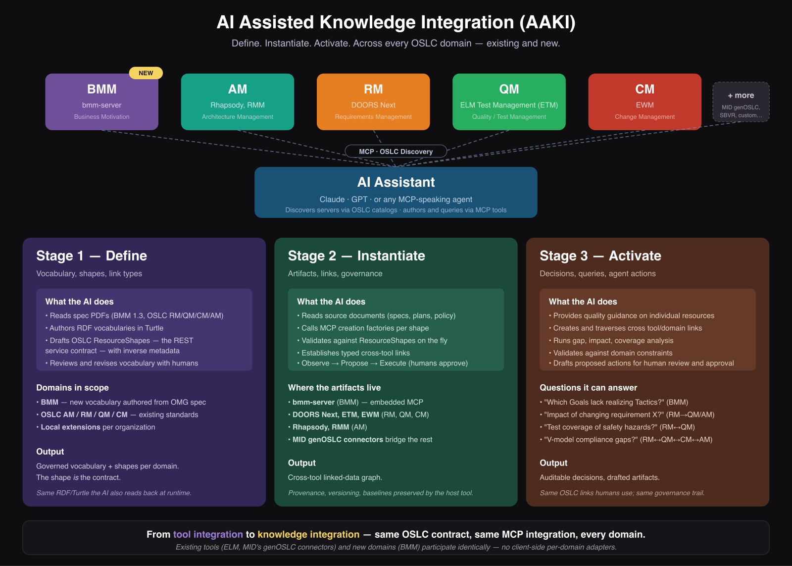

<!-- _class: title -->

# AI Assisted Knowledge Integration

## A short overview, with a live demo to follow

*Sets context for `AAKI-demo-script.md`*

---

# What if …

**What if** you could harvest your existing process and method documents and create a governed domain ontology in *days or weeks* instead of *months or years*?

**What if** your subject matter experts could use an AI assistant to harvest their knowledge, experience, and supporting documents into that ontology's OSLC server — *without manually crafting every resource and every link*?

---

# … and …

**What if** you could then use natural language to:

- ask questions about your ontology domain
- link it to other related domains
- run "what-if" analyses
- check for missing or invalid information
- navigate traceability and impact
- *make informed decisions on governed, semantically rich data sets*?

---

<!-- _class: title -->

## Sounds like a dream, doesn't it?

### This deck introduces how it's possible.

### The companion demo shows the implementation that makes it real.

---

# The three "what ifs" are the three AAKI stages

| The "what if" | AAKI stage |
|---|---|
| Harvest docs into a governed ontology *fast* | **Define** — AI drafts vocabulary + ResourceShapes from your specs/policies/methods |
| SMEs populate the OSLC server *without hand-crafting* | **Instantiate** — AI translates SME intent into shape-conformant resources and links via MCP |
| Ask the graph questions and make decisions | **Activate** — natural-language Q&A, what-if, gap & impact analysis, compliance reporting |

> AAKI = **AI Assisted Knowledge Integration.** Define, Instantiate, Activate over an OSLC linked-data system of record.

---

# AAKI at a glance

---

# Stage 1 — Define

The meaning layer. *What kinds of things exist, what properties they have, how they relate.*

- **Input**: spec / policy / method documents (PDFs, ReSpec drafts, slides, SME knowledge)
- **AI's role**: drafts an open RDF vocabulary (`vocab.ttl`) and OSLC ResourceShapes (`shapes.ttl`) that constrain it for a specific service contract; produces matching human-readable HTML
- **Your role**: review, refine, govern. Approve the contract that downstream consumers will rely on.
- **Output**: a real OSLC server domain — governed from day one

> Days or weeks, not months or years — because the AI is doing the typing and cross-checking, and you're doing the deciding.

---

# Stage 2 — Instantiate

The content layer. *Populate the server with the resources and links the ontology defines.*

- **Input**: an example document (EU-Rent business plan, ISO 9001 procedure, requirements set), plus SME conversations
- **AI's role**: translates intent into shape-conformant resources, posts to the OSLC server via MCP, creates the cross-domain links, reports progress
- **Your role**: govern context (which configuration, which change set, which approval state), review proposals before they're delivered, own the outcome
- **Output**: a populated, linked, queryable system of record

> The SME doesn't need to use the tools to directly create every resource and link. The AI never delivers without approval. Both win.

---

# Stage 3 — Activate

The value layer. *Use the graph to drive decisions.*

Natural-language questions. Cross-domain queries. "What-if" analyses. Gap detection. Impact analysis. Compliance reports. Traceability views. All running over the same governed graph — same provenance, same configuration context, same approval state.

> Stage 3 is what justifies Stages 1 and 2. Without Activate, you have a beautifully governed graph that nobody uses. With it, you have the system of record everyone wants to ask questions of.

---

# Activate has three facets

Three lenses on the same governed graph — each appropriate to a different question.

| Facet | The AI's scope | Example question |
|---|---|---|
| **Tool / Resource Optimization** | One tool, one domain | "Is this requirement well-written? Are there duplicate test cases?" |
| **Integration** | Live OSLC link graph across tools | "Which requirements lack test cases? What's the impact of changing this interface?" |
| **Analytics** | Materialized view (LQE-style) of the lifecycle | "What is our test coverage by hazard category? Which requirements have changed since the last milestone?" |

Same MCP protocol, same RDF substrate, different cost and scope per facet.

---

# Governance: Observe / Propose / Execute

The AI does not appear on the RACI chart. Three patterns let it assist without taking the wheel:

- **Observe** — read-only analyses; no approval needed. *"Show me requirements without test cases."*
- **Propose** — drafts artifacts and links into a *proposed* state; human reviews, edits, promotes. *"Draft a test case for this requirement."*
- **Execute** — mechanical operations under pre-authorized policy. *"Link every test case to the requirement it names in its description."*

Humans remain Responsible and Accountable. The governance trail (provenance, versioning, attribution, configuration context) proves it.

> Collaborator, not agent. Helper for Dave, not become Dave.

---

# Why this matters — and why now

- **RDF was built for this.** Turtle expresses *meaning*, not just structure — AI assistants are unusually fluent in it. Vocabulary and shapes are something an AI can read, reason about, and extend conversationally.
- **OSLC was built for this.** Typed, governed, linked artifacts across tools is the substrate AI needs to reason reliably. Without typed links, AI has only text similarity, which is unsafe for engineering decisions.
- **AI is the missing component.** What was a 6-month manual integration project becomes a 6-week guided collaboration. What was a graph nobody queried becomes a graph everyone queries.

Stages 1 and 2 used to be too expensive to justify Stage 3. AI changes that economics.

---

# The proof: `bmm-server`

A complete, working AAKI example built into the `oslc4js` workspace.

- **Define done.** The AI read the OMG Business Motivation Model 1.3 spec and produced `BMM.ttl` (vocabulary) + `BMM-Shapes.ttl` (ResourceShapes) — 25 classes, 49 properties, 14 ResourceShapes. The `create-oslc-server` script then assembled an OSLC service provider template plus these documents into a fully operational, AI-ready OSLC server.
- **Instantiate runs live.** In the demo, an AI assistant populates EU-Rent (BMM's running example) — Vision, Goals, Strategies, Tactics, Influencers, Assessments, Policies — into the running server, with the right cross-resource links, in minutes.
- **Activate runs live.** Natural-language questions against the populated server: "Which goals lack supporting tactics?" "What's the impact of revising Mission X?" The AI traverses the OSLC graph and answers.

> Real shapes. Real OSLC server. Real MCP endpoints. Not slide-ware.

---

# Handoff to the demo

The next 10 minutes are a live walkthrough against the running `bmm-server`:

**Beat 1 — Define.** Show what the AI authored before today.
**Beat 2 — Instantiate.** Watch the AI populate EU-Rent live via MCP.
**Beat 3 — Activate.** Ask the populated graph a question that needs the AI.

📖 Script: [`AAKI-demo-script.md`](AAKI-demo-script.md)

---

# Where to go next

| If you want to … | Read |
|---|---|
| See AAKI work live in 10 minutes | [`AAKI-demo-script.md`](AAKI-demo-script.md) |
| Read the framework in depth | [`AAKI.md`](AAKI.md) |
| See AAKI applied to a real ontology end-to-end | [`AAKI-Example.md`](AAKI-Example.md) (BMM walkthrough) |
| Present AAKI to a deeper audience | [`AAKI-Presentation.md`](AAKI-Presentation.md) (33 slides) |
| Use the Claude Code skills shipped with this workspace | `.claude/skills/aaki-{define,instantiate,activate}/` |

---

<!-- _class: title -->

# Thank you

## Questions before the demo?

> *AAKI is the framework. RDF + OSLC + AI is the stack. `bmm-server` is the proof. The dream is not a dream — it's a demo that runs today.*
