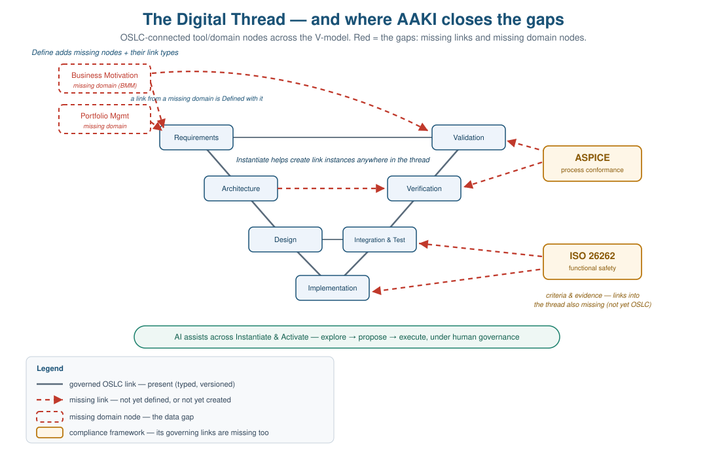

# AAKI Overview

*A narrative bringing AAKI together for stakeholders, setting context for the [AAKI-demo-script.md](AAKI-demo-script.md). This overview also absorbs the "AAKI and the digital thread" framing — why the thread underdelivers, and how AAKI closes the gaps.*

## The digital thread — and why it underdelivers

Picture the Systems & Software Engineering / PLM lifecycle as the classic OSLC diagram: a set of tool and domain **nodes** — business motivation, requirements, architecture, design, implementation, test and verification, change and configuration management — connected by **links** that let data be exchanged and traced across the whole V-model. That connected, traceable, queryable definition of the product *across its lifecycle* is the **digital thread**.

The industry has pursued this promise for years and seen thin returns. Viewed as a graph of nodes and links, the reasons come into focus — and two of them are AAKI's primary target:

- **Missing links between nodes — the connectivity/traceability gap.** The tools covering the V-model are islands. Even where a link is *possible*, creating it is manual, slow, expensive, and error-prone, so it mostly doesn't happen; and when links do exist they decay as their endpoints change, while without configuration context "which version?" is ambiguous. The result is a thread you cannot reliably exchange data over or trace across.
- **Missing domain nodes — the data gap.** Some information the organization needs has no node at all. **Business motivation and portfolio management** — *Doing the Right Things Right* — are frequently absent entirely, so the thread can trace *how* something was built but not *why it was the right thing to build*. Standing up a new domain and a tool to support it has historically been slow and specialized.

Two further gaps follow from these and are eased once they are closed:

- **Access.** Data scattered across servers with no federation gets copied into lossy data marts; and people act only on data whose provenance they trust.
- **Actionability.** Even a complete, connected thread is just data — populating it and extracting value from it have been manual, and the *author* pays the linking cost while the *analyst* reaps the benefit, so the thread stays sparse and unused.

**In short:** the thread has missing links and missing nodes, is hard to reach, and — even at its best — describes without acting.

## AAKI closes the gaps — with AI assistants and OSLC

AAKI — **AI Assisted Knowledge Integration** — is the practice of putting AI assistants to work over an OSLC linked-data substrate to close those gaps while keeping the thread governed, semantic, and compliant. Its focus is squarely the **connectivity/traceability** and **domain-data** gaps; access and actionability follow from closing them well.

- **OSLC + connectors add the missing links.** OSLC exposes otherwise-unintegrated tools through a standardized, discoverable interface (catalog → service providers → creation factories, query capabilities, vocabularies, shapes), making cross-tool linking and traceability possible without bespoke, brittle integrations — and discoverable by AI assistants via MCP. Link-ownership discipline gives every link a home and a queryable reverse direction; OSLC **link validity** marks a link **suspect** when an endpoint changes; OSLC **Configuration Management** supplies the "which baseline?" context.
- **Define adds the missing nodes.** Where a domain is absent, Define models it — **reusing** a shared vocabulary when one exists (SysML, PLM, OSLC RM/QM/CM/AM, BMM, FIBO) and **authoring** a new one only for genuine conceptual gaps such as business motivation — then stands up a working OSLC server for it, making the new information a first-class, linkable node in the thread.
- **Instantiate populates the nodes and links.** AI assistants translate documents, conversations, and existing data into shape-conformant resources and the typed links between them — *removing the linking cost from the author* and dissolving the incentive problem that kept the thread sparse.
- **Activate makes the thread actionable.** AI navigates and interprets a thread too large for any human to hold: gap, coverage, and impact analysis, multi-hop traversal, compliance reporting, and drafted proposals — running over federated query where the data lives, not a stale copy.

Define, Instantiate, and Activate are the three moves that turn a fragmented set of tools into a governed, semantic, actionable thread.

> **From one domain to the whole thread.** This is the scale-up in AAKI's ambition. The original frame was a *single* domain and the *single* OSLC server that supports it — `bmm-server` is one such node. The digital-thread frame is a **collection of domains and integrated tools**: many nodes, each a governed OSLC server (some newly Defined, most existing tools exposed through OSLC connectors), woven together by the cross-domain links that make a thread. Define/Instantiate/Activate apply at both scales — to build and fill one node, and to connect, populate, and query the whole. AAKI is no longer just "author a domain"; it is "close the gaps in a lifecycle-spanning thread of many domains and tools."

## What's in the thread, and how its evolution is governed

The nodes of the thread populate the **V-model**: business motivation and portfolio at the top, decomposing down the left through requirements, architecture, and design to implementation, then climbing the right through integration, verification, and validation into operation. The digital thread is the connected, versioned record of that whole descent and ascent — that is *what is in the thread*.

Its evolution is not unmanaged. Process and safety regimes — most notably **Automotive SPICE (ASPICE)** and **ISO 26262** — prescribe how the work must be performed and evidenced. In the AAKI picture they sit **off to the side of the thread, each with its own OSLC vocabulary, linking *into* the thread's artifacts**: an ASPICE process outcome or an ISO 26262 safety requirement is itself a governed resource that links to the requirements, designs, and tests it attests to. Because both the criteria and the evidence are linked data, conformance can be *assessed continuously over the live thread* rather than reconstructed in an episodic audit — turning compliance from a crisis into a confirmation. (This is the basis of a Continuous ASPICE assessment design; ISO 26262 follows the same pattern on the safety axis.)

For this overview the point is just the positioning: **AAKI's job is to close the thread's connectivity and data gaps; ASPICE and ISO 26262 are important consumers that attach to the closed thread to govern its evolution.**

## A note on the "ontology" — meaning without the reasoning overhead

Define produces an open RDF vocabulary plus OSLC ResourceShapes — an *application vocabulary and an API/validation contract*, in the same lineage as W3C **SHACL** (OSLC's ResourceShape is one of SHACL's ancestors). It deliberately does **not** require OWL reasoning: like schema.org and most production knowledge graphs, the thread is *validated, not inferred*. This is a bridge, not a wall — the vocabulary is plain RDF and anyone may layer OWL over it — but AAKI does not make reasoning a precondition for interoperability. Where an authoritative formal ontology already exists (SysML v2, ISO 15926, IOF/BFO, FIBO), Define reuses it as the vocabulary layer. AAKI's contribution is closing the thread's connectivity and data gaps, which formal ontologies do not themselves address.

---

## The three stages, told as three "what ifs"

The gap-closing above maps to three stages a stakeholder can grasp as three "what ifs":

| The "what if" | AAKI stage | What it means |
|---|---|---|
| Harvest documents into a governed domain node in days/weeks | **Define** | The AI reads your spec/policy/method documents and either **configures** an OSLC server over existing shared vocabularies (SysML, PLM, OSLC RM/QM/CM/AM, BMM) that already cover the domain — the common case — or **drafts** a new open RDF vocabulary plus OSLC ResourceShapes for a genuine conceptual gap. You review, refine, and publish; the node is governed from day one. |
| SMEs populate the node and its links without hand-crafting each one | **Instantiate** | The AI translates SME intent (from documents, conversations, existing data) into shape-conformant resources and the cross-domain links between them, posted via MCP. The SME stays in the loop, owns the decisions, and isn't bottlenecked by tooling. |
| Ask the connected thread questions and make informed decisions | **Activate** | The graph is now AI-addressable: natural-language queries, what-if analyses, gap/coverage/impact detection, traceability, and compliance reporting — over the governed, linked-data system of record. |

> **A note on Define — reuse vs. create.** *Reuse an existing vocabulary whenever a shared concept space already captures the semantics at the abstraction you need.* SysML, PLM, OSLC RM/QM/CM/AM, BMM, FIBO, STEP — each is battle-tested, its semantics public, its tooling extant, and its adoption gives immediate cross-tool integration. Create a new vocabulary only for a genuine conceptual gap. In practice, Define for most engineering domains is **almost entirely configuration** — the layers are covered. The `bmm-server` example exists because business motivation is a real gap that BMM fills.

---

## Three facets of model use — within Activate

Within Activate the AI operates at three distinct facets — different lenses on the same governed graph, each suited to a different question.

- **Tool / Resource Optimization** — the AI improves authoring inside one tool against that tool's own vocabulary and guidelines. *"Is this requirement well-written? Are there duplicate test cases?"* Scope: one tool, one domain.
- **Integration** — the AI traverses the live OSLC link graph spanning tools and domains. *"Which requirements lack test cases? What's the impact of changing this interface on downstream verification?"* Its substrate is the typed, governed links — without them the AI has only unreliable text similarity.
- **Analytics** — the AI queries a materialized view of the whole lifecycle (LQE-style) for fast aggregates. *"What's our test coverage by hazard category? Which requirements changed since the last milestone?"*

A real deployment connects the AI to all three through MCP. Same governance, same provenance, same RDF substrate — different cost and scope per facet.

---

## Governance: how the AI assists without taking the wheel

The AI in AAKI is a collaborator, not a decision-maker. Three patterns make this concrete:

- **Observe** — read-only analyses; no approval needed. *"Show me requirements without test cases."*
- **Propose** — drafts artifacts and links into a *proposed* state; the human reviews, edits, and promotes to approved. *"Draft a test case for this requirement."*
- **Execute** — mechanical operations under pre-authorized policy, granted by policy class, not per action. *"Link every test case to the requirement it names."*

The AI does not appear on a RACI chart. Humans remain Responsible and Accountable for every recorded decision; the provenance trail (versioning, attribution, configuration context) proves it.

---

## The proof: `bmm-server`

A complete worked example of AAKI end to end — and a concrete instance of closing the *data gap* by adding the business-motivation node:

- **Define.** An AI assistant read the OMG Business Motivation Model 1.3 specification and drafted `BMM.ttl` (vocabulary) and `BMM-Shapes.ttl` (ResourceShapes). The `create-oslc-server` script then assembled a service-provider template plus these documents into a fully operational, AI-ready OSLC server node.
- **Instantiate.** Live in the demo: an AI populates EU-Rent (BMM's running example) — Vision, Goals, Strategies, Tactics, Influencers, Assessments, Policies — with the right cross-resource links, in minutes.
- **Activate.** Live in the demo: ask the populated node natural-language questions — "Which goals lack supporting tactics?" "What's the impact of revising Mission X?" — and the AI traverses the OSLC graph to answer.

Real shapes, a real OSLC server, real MCP endpoints — not slide-ware.

---

## Why this is different

AAKI does not make the thread actionable by dumping everything into a data lake and retrieving with similarity search. It keeps the thread a **governed, semantic system of record**: shared vocabularies give it meaning, shapes constrain what is valid, OSLC links carry typed and versioned relationships, and AI operates as a **constrained participant** — never the thread's unaccountable author. (See [`AAKI-vs-GraphRAG.md`](AAKI-vs-GraphRAG.md) for the contrast with extraction-based approaches.) The result is a thread you can reason over, trust, and defend to an auditor — and one an AI assistant can safely help build and use.

---

## In one line

> **The digital thread's promise was traceability; its unmet need was action. AAKI uses AI assistants and OSLC to close the thread's missing links and missing nodes — then lets experts populate it and everyone query it — so the organization can Do the Right Things Right and let ASPICE and ISO 26262 govern the thread's evolution over trustworthy, connected data.**

---

## Where to go next

| If you want to … | Read |
|---|---|
| See AAKI work live in 10 minutes | [AAKI-demo-script.md](AAKI-demo-script.md) |
| Read the full framework | [AAKI.md](AAKI.md) |
| See AAKI applied to a real domain end-to-end | [AAKI-Example.md](AAKI-Example.md) (BMM walkthrough) |
| Understand how AAKI differs from GraphRAG | [AAKI-vs-GraphRAG.md](AAKI-vs-GraphRAG.md) |
| Present AAKI to a stakeholder audience | [AAKI-Presentation.md](AAKI-Presentation.md) (full deck), [AAKI-Overview-Presentation.md](AAKI-Overview-Presentation.md) (short deck), or this Overview |
| Use the Claude Code skills that ship with the workspace | [`aaki-define`](../.claude/skills/aaki-define/SKILL.md), [`aaki-instantiate`](../.claude/skills/aaki-instantiate/SKILL.md), [`aaki-activate`](../.claude/skills/aaki-activate/SKILL.md) |
