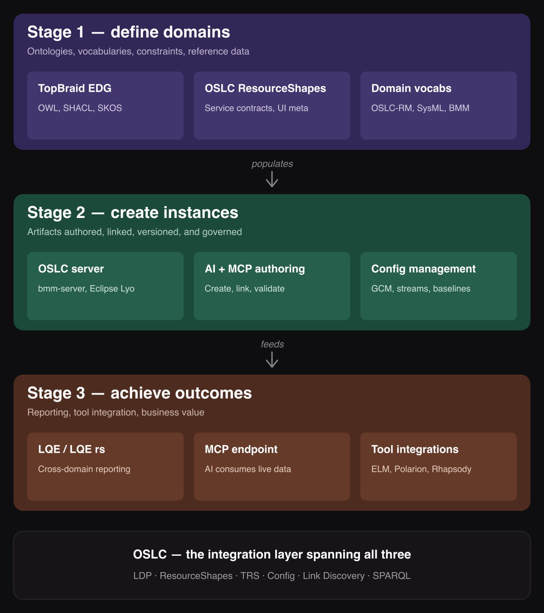
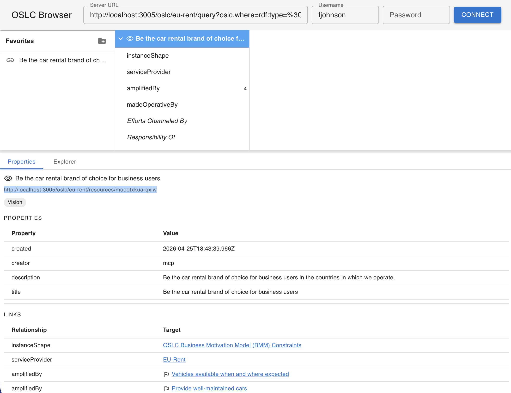
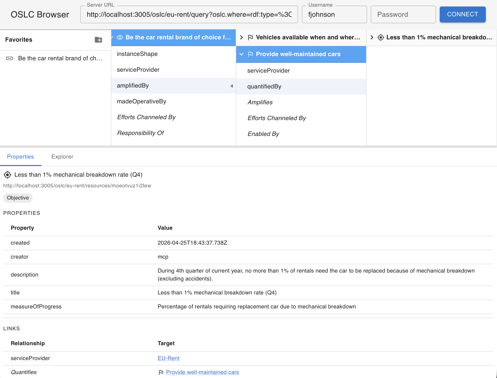
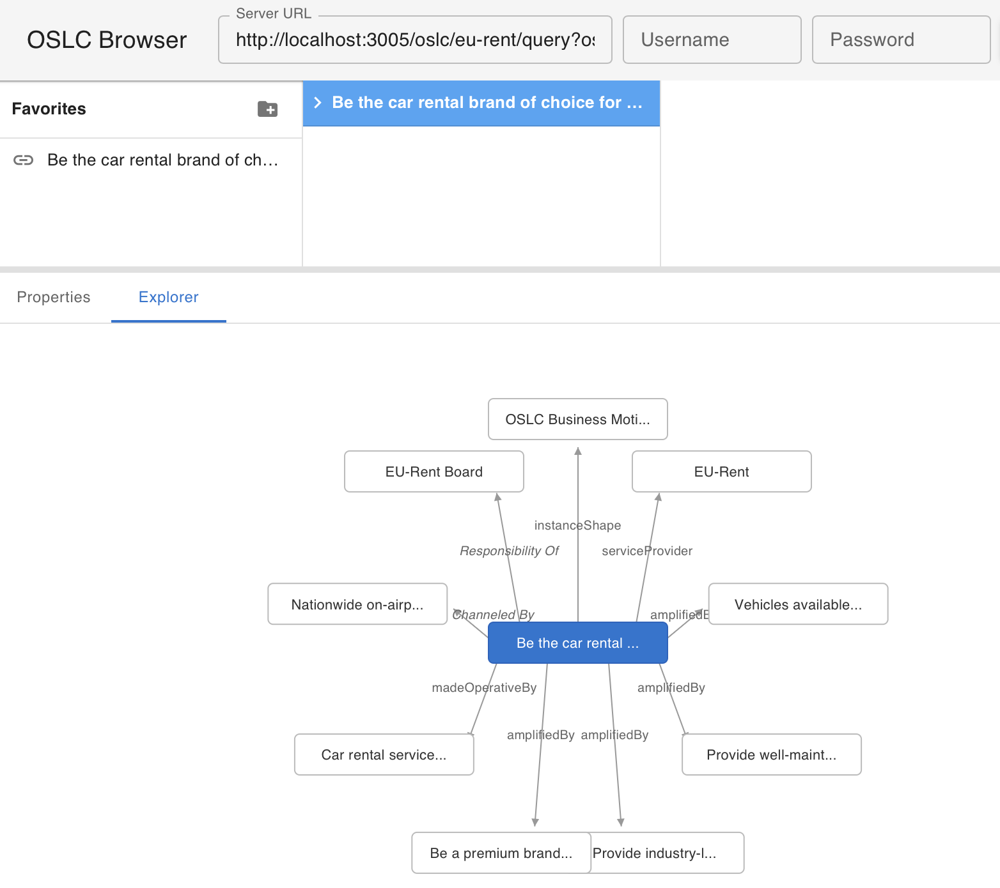

# AAKI: A BMM Worked Example

## AI Assisted Knowledge Integration, Walked End-to-End

### Companion to the AAKI framework deck

The detailed worked example for this deck — every shape fragment, prompt, and MCP response shown here, plus the full reproduction steps — lives in **`docs/AAKI-Example.md`**. This deck summarizes the journey; that document grounds it.

---

<!-- _class: toc -->

# Contents

- AAKI at a glance
- The Problem BMM Lets Us Tell
- Why BMM Is the Right Lens
- The Three AAKI Stages
- Define — Authoring with AI
- Define — Our Shape Extensions
- Define — `create-oslc-server.ts`
- Define — What You Get for Free
- Instantiate — Why EU-Rent
- Instantiate — Populating with AI
- Instantiate — The Browser View
- Activate — AI Analysis
- Activate — Programmatic Consumers
- Activate — LDM and Human Users
- What Changed About OSLC
- The Three Extensions
- Why Structure + AI > Either Alone
- The AI-Assisted V-Model (pointer)
- Thank You

---

# AAKI at a glance


---

# The Problem

**Business motivation has no home in the application lifecycle.**

- A requirement realizes *some* Goal. A test case verifies *some* Requirement. A Strategy makes *some* Vision operative.
- But today's lifecycle tools — ELM, MID Connectors, Jira, ServiceNow — capture the realization, not the motivation behind it.
- No widely deployed OSLC server exists for BMM, SBVR, or similar business-intent vocabularies.
- So traceability stops at the requirement and the real "why" lives in PowerPoint decks.
- ALM, PLM, and the SSE V-model all have no anchor without the motivation layer above them.

**Goal of this walkthrough:** Build an OSLC BMM server end-to-end, populate it with EU-Rent, and show how AI assistants make every step — authoring, instantiation, analysis — first-class.

---

# Why BMM Is the Right Lens

- **Realistic ontology.** 25 classes, ~49 properties. Visions, Goals, Missions, Strategies, Tactics, Policies, Rules, Influencers, Assessments, Potential Impacts, Business Processes, Assets, Organization Units.
- **Genuinely useful.** Populated BMM models answer portfolio questions: "which Goals are unrealized?", "which Influencers lack Assessments?"
- **Non-trivial but comprehensible.** A week to internalize. Small enough to render as a single graph.
- **Has a published running example.** EU-Rent, worked through BMM 1.3 Annex C. Reader can check every resource against the spec.
- **No existing OSLC server for it.** Exactly the gap oslc4js exists to close — connecting BMM motivation to ELM requirements/models/tests and MID OSLC Connectors.

---

# The Three AAKI Stages

| Stage | Answers | What's new with AI |
|---|---|---|
| **Define** — schema | What kinds of things exist, how they relate, what UI metadata drives authoring | AI authors vocabulary + shapes (in Turtle, fluently) from spec documents |
| **Instantiate** — artifacts | What are the actual Visions, Goals, Strategies in this organization | AI populates through MCP, translating SME intent into shape-conformant resources |
| **Activate** — value | What decisions, reports, analyses, and agent actions the data enables | AI queries the governed graph for gaps, summaries, proposed actions — with humans in the governance loop |



> *RDF/Turtle is unusually well-suited to AI workflows — it captures meaning, not structure. AI assistants produce and consume Turtle as fluently as prose.*

---

# Part 2 — Define

## Authoring the BMM domain with an AI assistant

- One reference prompt, reading the OMG BMM 1.3 spec.
- Three artifacts produced: `BMM.ttl`, `BMM-Shapes.ttl`, `BMM-Shapes.html`.
- Zero application code written by humans.
- Key guidance: naming discipline and proposed shape extensions.

---

# Define — The Authoring Prompt (excerpt)

> *Read the OMG BMM 1.3 specification. Produce:*
>
> *1. `BMM.ttl` — RDF vocabulary: one class per BMM class, one property per attribute/relationship, with domains, ranges, labels, comments.*
>
> *2. `BMM-Shapes.ttl` — one `oslc:ResourceShape` per instantiable class, with `oslc:property` constraints covering every supported property.*
>
> *3. `BMM-Shapes.html` — human-browsable rendering.*
>
> **Naming rule:** short, domain-agnostic predicates. `amplifiedBy`, not `amplifiedByMission`. `quantifies`, not `quantifiesGoal`.
>
> **Inverse metadata rule:** every link property declares `oslc:inversePropertyDefinition` (URI for reverse direction) and `oslc:inverseLabel` (human-readable inverse wording). *See `docs/OSLC-Shape-Extensions.md`.*

Full prompt: `docs/prompts/01-author-bmm-vocabulary.md`

---

# Define — Our Shape Extensions

Two new properties on `oslc:Property`, proposed for OSLC-OP:

| Property | Purpose |
|---|---|
| `oslc:inversePropertyDefinition` | URI identifier for the reverse direction of a link property. |
| `oslc:inverseLabel` | Human-readable label for that reverse direction. |

```turtle
<#p-channelsEffortsToward>
  a oslc:Property ;
  oslc:name "channelsEffortsToward" ;
  oslc:propertyDefinition bmm:channelsEffortsToward ;
  oslc:valueType oslc:Resource ;
  oslc:inversePropertyDefinition bmm:effortsChanneledBy ;
  oslc:inverseLabel "Efforts Channeled By" .
```

**Why it matters:** the inverse URI is an *identifier*, not asserted as an `rdf:Property`. The triple is stored once. Clients render incoming links by reflecting off the shape — no hardcoded inverse-type tables like DOORS Next or `oslc-client.LDMClient.INVERSE_LINK_TYPES`. Same benefit applies to OSLC **LDM** clients: incoming links discovered via `/discover-links`.

---

# Define — `create-oslc-server.ts`

The actual command that scaffolded `bmm-server`:

```bash
npx tsx create-oslc-server.ts --name bmm-server --port 3005 \
  --vocab  "bmm-server/config/domain/BMM.ttl" \
  --shapes "bmm-server/config/domain/BMM-Shapes.ttl" \
  --managed Vision,Goal,Objective,Mission,Strategy,Tactic,BusinessPolicy,
            BusinessRule,Influencer,Assessment,PotentialImpact,
            OrganizationUnit,BusinessProcess,Asset
```

- Generates `config/catalog-template.ttl` — one ServiceProvider creation template, one creation factory + creation/selection dialogs per managed class, one query capability for the domain.
- `--managed` can be a **subset** of the domain's classes when only some need to be instantiated for the use case.
- Emits a thin `src/app.ts` that mounts `oslc-service` against a Jena Fuseki backend via `jena-storage-service`.
- Scaffolds a `ui/` directory wrapping the `oslc-browser` library.
- Authored surface area: declarative `config/` content. **No domain code.**

---

# Define — What You Get for Free

Starting `bmm-server` yields, from the declarative inputs alone:

- **Service Provider catalog** at `/oslc` — factories, queries, shapes per ServiceProvider
- **Service Provider creation template** (what ELM calls a *project area*)
- **Creation factories + creation/selection dialogs** per managed class; **one query capability for the domain**
- **Compact resource previews** for hover tooltips
- **OSLC browser** at `/` — column navigation, Properties, Explorer graph, diagrams
- **LDM `/discover-links` endpoint** — standard OSLC Link Discovery Management, answered from this server's storage
- **Embedded MCP endpoint** at `/mcp` — catalog/vocabulary/shapes as resources, `create_*` / `query_*` tools for AI-assisted content creation and use

**The shape IS the contract.** Every operational surface is generated from it.

---

# Define — The Payoff

From a spec PDF to a running, fully-featured OSLC service for a non-trivial domain:

- **AI authored the vocabulary and shapes.**
- **The scaffold script generated the server.**
- **The declarative contract drives the REST API, the browser UI, the LDM endpoint, and the MCP tool schemas.**

No domain-specific application code. No hand-wired UI. No hardcoded link-type maps.

The next question: what does populating this server look like?

---

# Part 3 — Instantiate

## Populating the EU-Rent example with an AI assistant

- BMM 1.3 Annex C develops EU-Rent, a fictitious European car rental company, as the running example.
- ~72 linked resources across every BMM class.
- Reader can check every resource against the published spec.
- Again driven by a reference prompt through the MCP endpoint.

---

# Instantiate — The Population Prompt (shape)

**1. Discover.** Read `oslc://catalog`, `oslc://vocabulary`, `oslc://shapes` via MCP. Understand what the server supports before creating anything.

**2. Create the ServiceProvider.** `create_service_provider` for "EU-Rent Board".

**3. Populate by class.**

- 1 Vision, ~4 Goals + Objectives, 1 Mission
- ~3 Strategies, ~5 Tactics
- ~5 Policies, ~6 Rules
- ~20 Influencers, ~6 Assessments, ~5 Potential Impacts
- ~4 Business Processes, ~4 Assets, ~4 Organization Units

**4. Link.** Every BMM relationship type.

**5. Report.** Query each class, spot-check link graphs, summarize counts.

Full prompt: `docs/prompts/02-populate-eu-rent-example.md`

---

# Instantiate — Runtime

**Interactive:** Claude Desktop MCP session, ~15–25 minutes for the full 72-resource population. The assistant discovers the catalog, creates the ServiceProvider, creates resources by class with proper links, reports counts.

**Scripted:** `bmm-server/testing/populate-eurent.sh` does the same work non-interactively in ~60 seconds for fast dev-loop replays.

**Either path produces the same populated graph.** The interactive path is the authoritative AAKI demonstration; the script is a time-saver.

---

# Instantiate — The Browser View: Properties



**Vision properties, with incoming links.**

- Outgoing links (`amplifiedBy`, `madeOperativeBy`) — regular type.
- Incoming links (`Efforts Channeled By`, `Responsibility Of`) — italicized in the same Links table.
- Labels come from `oslc:inverseLabel` on the source-side shape.
- Italics signal the triple is stored on the source; the user navigates transparently.

---

# Instantiate — The Browser View: Column Navigator



**Expanded Vision accordion.**

- Mixed outgoing + incoming predicates.
- Click outgoing → fetch targets into next column.
- Click incoming (italic) → fetch source resources via `/discover-links`, render as the next column.
- User navigates bidirectionally without thinking about storage ownership.

---

# Instantiate — The Browser View: Explorer Graph



**Radial graph around the Vision.**

- Center = selected Vision. Perimeter = directly related resources.
- Outgoing and incoming edges both point from center outward.
- Incoming edge labels italicized via SVG `<tspan>`.
- A neighbor linked in both directions shows both labels on a single edge.

---

# Instantiate — The Payoff

Manually authoring 72 linked BMM resources from a 200-page PDF is a multi-day SME engagement.

**The AI does it in a session.**

This inverts the traditional difficulty curve:

- *Before:* users struggled to create models; understanding was the easier half.
- *Now:* creation is fast; the SME's job shifts to reviewing, correcting, and steering.

The AI is not replacing subject-matter expertise. It removes the translation-into-OSLC-REST-calls bottleneck that kept SMEs out of the authoring loop.

---

# Part 4 — Activate

## One contract, four kinds of consumer

The same Define + Instantiate deliverables serve four consumer archetypes without additional code:

1. **AI assistants** asking analytical questions
2. **Programmatic OSLC consumers** running standard queries
3. **LDM clients** discovering incoming links
4. **Human users** in the browser

Every one of them reflects off the shapes, vocabulary, and OSLC contract declared in Define.

---

# Activate — AI Analysis Prompts

Reference prompts in `docs/prompts/03-analyze-bmm-model.md`:

- **Gap analysis.** *"Which Goals have no realizing Tactic chain?"*
- **Structural summary.** *"Summarize the influence landscape: Assessments → Influencers → Potential Impacts → Directives → OrgUnits."*
- **Multi-hop traversal.** *"Walk the realization chain from the EU-Rent Vision through Goals, Strategies, Tactics, Processes, Assets — identify the weakest link."*
- **Observe-Propose-Execute.** *"Propose a new Business Rule for the customer-retention Policy responding to the competitor-modernization Influencer. Do not create it — format it for my review."*
- **Compliance validation.** *"Verify every OrgUnit `isResponsibleFor` at least one End. Report violations as a SHACL-style assertion."*

---

# Activate — Why These Work

Every analysis prompt uses the **same three MCP resources**:

- `oslc://catalog` — what ServiceProviders exist
- `oslc://vocabulary` — BMM classes and relationships
- `oslc://shapes` — required fields, cardinalities, **inverse metadata**

and the **same MCP tools**:

- `query_*` per class
- `fetch_resource` for details
- `create_*` and `update_*` for Observe-Propose-Execute authoring

The AI carries **no BMM-specific code**. It reads the shape, queries the data, reasons with both. Any new domain works the same way.

---

# Activate — Programmatic OSLC

Standard OSLC 3.0 query against the query base:

```
GET /oslc/eu-rent/query?oslc.where=rdf:type=<http://www.omg.org/spec/BMM%23Vision>
  Accept: application/ld+json
```

Any OSLC-conformant client consumes this — existing ELM adapters, MID Connectors, custom integrations.

A **federating consumer** (an LQE or dedicated LDM provider) could aggregate BMM resources alongside requirements, test cases, and change requests from ELM via TRS feeds. Answers cross-domain questions: *"which test cases verify requirements realizing Goals that amplify the EU-Rent Vision?"*

TRS feeds in `oslc-service` are a future extension; the `/discover-links` endpoint covers same-server incoming link queries.

---

# Activate — LDM and Human Users

**LDM `/discover-links`** — a specialized client posts a target URI, gets back the incoming links (reverse triples). Labels resolved client-side from the shape cache via `oslc:inverseLabel`. Same wire format as a dedicated LDM/LQE provider, so clients work interchangeably.

**Human users** — the same BMM server, same vocabulary, same shapes, same data, rendered as a column browser, Properties panels, and dependency graphs for stakeholder walkthroughs.

A product manager who doesn't know RDF exists browses the EU-Rent Vision, follows `amplifiedBy` to Goals, sees the incoming *"Efforts Channeled By"* Strategies, and understands the realization structure without reading the spec.

---

# Activate — The Payoff

**Four kinds of consumers, one declarative contract.**

- Define once. Instantiate once. Activate arbitrarily.
- Adding a new consumer kind — GraphQL gateway, SHACL validator, natural-language translator — costs **shape reads**, not a new inverse-type table or a domain-specific adapter.
- The server **exploits OSLC templates and OSLC discovery** to build its own services declaratively from `config/domain/`. OSLC is both the contract the server implements and the pattern by which the server is defined.

Replacing or extending BMM with a new domain vocabulary costs a new `config/domain/`, not a rewrite.

---

# Part 5 — What Changed About OSLC

**Old framing:**

> "RDF + typed links + delegated dialogs for lifecycle tool integration."

Still accurate. Still valuable.

**New framing demonstrated by this walkthrough:**

> "OSLC is the substrate for **AI Assisted Knowledge Integration (AAKI)**."

The RDF, the links, and the delegated dialogs are still there. But the server has become an **AI-addressable knowledge store**, not just a human-facing web application — and RDF/Turtle, far from being legacy baggage, turns out to be the ideal exchange format between AI authoring and the governed system of record.

---

# The Three Extensions That Closed the AAKI Loop

None of these changed OSLC Core or the RDF model. Each earns its place by removing a specific point of coordination that used to block AI-assisted workflows.

| Extension | Removes |
|---|---|
| **Embedded MCP endpoint** in `oslc-service` | The gap between OSLC servers and AI assistants — no separate MCP bridge to build or run. |
| **LDM `/discover-links`** per server | The need for a dedicated LDM provider for efficient access to locally accessible incoming links. |
| **Shape inverse metadata** (`oslc:inversePropertyDefinition`, `oslc:inverseLabel`) | Hardcoded client-side inverse-type tables. Vocabulary governance replaces client-rebuild cycles. |

---

# Why Structure + AI > Either Alone

**AI alone:** ephemeral. No auditability, no persistence, no interoperability, no governance. A conversation produces text, not artifacts.

**Ontology + OSLC alone:** governed but under-populated and hard to use. The authoring bottleneck kept these systems from accumulating the instance data that makes them valuable.

**Together:** the AI is the most capable authoring and analysis tool a governed knowledge graph has ever had. The governed knowledge graph is the persistent, auditable, queryable substrate the AI needs to produce decisions rather than conversations.

**Neither alone is as valuable as both together.**

---

# AAKI Stages — BMM Annotated


- **Define** — Claude authored `BMM.ttl` (25 classes, 49 properties), `BMM-Shapes.ttl` (14 shapes, 38 link properties with inverse metadata), `BMM-Shapes.html` — from the OMG spec. Zero domain code.
- **Instantiate** — Claude populated **72 linked EU-Rent resources** via MCP in a single session: 1 Vision, 4 Goals, 1 Mission, 3 Strategies, 5 Tactics, 5 Policies, 6 Rules, 20 Influencers, 6 Assessments, …
- **Activate** — gap analysis ("unrealized Goals"), structural summary ("Influence landscape"), Observe-Propose-Execute authoring — all over the same declarative contract. Human browser + LDM clients + OSLC queries + AI analysts served by one shape set.

Feedback flows back from Activate into new Instantiate actions, the governed Define stage keeps coherent.

---

# The AI-Assisted V-Model

**BMM anchors the motivation layer. The same pattern extends upward along the traceability chain:**

An OSLC link graph across requirements (DOORS Next) → design (Rhapsody, RMM) → verification (ELM Test Management) *is* the V-model's traceability substrate.

An AI assistant that queries LQE for structural gaps, proposes cross-tool action plans through OSLC integration endpoints, and executes authoring through tool-specific MCPs realizes a **continuous, quantifiable governance loop** that document-based V-model processes cannot.

> *Requirement-change impact becomes a queryable, auditable cycle: discover in LQE, plan in OSLC, author in tool MCPs, verify closure in LQE.*

Full V-model scenario is beyond this walkthrough — a natural extension of the loop demonstrated here.

---

# Key Takeaways

1. **The shape is the constraining contract.** Define it with AI help. Every operational surface — REST, UI, LDM, MCP — follows.
2. **AI participates in all three AAKI stages.** Authoring (Define), population (Instantiate), analysis (Activate). Humans stay in the governance loop where it matters.
3. **Small extensions, large consequences.** Embedded MCP + LDM `/discover-links` + shape inverse metadata together make OSLC an AI-addressable knowledge integration substrate — the technical realization of AAKI.
4. **Structure and AI are complementary.** The system of record supplies auditability, persistence, interoperability, governance. The AI supplies authoring speed and analytical depth.
5. **BMM is the demo; the pattern generalizes.** Any ontology expressible as RDF + shapes works the same way.

---

# References

- [**`docs/AAKI-Example.md`**](https://github.com/OSLC/oslc4js/blob/master/docs/AAKI-Example.md) — **companion document** for this deck: every shape fragment, prompt, and MCP-response example shown here, with the full reproduction steps
- [**`docs/AAKI.md`**](https://github.com/OSLC/oslc4js/blob/master/docs/AAKI.md) — the abstract AAKI framework that this worked example demonstrates
- [**`docs/OSLC-Shape-Extensions.md`**](https://github.com/OSLC/oslc4js/blob/master/docs/OSLC-Shape-Extensions.md) — proposed OSLC-OP property definitions (`oslc:inversePropertyDefinition`, `oslc:inverseLabel`)
- [**`docs/prompts/`**](https://github.com/OSLC/oslc4js/tree/master/docs/prompts) — canonicalized reference prompts for vocabulary authoring, EU-Rent population, and analysis
- [**`bmm-server/README.md`**](https://github.com/OSLC/oslc4js/blob/master/bmm-server/README.md) — server setup and EU-Rent population script
- [**`oslc-browser/README.md`**](https://github.com/OSLC/oslc4js/blob/master/oslc-browser/README.md) — incoming-link rendering pipeline
- [**OMG Business Motivation Model 1.3**](https://www.omg.org/spec/BMM/1.3) — local PDF: [`bmm-server/docs/BMM-formal-15-05-19.pdf`](https://github.com/OSLC/oslc4js/blob/master/bmm-server/docs/BMM-formal-15-05-19.pdf)
- [**OASIS OSLC Core 3.0**](https://docs.oasis-open-projects.org/oslc-op/core/v3.0/oslc-core.html) — the baseline this work extends

---

<!-- _class: small-text -->

# Thank You

## Questions, suggestions, and OSLC-OP submissions welcome.

- **Repository:** [github.com/OSLC/oslc4js](https://github.com/OSLC/oslc4js)
- **Proposed extensions:** [docs/OSLC-Shape-Extensions.md](https://github.com/OSLC/oslc4js/blob/master/docs/OSLC-Shape-Extensions.md)
- **Reproduce the walkthrough:** start `bmm-server`, run [`testing/populate-eurent.sh`](https://github.com/OSLC/oslc4js/blob/master/bmm-server/testing/populate-eurent.sh), open [http://localhost:3005/](http://localhost:3005/)

*The deeper claim: OSLC has evolved from lifecycle tool integration to knowledge integration. BMM makes that visible. The pattern applies wherever structured meaning meets AI assistants.*
