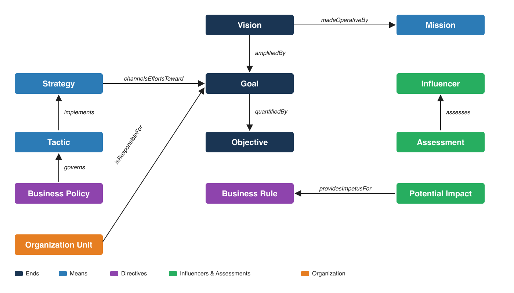
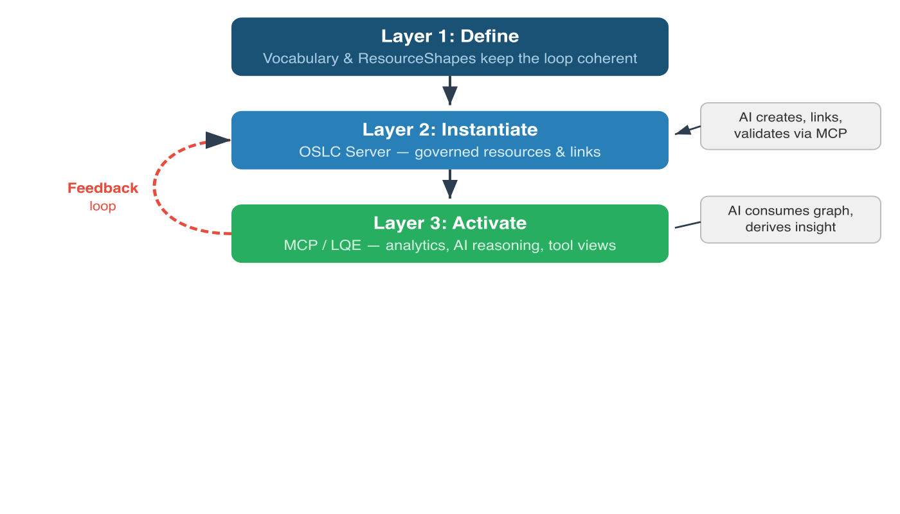
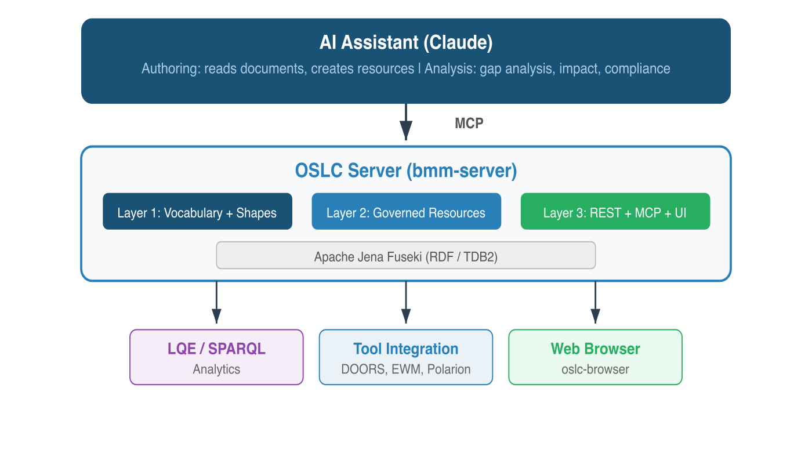
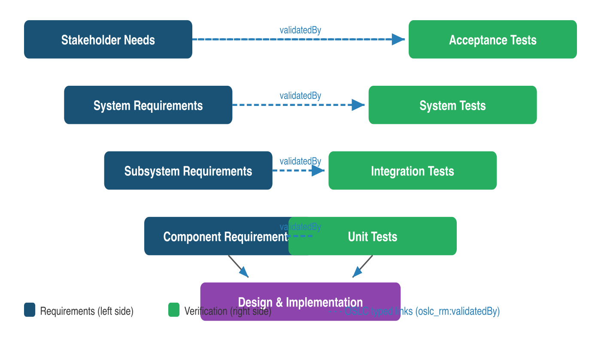
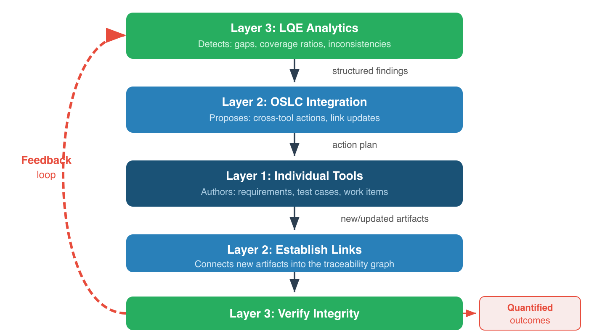

# AI Assisted Knowledge Integration

## Define — Instantiate — Activate

### Realizing AAKI over OSLC Linked Data, with AI as a First-Class Participant

---

<!-- _class: toc -->

# Contents

- [Challenge Brief](#challenge-brief)
  - [The Customer Challenge](#the-customer-challenge)
  - [The AAKI Solution](#the-aaki-solution)
  - [The Business Value](#the-business-value)
- [The Define, Instantiate and Activate Strategic Framework](#the-define-instantiate-and-activate-strategic-framework)
- [Why RDF, Why Turtle](#why-rdf-why-turtle)
- [Stage 1 — Define](#stage-1--define)
- [Stage 1 Example: BMM Vocabulary](#stage-1-example-bmm-vocabulary)
- [Stage 2 — Instantiate](#stage-2--instantiate)
- [Stage 2 Example: EU-Rent](#stage-2-example-eu-rent)
- [AI Transforms Stage 2](#ai-transforms-stage-2)
- [Stage 3 — Activate](#stage-3--activate)
- [Stage 3 Example: MCP Endpoint](#stage-3-example-mcp-endpoint)
- [The Feedback Loop](#the-feedback-loop)
- [Why Not Just Use AI Alone?](#why-not-just-use-ai-alone)
- [BMM Server: Working Example](#bmm-server-working-example)
- [Key Takeaway](#key-takeaway)
- [AI-Assisted V-Model](#ai-assisted-v-model)
- [Three Layers of AI Assistance](#three-layers-of-ai-assistance)
- [Scenario: Requirements Change](#scenario-requirements-change)
- [The V-Model Feedback Loop](#the-v-model-feedback-loop)

---

<!-- _class: lead -->

# Challenge Brief

## Customer challenge → AAKI solution → business value

---

# The Customer Challenge

Organizations that depend on shared domain knowledge face **three persistent gaps**:

**1. Defining shared concept spaces is hard.**
Each team's tools encode domain knowledge differently — same concept, different URIs, different structures. Integration becomes glue code, not meaning sharing. Building a tool that supports a concept space, *and* integrates with others, is a substantial undertaking on its own.

**2. Populating those concept spaces is slow.**
Getting SMEs to translate documents, conversations, and tacit knowledge into governed, linked artifacts is a manual, expert-heavy bottleneck. Most domain knowledge stays in PDFs, spreadsheets, and people's heads.

**3. Extracting value is mostly manual.**
Stakeholder views and reports help, but impact analyses, gap detection, traceability assessments, and decision support still get done by hand — slowly, inconsistently, and often not at all.

---

# The AAKI Solution

**AI Assisted Knowledge Integration (AAKI)** addresses all three gaps together — a strategic framework realized in three stages on linked-data infrastructure.

| Stage | What it produces | Who participates |
|---|---|---|
| **Define** | Governed vocabulary and shapes | Ontologists + AI drafting from source documents |
| **Instantiate** | Governed artifacts and links | SMEs + AI translating intent into shape-conformant resources |
| **Activate** | Decisions, queries, traceability, agent actions | AI analyzing the graph; stakeholders consuming the results |

> The OSLC server is the **system of record** — auditable, versionable, interoperable.
> The AI is the **most capable authoring and analysis tool** that system of record has ever had.

**oslc4js** is a concrete AAKI implementation. `bmm-server` and `mrm-server` demonstrate every stage end-to-end against real domain ontologies — proving the framework works in practice.

---

# The Business Value

When integration is framed as AAKI, the conversation moves **up the abstraction stack**.

| What we used to talk about | What AAKI lets us talk about |
|---|---|
| Tool adaptors, selection dialogs | Producers and consumers of shared concept spaces |
| Link creation, RDF representations | Ontologies and shapes as the contract |
| Manual integration plumbing | Versioning, traceability, provenance as architectural side effects |
| Engineers wiring up tools | SMEs and stakeholders working in their own domain language |

The result: **less effort** to Define, Instantiate, and Activate domain knowledge — and a **much wider set of stakeholders** able to use that knowledge to drive effective, timely action.

---

# The Define, Instantiate and Activate Strategic Framework

Making shared meaning actionable across an enterprise requires three distinct stages:

| Stage | Purpose | Answers |
|-------|---------|---------|
| **1. Define** | Vocabulary governance | What kinds of things exist? How do they relate? |
| **2. Instantiate** | Artifact creation & governance | What are the actual resources in this project? |
| **3. Activate** | Outcomes & value delivery | What decisions can we make from this data? |

This maps onto the classic **schema / instance / use** distinction from information architecture — applied to **AAKI: realized over OSLC linked data and AI-addressable knowledge stores via MCP.**

---

# Why RDF, Why Turtle

AAKI's choice of RDF — and Turtle in particular — is no longer just an OSLC legacy. It's a deliberate fit with AI workflows.

- **RDF captures meaning, not structure** — typed entities, named relationships, inferable constraints
- **AI assistants produce and consume Turtle as fluently as prose** — Turtle expresses knowledge, not a schema-bound shape
- **Round-trippable through the system of record** — what the AI authors in Stage 2 is the same RDF the AI analyzes in Stage 3
- **Pairs with OSLC ResourceShapes** for shape-conformant authoring at speed

> Where data formats like JSON or SQL describe *structure*, RDF describes *meaning*. That's why an AI can author governed vocabulary, instances, and queries — all in the same notation.

---

# Stage 1 — Define

**The meaning layer**: It establishes shared understanding before any data is created.

**Two complementary mechanisms:**

- **Ontology governance** (e.g., TopBraid EDG) — stakeholder review workflows, change history, version control of the vocabulary, multi-user authoring
- **OSLC ResourceShapes** — formalize the vocabulary as a REST API contract: required properties, cardinality, allowed values, UI metadata for creation dialogs

**Without Stage 1:** Stage 2 produces a connected but semantically incoherent graph — links exist but mean different things in different tools.

---

# Stage 1 Example: BMM Vocabulary

The **bmm-server** defines the OMG Business Motivation Model 1.3 as an RDF ontology:

<div class="columns">
<div>

**Ends** (what to achieve)
- Vision
- Goal
- Objective

**Means** (how to achieve it)
- Mission
- Strategy, Tactic
- Business Policy, Business Rule

</div>
<div>

**Influencers & Assessment**
- Influencer (External/Internal)
- Assessment (SWOT)
- Potential Impact (Risk/Reward)

**Organization**
- Organization Unit
- Business Process
- Asset

</div>
</div>

**25 classes, 49 properties, 14 ResourceShapes**

---

# Stage 1 Example: BMM Relationships

The ontology defines precisely how concepts connect. These typed relationships are what make queries, traceability, and AI analysis precise.



---

# Stage 2 — Instantiate

**The artifact layer**: Here we transition from ontology experts to **subject matter experts** in the domain.

**What it produces:**
- Actual resources — requirements, plans, assessments, strategies
- Typed links between resources
- Version history and governance state (draft, approved, baselined)

**Configuration management** (streams, baselines, change sets) gives this stage its temporal dimension — reasoning about "the system as of this baseline" rather than just today's snapshot.

**Without Stage 2 governance:** Stage 3 can't answer versioned questions.

---

<!-- _class: small-text -->

# Stage 2 Example: EU-Rent

*All examples from the actual OMG BMM 1.3 specification, populated by AI reading the PDF.*

| BMM Concept | EU-Rent Examples in Spec |
|-------------|------------------------|
| Vision | 1 — premium brand car rental |
| Goals | 4 — premium brand, customer service, well-maintained cars, availability |
| Objectives | 4 — A C Nielsen ratings, customer satisfaction, breakdown rate |
| Mission | 1 — car rental across Europe and North America |
| Strategies | 3+ — nationwide operation, car purchase/disposal, rewards scheme |
| Tactics | 5+ — encourage extensions, outsource maintenance, standard specs, etc. |
| Business Policies | 5+ — minimize depreciation, guarantee payments, no exports, etc. |
| Business Rules | 6+ — match spec, lowest mileage, driver's license, service scheduling, etc. |
| Influencers | 28+ — competitors, customers, regulations, technology, etc. |
| Assessments | 6+ — SWOT: strengths, weaknesses, opportunities, threats |
| Potential Impacts | 5+ — risks and rewards |

---

<!-- _class: small-text -->

# AI Transforms Stage 2

Traditionally, Stage 2 was the bottleneck — entirely human-authored through forms and structured editors.

**With MCP (Model Context Protocol), AI becomes a first-class collaborator** — and because everything flows in Turtle, the AI's authoring round-trips cleanly through the same governed system of record:

1. AI **learns the domain model** from MCP resources (vocabulary, shapes, catalog)
2. AI **reads source documents** (specifications, plans, policy documents)
3. AI **identifies instances** — Visions, Goals, Strategies, Assessments
4. AI **creates and links resources** directly via the OSLC server API
5. AI **validates** against ResourceShape constraints

> *"Read the BMM 1.3 specification and create all the EU-Rent example artifacts and relationships described in the document."*

---

# Stage 3 — Activate

**The value layer**: Without it, Stages 1 and 2 produce a beautifully governed but unused knowledge graph.

**Three activation mechanisms:**

| Mechanism | Use | Example |
|-----------|-----|---------|
| **LQE - SPARQL/SQL** | Analytical | Traceability reports, coverage metrics, validation |
| **MCP Endpoint** | Agentic | AI agents reasoning over live data, proposing changes |
| **Tool Integrations** | Operational | Engineers seeing linked data in DOORS Next, EWM, Polarion |

---

# Stage 3 Example: MCP Endpoint

The bmm-server exposes an MCP endpoint at `/mcp` with **34 dynamically generated tools:**

<div class="columns">
<div>

**14 create tools**
- one per BMM resource type

**1 query capability**
- for all BMM resource types

</div>
<div>

**6 generic tools**
- create_service_provider
- get_resource, update_resource
- delete_resource
- list_resource_types, query_resources

**3 MCP resources (for AI learning)**
- oslc://vocabulary
- oslc://shapes
- oslc://catalog

</div>
</div>

---

# The Feedback Loop

This creates a virtuous cycle that didn't exist before MCP:



---

# Why Not Just Use AI Alone?

> *"Can't we just feed all our documents to an LLM and ask it questions?"*

**Yes — but AI outputs are ephemeral.** A conversation produces text, not governed artifacts.

| Concern | AI Alone | AI + OSLC Server |
|---------|----------|-------------------|
| **Audit trail** | "Claude said so" | Versioned artifact with provenance |
| **Persistence** | Different answer next month | Living model with change history |
| **Interoperability** | Prose output | Machine-consumable linked data (RDF) |
| **Governance** | Chat session | Review workflows, access controls, sign-off |
| **Precision** | Fluent non-answers | Visible, queryable gaps |
| **Repeatability** | Statistical approximation | Deterministic queries on governed data |

---

# AI Needs Structure to Be Reliable

- **Better patterns, better results.** RDF assertions governed by ResourceShapes are consistent in expression, precisely typed, and richly linked.

- **The ontology gives the AI a map.** Without it, the AI is a very expensive search engine that produces fluent but structurally ungrounded answers.

- **Explicit gaps vs. hallucination.** The system of record forces explicit representation of what is known vs. unknown. A gap in the model is a visible, queryable gap — not a fluent non-answer.

- **Quantitative analytics.** Ontology-structured data delivers precise, repeatable results for compliance reporting and impact analysis.

---

# What AI Brings to the System of Record

**Authoring acceleration**
SMEs who can't write RDF or navigate complex tool UIs can now contribute their knowledge conversationally. The AI translates intent into ontology-conformant resources.

**Analytical depth**
AI can consume the entire linked data graph and perform analysis impractical for humans with queries and reports alone — identifying gaps, contradictions, and inconsistencies across hundreds of interconnected resources.

**Humans in the loop**
Ontologies provide stakeholder viewpoints — structured perspectives tailored to different roles. These keep humans meaningfully engaged, which matters because humans take responsibility for action and outcome.

---

# Collaborators, Not Agents on the RACI Chart

AI assistants in AAKI are **collaborators, not agents replacing people**.

They draft vocabulary, populate instances, traverse the graph for analysis, and propose actions — **but they do not appear on a RACI chart.**

- Humans remain **Responsible** and **Accountable** for every decision the system records.
- The AI accelerates the work; the **governance trail** (provenance, versioning, approval state, configuration context) proves the human owned the outcome.
- A conversation with an AI is not a decision; an **artifact in a governed repository, attributed to a named human**, is.

> AAKI's job is to make the gap between those two as small and as fast as possible — without erasing it.

---

# The Integrated Architecture



---

<!-- _class: small-text -->

# BMM Server: A Complete Working Example

**Scaffolded with `create-oslc-server.ts` from the AI-authored vocabulary and shapes:**

```bash
npx tsx create-oslc-server.ts --name bmm-server --port 3005 \
  --vocab BMM.ttl --shapes BMM-Shapes.ttl \
  --managed Vision,Goal,Objective,Mission,Strategy,Tactic,...,Asset   # 14 BMM classes
```

| Aspect | Implementation |
|--------|---------------|
| **Domain** | OMG Business Motivation Model 1.3 |
| **Stage 1 — Define** | 25 classes, 49 properties in BMM.ttl; 14 ResourceShapes (for concrete classes), created with AI assistance from the OMG BMM Specification |
| **Stage 2 — Instantiate** | RDF triple store (Jena Fuseki); EU-Rent example from BMM 1.3 spec, populated by AI |
| **Stage 3 — Activate** | OSLC REST API + MCP endpoint (34 tools) + oslc-browser UI |

**Try it:** Start Fuseki, then `cd bmm-server && npm start` — server on `localhost:3005`

---

# Key Takeaway

**AAKI** positions ontologies and OSLC servers not as alternatives to AI, but as the infrastructure that makes AI-assisted work:

- **Auditable** — every resource has provenance and version history
- **Repeatable** — deterministic queries on governed data, not statistical approximation
- **Governable** — review workflows, access controls, multi-stakeholder sign-off
- **Interoperable** — machine-consumable linked data across tools and organizations

> The OSLC server is the **system of record**.
> The AI is the most capable **authoring and analysis tool** that system of record has ever had.
> The ontology is what makes their collaboration **precise** rather than statistically approximate.
> RDF is the **lingua franca** that lets the AI and the system of record exchange knowledge without translation loss.

---

# Applying AAKI to an AI-Assisted V-Model

AAKI applies not just to individual OSLC servers, but to the **entire systems engineering lifecycle**.



In OSLC terms, each traceability link is **typed** — the V-model's traceability is a **live link graph** spanning tools.

---

# Three Layers of AI Assistance

> *Note: "Layer 1/2/3" here refers to AI tiers in an integrated tool chain — distinct from AAKI's Stage 1/2/3 above.*

An AI assistant connected via MCP to an integrated tool chain operates at three layers:

| Layer | Scope | MCP Access | Example |
|-------|-------|------------|---------|
| **1. Tool-Local** | Single tool | Tool's own MCP | DOORS Next AI improves requirement quality |
| **2. Integration** | Cross-tool | OSLC server MCP | "Which requirements lack test cases?" |
| **3. Analytics** | Lifecycle-wide | LQE/TRS MCP | Coverage ratios, compliance, impact analysis |

**Layer 1** improves authoring within each tool silo.
**Layer 2** enables cross-tool reasoning over the OSLC link graph.
**Layer 3** provides efficient read-only analytics across the entire lifecycle.

---

<!-- _class: small-text -->

# Scenario: Requirements Change Impact

An engineer changes a system requirement: performance threshold from 100ms to 50ms.

**Phase 1 — Impact Discovery (Layer 3, LQE)**
AI queries the materialized graph for full downstream impact.
Result: "3 subsystem requirements, 12 component requirements, 8 test cases (2 passing, 3 draft, 3 missing), 4 work items affected"

**Phase 2 — Triage and Planning (Layer 2, OSLC)**
AI traverses live links to assess each affected artifact. Flags test cases needing updates. Identifies pre-existing coverage gaps made urgent by the change.

**Phase 3 — Assisted Authoring (Layer 1, Tools)**
ETM: drafts updated test procedures. DOORS Next: proposes revised subsystem allocations. EWM: creates linked change requests.

**Phase 4 — Verification (Layer 3, LQE)**
AI re-queries to confirm all gaps closed, coverage restored.

---

# The V-Model Feedback Loop



This is **AAKI applied to the lifecycle**: vocabularies define valid traceability, tools instantiate artifacts and links, analytics activate the data — feeding back into new versions.

---

# Governance: Authority and Approval

Governance helps ensure we achieve intended outcomes with proper authority and approval traceability. 

| Level | AI Action | Approval | Example |
|-------|-----------|----------|---------|
| **Observe** | Query and report | None needed | LQE gap analysis, coverage reports |
| **Propose** | Draft artifacts in "Draft" state | Human review required | AI-generated test cases, requirement updates |
| **Execute** | Create links by policy | Pre-authorized | Mechanical linking: test case to requirement |

The AI operates within OSLC access controls — it does not bypass governance. The AI authenticates with the user's identity; the same role-based permissions apply whether the request comes from a browser or from an AI through MCP.

---

# Governance: Traceability and Metrics

**Traceability of AI actions** — Every AI action records provenance: what triggered it, what analysis justified it, what policy authorized it, what human approved it. TRS propagates these records to LQE.

**Quantifiable outcomes:**

| Metric | What It Measures |
|--------|-----------------|
| Coverage ratio | Requirement-to-test traceability before and after |
| Gap closure rate | Gaps resolved per cycle |
| Change propagation completeness | Downstream artifacts updated within time window |
| Consistency scores | SHACL validation against V-model structural rules |
| Cycle time | Requirement change to verified traceability closure |

> These metrics measure the **engineering process**, not the AI. The AI makes the process faster and more complete.

---

# Thank You

**Resources:**

- oslc4js repository: [github.com/OSLC/oslc4js](https://github.com/OSLC/oslc4js)
- BMM Server: [oslc4js/bmm-server/](https://github.com/OSLC/oslc4js/tree/master/bmm-server)
- AAKI framework: [oslc4js/docs/AAKI.md](https://github.com/OSLC/oslc4js/blob/master/docs/AAKI.md)
- AAKI BMM walkthrough: [oslc4js/docs/AAKI-Example.md](https://github.com/OSLC/oslc4js/blob/master/docs/AAKI-Example.md)
- OSLC specifications: [open-services.net](https://open-services.net)
- OMG BMM 1.3: [omg.org/spec/BMM/1.3](https://www.omg.org/spec/BMM/1.3)
