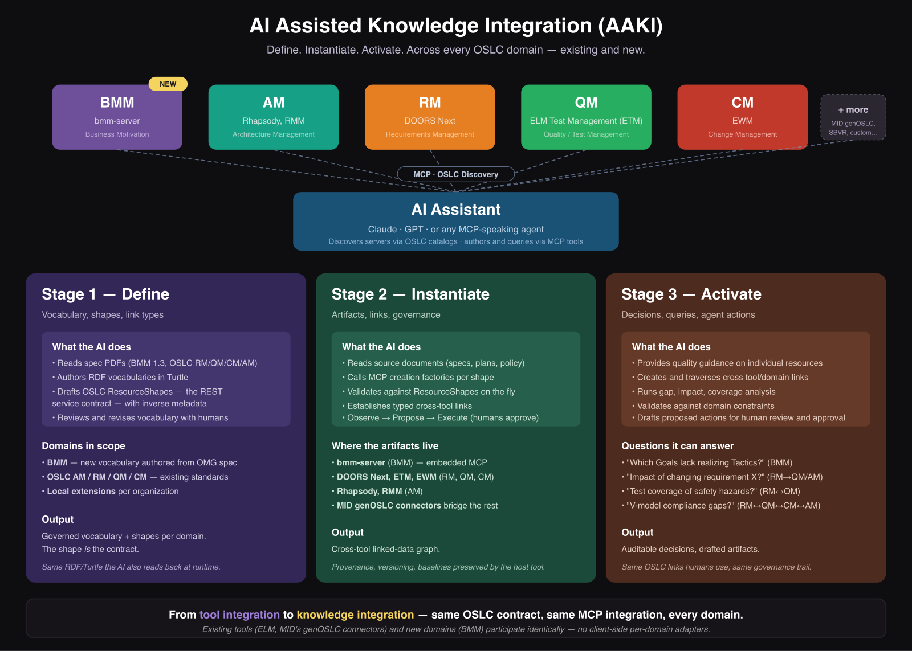
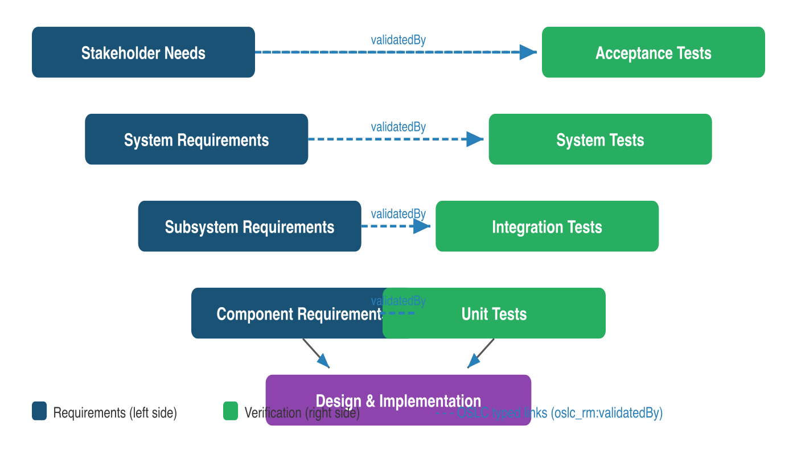
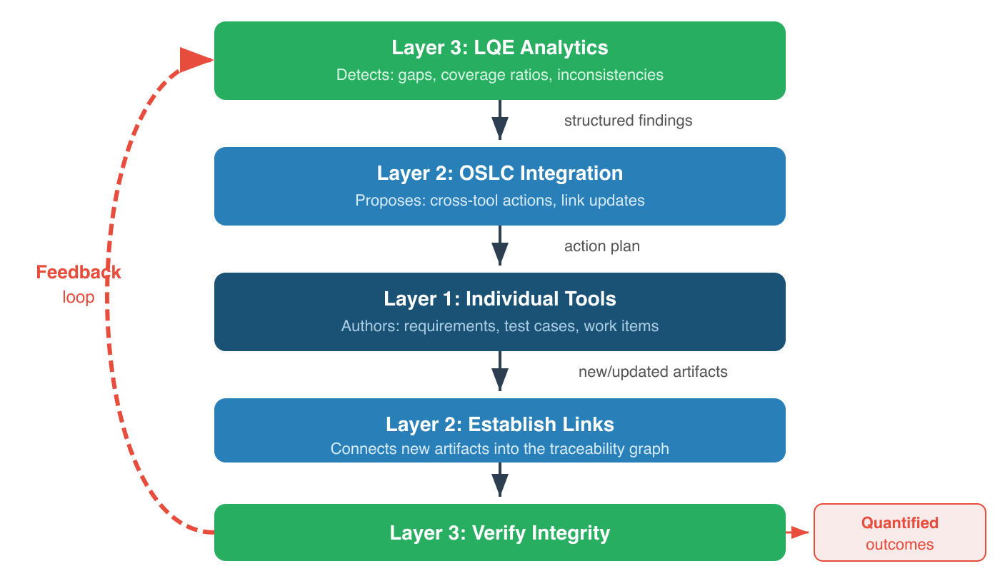

# AI Assisted Knowledge Integration

## Making the digital thread actionable — with AI assistants and OSLC

### Closing the thread's missing links and missing nodes: Define — Instantiate — Activate

---

<!-- _class: toc -->

# Contents

- [The digital thread — and why it underdelivers](#the-digital-thread--and-why-it-underdelivers)
  - [The digital thread](#the-digital-thread)
  - [Why it underdelivers](#why-it-underdelivers--a-graph-with-holes)
  - [AAKI closes the gaps](#aaki-closes-the-gaps--ai-assistants--oslc)
  - [From one domain to the whole thread](#from-one-domain-to-the-whole-thread)
  - [AAKI at a glance](#aaki-at-a-glance)
- [Define, Instantiate, Activate — the three moves](#define-instantiate-activate--the-three-moves-that-close-the-gaps)
- [Why RDF, Why Turtle](#why-rdf-why-turtle)
- [The connectivity substrate — OSLC](#the-connectivity-substrate--oslc)
- [Stage 1 — Define](#stage-1--define-add-the-missing-node)
- [A note on the "ontology"](#a-note-on-the-ontology)
- [Stage 2 — Instantiate](#stage-2--instantiate-add-the-missing-links)
- [Stage 3 — Activate](#stage-3--activate-make-the-thread-actionable)
- [Why Not Just Use AI Alone?](#why-not-just-use-ai-alone)
- [Collaborators, Not Agents](#collaborators-not-agents-on-the-raci-chart)
- [BMM Server: Working Example](#bmm-server-a-complete-working-example)
- [Why now](#why-now)
- [Key Takeaway](#key-takeaway)
- [AI-Assisted V-Model](#applying-aaki-to-an-ai-assisted-v-model)
- [Three Layers of AI Assistance](#three-layers-of-ai-assistance)
- [Scenario: Requirements Change](#scenario-requirements-change-impact)
- [What's in the thread, and who governs it](#whats-in-the-thread-and-who-governs-it)
- [Governance: Observe / Propose / Execute](#governance-observe--propose--execute)

---

<!-- _class: lead -->

# The digital thread — and why it underdelivers

## The lifecycle as a graph of nodes and links — and the gaps that keep it from paying off

---

# The digital thread

The Systems & Software Engineering / PLM lifecycle as the classic OSLC picture: tool and domain **nodes** — business motivation, requirements, architecture, design, implementation, test and verification, change and configuration management — connected by **links** that let data be exchanged and traced across the whole **V-model**.

That connected, traceable, queryable definition of the product *across its lifecycle* **is** the digital thread.

> The promise: trace not just *how* the product was built, but *why it was the right thing to build* — end to end, across every tool.

---

# Why it underdelivers — a graph with holes

The industry has pursued this promise for years and seen thin returns. Seen as nodes and links, two gaps dominate — and they are AAKI's primary target:

- **Missing links between nodes — the connectivity/traceability gap.** The tools are islands. Even where a link is *possible*, creating it is manual, slow, expensive, and error-prone, so it mostly doesn't happen — and links that do exist decay as their endpoints change.
- **Missing domain nodes — the data gap.** Some information has no node at all. **Business motivation and portfolio management** — *Doing the Right Things Right* — are frequently absent entirely, so the thread traces *how* something was built but not *why it was the right thing to build*.

Two more follow: data is **hard to reach** (no federation → lossy data marts), and even a complete thread is **inert** — it describes, it doesn't act.

---

# AAKI closes the gaps — AI assistants + OSLC

**AI Assisted Knowledge Integration (AAKI)** puts AI assistants to work over an OSLC linked-data substrate to close those gaps while keeping the thread governed, semantic, and compliant.

- **OSLC + connectors add the missing links** — a standardized, discoverable interface (catalog → service providers → creation factories, query capabilities, vocabularies, shapes), discoverable by AI via **MCP**.
- **Define adds the missing nodes** — model an absent domain and stand up a working OSLC server for it.
- **Instantiate populates nodes and links** — removing the linking cost from the author.
- **Activate makes the thread actionable** — gap, coverage, and impact analysis, traceability, compliance reporting, drafted proposals.

> Focus is squarely the connectivity/traceability and domain-data gaps; access and actionability follow from closing them well.

---

# From one domain to the whole thread

This is the scale-up in AAKI's ambition.

- **The original frame:** a *single* domain and the *single* OSLC server behind it — `bmm-server` is one such node.
- **The digital-thread frame:** a **collection of domains and integrated tools** — many governed nodes (some newly Defined, most existing tools exposed through OSLC connectors), woven together by the cross-domain links that make a thread.

> Define / Instantiate / Activate apply at **both** scales — to build and fill one node, and to connect, populate, and query the whole. AAKI is no longer "author a domain"; it is **close the gaps in a lifecycle-spanning thread of many domains and tools.**

---

# AAKI at a glance



---

# Define, Instantiate, Activate — the three moves that close the gaps

Turning a fragmented set of tools into a governed, semantic, actionable thread takes three distinct moves:

| Stage | The gap it closes | Answers |
|-------|-------------------|---------|
| **1. Define** | Adds a **missing node** — vocabulary + shapes, stood up as an OSLC server | What kinds of things exist? How do they relate? |
| **2. Instantiate** | Adds the **missing links** — populates nodes with resources and typed links | What are the actual resources, and how do they connect? |
| **3. Activate** | Makes the thread **actionable** — analysis, traceability, decisions | What can we decide from this connected data? |

This maps onto the classic **schema / instance / use** distinction — realized over OSLC linked data and AI-addressable via MCP.

---

# Why RDF, Why Turtle

AAKI's choice of RDF — and Turtle in particular — is no longer just an OSLC legacy. It's a deliberate fit with AI workflows.

- **RDF captures meaning, not structure** — typed entities, named relationships, inferable constraints
- **AI assistants produce and consume Turtle as fluently as prose** — Turtle expresses knowledge, not a schema-bound shape
- **Round-trippable through the system of record** — what the AI authors in Stage 2 is the same RDF the AI analyzes in Stage 3
- **Pairs with OSLC ResourceShapes** for shape-conformant authoring at speed

> Where data formats like JSON or SQL describe *structure*, RDF describes *meaning*. That's why an AI can author governed vocabulary, instances, and queries — all in the same notation.

---

# The connectivity substrate — OSLC

Closing the *connectivity* gap needs a standard way for tools to link and be discovered:

- **OSLC connectors** expose otherwise-unintegrated tools through a discoverable interface: catalog → service providers → creation factories, query capabilities, vocabularies, shapes — discoverable by AI via **MCP**.
- **Link ownership** gives every link a home and a queryable reverse direction.
- **Link validity** marks a link **suspect** when an endpoint changes — staleness made visible.
- **Configuration Management** answers "which baseline?" — traceability with version context.

> Without this substrate the AI has only text similarity — unsafe for engineering decisions. With it, the AI reasons over typed, governed, versioned links.

---

# Stage 1 — Define (add the missing node)

**The meaning layer** — establishes shared understanding before any data is created, turning an absent domain into a first-class, linkable node.

**Two complementary mechanisms:**

- **Ontology governance** (e.g., TopBraid EDG) — stakeholder review workflows, change history, version control, multi-user authoring
- **OSLC ResourceShapes** — formalize the vocabulary as a REST API contract: required properties, cardinality, allowed values, UI metadata for creation dialogs

**Reuse first, create only for gaps:**

- *Reuse* a shared concept space (SysML, PLM, OSLC RM/QM/CM/AM, BMM, FIBO) whenever it already covers the domain — Define becomes a **configuration** exercise. Most engineering domains land here.
- *Create* a new open RDF vocabulary only for a genuine conceptual gap — like business motivation, which `bmm-server` fills.

> Days or weeks, not months — and most of those days are configuration, not authoring.

---

# A note on the "ontology"

Define produces an **application vocabulary + an API/validation contract** — in the lineage of W3C **SHACL** (OSLC's ResourceShape is one of its ancestors).

- It **validates**, it does not **infer** — like schema.org and most production knowledge graphs.
- **OWL-compatible, not OWL-required**: the vocabulary is plain RDF; layer OWL over it if you wish, but reasoning is never a precondition for interoperability.
- Where an authoritative formal ontology already exists (SysML v2, ISO 15926, IOF/BFO, FIBO), Define **reuses** it as the vocabulary layer.

> AAKI's contribution is closing the thread's connectivity and data gaps — which formal ontologies do not themselves address.

---

# Stage 1 Example: BMM Vocabulary

The **bmm-server** defines the OMG Business Motivation Model 1.3 as an RDF ontology:

<div class="columns">
<div>

**Ends** (what to achieve)
- Vision
- Goal
- Objective

**Means** (how to achieve it)
- Mission
- Strategy, Tactic
- Business Policy, Business Rule

</div>
<div>

**Influencers & Assessment**
- Influencer (External/Internal)
- Assessment (SWOT)
- Potential Impact (Risk/Reward)

**Organization**
- Organization Unit
- Business Process
- Asset

</div>
</div>

**25 classes, 49 properties, 14 ResourceShapes**

---

# Stage 1 Example: BMM Relationships

The ontology defines precisely how concepts connect. These typed relationships are what make queries, traceability, and AI analysis precise.


---

# Stage 2 — Instantiate (add the missing links)

**The artifact layer** — the transition from ontology experts to **subject matter experts**, populating the node with resources *and the typed links between them*.

**What it produces:**
- Actual resources — requirements, plans, assessments, strategies
- Typed cross-resource and cross-domain links
- Version history and governance state (draft, approved, baselined)

**Configuration management** (streams, baselines, change sets) gives this stage its temporal dimension — reasoning about "the system as of this baseline" rather than just today's snapshot.

> The linking cost moves off the author. The AI never delivers without approval. The incentive problem that kept the thread sparse dissolves.

---

<!-- _class: small-text -->

# Stage 2 Example: EU-Rent

*All examples from the actual OMG BMM 1.3 specification, populated by AI reading the PDF.*

| BMM Concept | EU-Rent Examples in Spec |
|-------------|------------------------|
| Vision | 1 — premium brand car rental |
| Goals | 4 — premium brand, customer service, well-maintained cars, availability |
| Objectives | 4 — A C Nielsen ratings, customer satisfaction, breakdown rate |
| Mission | 1 — car rental across Europe and North America |
| Strategies | 3+ — nationwide operation, car purchase/disposal, rewards scheme |
| Tactics | 5+ — encourage extensions, outsource maintenance, standard specs, etc. |
| Business Policies | 5+ — minimize depreciation, guarantee payments, no exports, etc. |
| Business Rules | 6+ — match spec, lowest mileage, driver's license, service scheduling, etc. |
| Influencers | 28+ — competitors, customers, regulations, technology, etc. |
| Assessments | 6+ — SWOT: strengths, weaknesses, opportunities, threats |
| Potential Impacts | 5+ — risks and rewards |

---

<!-- _class: small-text -->

# AI Transforms Stage 2

Traditionally, Stage 2 was the bottleneck — entirely human-authored through forms and structured editors.

**With MCP (Model Context Protocol), AI becomes a first-class collaborator** — and because everything flows in Turtle, the AI's authoring round-trips cleanly through the same governed system of record:

1. AI **learns the domain model** from MCP resources (vocabulary, shapes, catalog)
2. AI **reads source documents** (specifications, plans, policy documents)
3. AI **identifies instances** — Visions, Goals, Strategies, Assessments
4. AI **creates and links resources** directly via the OSLC server API
5. AI **validates** against ResourceShape constraints

> *"Read the BMM 1.3 specification and create all the EU-Rent example artifacts and relationships described in the document."*

---

# Stage 3 — Activate (make the thread actionable)

**The value layer** — use the connected thread to drive decisions. Without it, Stages 1 and 2 produce a beautifully governed but unused knowledge graph.

Natural-language questions, cross-domain queries, "what-if" analyses, gap and coverage detection, impact analysis, compliance reports, traceability views — all over the same governed graph, with the same provenance, configuration context, and approval state.

**Three activation mechanisms:**

| Mechanism | Use | Example |
|-----------|-----|---------|
| **LQE — SPARQL/SQL** | Analytical | Traceability reports, coverage metrics, validation |
| **MCP Endpoint** | Agentic | AI reasoning over live data, proposing changes |
| **Tool Integrations** | Operational | Engineers seeing linked data in DOORS Next, EWM, Polarion |

---

# Stage 3 Example: MCP Endpoint

The bmm-server exposes an MCP endpoint at `/mcp` with **34 dynamically generated tools:**

<div class="columns">
<div>

**14 create tools**
- one per BMM resource type

**1 query capability**
- for all BMM resource types

</div>
<div>

**6 generic tools**
- create_service_provider
- get_resource, update_resource
- delete_resource
- list_resource_types, query_resources

**3 MCP resources (for AI learning)**
- oslc://vocabulary
- oslc://shapes
- oslc://catalog

</div>
</div>

---

# The Feedback Loop

This creates a virtuous cycle that didn't exist before MCP:


---

# Why Not Just Use AI Alone?

> *"Can't we just feed all our documents to an LLM and ask it questions?"*

**Yes — but AI outputs are ephemeral.** A conversation produces text, not governed artifacts — and no links across the thread.

| Concern | AI Alone | AI + OSLC Server |
|---------|----------|-------------------|
| **Audit trail** | "Claude said so" | Versioned artifact with provenance |
| **Persistence** | Different answer next month | Living model with change history |
| **Interoperability** | Prose output | Machine-consumable linked data (RDF) |
| **Governance** | Chat session | Review workflows, access controls, sign-off |
| **Precision** | Fluent non-answers | Visible, queryable gaps |
| **Repeatability** | Statistical approximation | Deterministic queries on governed data |

---

# Why the governed thread makes AI reliable

**AI needs structure to be trustworthy — the thread supplies it:**

- **The ontology gives the AI a map.** Without it, the AI is an expensive search engine producing fluent but structurally ungrounded answers.
- **Explicit gaps vs. hallucination.** A gap in the model is a *visible, queryable* gap — not a fluent non-answer.
- **Quantitative analytics.** Shape-governed data delivers precise, repeatable results for compliance reporting and impact analysis.

**And AI brings capability the system of record never had:**

- **Authoring acceleration** — SMEs who can't write RDF contribute conversationally; the AI translates intent into ontology-conformant resources.
- **Analytical depth** — the AI consumes the entire linked graph, finding gaps, contradictions, and inconsistencies across hundreds of interconnected resources.
- **Humans in the loop** — stakeholder viewpoints keep humans engaged and accountable for action and outcome.

---

# Collaborators, Not Agents on the RACI Chart

AI assistants in AAKI are **collaborators, not agents replacing people**.

They draft vocabulary, populate instances, traverse the graph for analysis, and propose actions — **but they do not appear on a RACI chart.**

- Humans remain **Responsible** and **Accountable** for every decision the system records.
- The AI accelerates the work; the **governance trail** (provenance, versioning, approval state, configuration context) proves the human owned the outcome.
- A conversation with an AI is not a decision; an **artifact in a governed repository, attributed to a named human**, is.

> AAKI's job is to make the gap between those two as small and as fast as possible — without erasing it.

---

# The Integrated Architecture


---

<!-- _class: small-text -->

# BMM Server: A Complete Working Example

One node of a digital thread — the business-motivation domain, a real *data-gap* fill. **Scaffolded with `create-oslc-server.ts` from the AI-authored vocabulary and shapes:**

```bash
npx tsx create-oslc-server.ts --name bmm-server --port 3005 \
  --vocab BMM.ttl --shapes BMM-Shapes.ttl \
  --managed Vision,Goal,Objective,Mission,Strategy,Tactic,...,Asset   # 14 BMM classes
```

| Aspect | Implementation |
|--------|---------------|
| **Domain** | OMG Business Motivation Model 1.3 |
| **Stage 1 — Define** | 25 classes, 49 properties in BMM.ttl; 14 ResourceShapes (for concrete classes), created with AI assistance from the OMG BMM Specification |
| **Stage 2 — Instantiate** | RDF triple store (Jena Fuseki); EU-Rent example from BMM 1.3 spec, populated by AI |
| **Stage 3 — Activate** | OSLC REST API + MCP endpoint (34 tools) + oslc-browser UI |

> Real shapes. Real OSLC server. Real MCP endpoints. Not slide-ware.

---

# Why now

- **RDF was built for this.** Turtle expresses *meaning*, not just structure — AI assistants are unusually fluent in it.
- **OSLC was built for this.** Typed, governed, linked artifacts across tools is the substrate AI needs to reason reliably.
- **AI is the missing component.** A 6-month manual integration becomes a 6-week guided collaboration; a thread nobody queried becomes one everyone queries.

> Stages 1 and 2 used to be too expensive to justify Stage 3. AI changes that economics — the linking cost that kept the thread sparse moves off the author.

---

# Key Takeaway

**AAKI** positions ontologies and OSLC servers not as alternatives to AI, but as the infrastructure that makes AI-assisted work — and the digital thread itself — auditable, repeatable, governable, and interoperable.

- **Auditable** — every resource has provenance and version history
- **Repeatable** — deterministic queries on governed data, not statistical approximation
- **Governable** — review workflows, access controls, multi-stakeholder sign-off
- **Interoperable** — machine-consumable linked data across tools and organizations

> The OSLC server is the **system of record**.
> The AI is the most capable **authoring and analysis tool** that system of record has ever had.
> The shared vocabulary is what makes their collaboration **precise** rather than statistically approximate.
> RDF is the **lingua franca** that lets the AI and the system of record exchange knowledge without translation loss.

---

<!-- _class: small-text -->

# Authoring skills

This workspace ships three Claude Code skills under `.claude/skills/` — one per AAKI stage — so AI assistants helping with the codebase apply the same conventions consistently.

| Skill | Use when... |
|---|---|
| **aaki-define** | creating or extending an OSLC domain — vocabulary + shapes + HTML |
| **aaki-instantiate** | populating an OSLC server via MCP from a source document |
| **aaki-activate** | extracting value — gap / impact / coverage / Observe-Propose-Execute |

Picked up **automatically** when the description matches the user's request.

To invoke explicitly: *"use the aaki-define / aaki-instantiate / aaki-activate skill"*.

> Each skill is self-contained with reusable prompt templates that work for any OSLC domain — and respects the user's RACI position (credentials, working context, no delivery / merge / promote on the user's behalf).

---

# Applying AAKI to an AI-Assisted V-Model

AAKI applies not just to individual OSLC servers, but to the **entire systems engineering lifecycle** — the whole digital thread.



In OSLC terms, each traceability link is **typed** — the V-model's traceability is a **live link graph** spanning tools.

---

# Three Layers of AI Assistance

> *These are Activate's three facets in an integrated tool chain — distinct from AAKI's Stage 1/2/3 above.*

An AI assistant connected via MCP to an integrated tool chain operates at three layers:

| Layer | Scope | MCP Access | Example |
|-------|-------|------------|---------|
| **1. Tool-Local** | Single tool | Tool's own MCP | DOORS Next AI improves requirement quality |
| **2. Integration** | Cross-tool | OSLC server MCP | "Which requirements lack test cases?" |
| **3. Analytics** | Lifecycle-wide | LQE/TRS MCP | Coverage ratios, compliance, impact analysis |

**Layer 1** improves authoring within each tool silo.
**Layer 2** enables cross-tool reasoning over the OSLC link graph.
**Layer 3** provides efficient read-only analytics across the entire lifecycle.

---

<!-- _class: small-text -->

# Scenario: Requirements Change Impact

An engineer changes a system requirement: performance threshold from 100ms to 50ms.

**Phase 1 — Impact Discovery (Layer 3, LQE)**
AI queries the materialized graph for full downstream impact.
Result: "3 subsystem requirements, 12 component requirements, 8 test cases (2 passing, 3 draft, 3 missing), 4 work items affected"

**Phase 2 — Triage and Planning (Layer 2, OSLC)**
AI traverses live links to assess each affected artifact. Flags test cases needing updates. Identifies pre-existing coverage gaps made urgent by the change.

**Phase 3 — Assisted Authoring (Layer 1, Tools)**
ETM: drafts updated test procedures. DOORS Next: proposes revised subsystem allocations. EWM: creates linked change requests.

**Phase 4 — Verification (Layer 3, LQE)**
AI re-queries to confirm all gaps closed, coverage restored.

---

# The V-Model Feedback Loop



This is **AAKI applied to the lifecycle**: vocabularies define valid traceability, tools instantiate artifacts and links, analytics activate the data — feeding back into new versions.

---

# What's in the thread, and who governs it

- **The V-model is what's in the thread** — motivation and portfolio at the top, down the left through requirements/architecture/design to implementation, up the right through integration/verification/validation into operation.
- **ASPICE and ISO 26262 govern its evolution** — they sit *off to the side*, each with its **own OSLC vocabulary**, linking *into* the thread's artifacts.
- An ASPICE process outcome or an ISO 26262 safety requirement is a **governed resource** linked to the requirements, designs, and tests it attests to.

> Because criteria *and* evidence are linked data, conformance can be assessed **continuously over the live thread** — compliance becomes a confirmation, not a crisis. AAKI's job is to close the gaps; ASPICE and ISO 26262 attach to the closed thread to govern it.

---

# Governance: Observe / Propose / Execute

Governance ensures intended outcomes with proper authority and approval traceability. The AI operates *within* OSLC access controls — it authenticates with the user's identity, and the same role-based permissions apply whether the request comes from a browser or from an AI through MCP.

| Level | AI Action | Approval | Example |
|-------|-----------|----------|---------|
| **Observe** | Query and report | None needed | LQE gap analysis, coverage reports |
| **Propose** | Draft artifacts in "Draft" state | Human review required | AI-generated test cases, requirement updates |
| **Execute** | Create links by policy | Pre-authorized | Mechanical linking: test case to requirement |

> Collaborator, not agent. The AI never bypasses governance.

---

# Governance: Traceability and Metrics

**Traceability of AI actions** — Every AI action records provenance: what triggered it, what analysis justified it, what policy authorized it, what human approved it. TRS propagates these records to LQE.

**Quantifiable outcomes:**

| Metric | What It Measures |
|--------|-----------------|
| Coverage ratio | Requirement-to-test traceability before and after |
| Gap closure rate | Gaps resolved per cycle |
| Change propagation completeness | Downstream artifacts updated within time window |
| Consistency scores | SHACL validation against V-model structural rules |
| Cycle time | Requirement change to verified traceability closure |

> These metrics measure the **engineering process**, not the AI. The AI makes the process faster and more complete.

---

# Thank You

> *The digital thread's promise was traceability; its unmet need was action. AAKI uses AI assistants and OSLC to close the thread's missing links and missing nodes — then lets experts populate it and everyone query it — so the organization can Do the Right Things Right, and let ASPICE and ISO 26262 govern the thread's evolution over trustworthy, connected data.*

**Resources:**

- oslc4js repository: [github.com/OSLC/oslc4js](https://github.com/OSLC/oslc4js)
- BMM Server: [oslc4js/bmm-server/](https://github.com/OSLC/oslc4js/tree/master/bmm-server)
- AAKI Overview: [oslc4js/docs/AAKI-Overview.md](https://github.com/OSLC/oslc4js/blob/master/docs/AAKI-Overview.md)
- AAKI framework: [oslc4js/docs/AAKI.md](https://github.com/OSLC/oslc4js/blob/master/docs/AAKI.md)
- AAKI BMM walkthrough: [oslc4js/docs/AAKI-Example.md](https://github.com/OSLC/oslc4js/blob/master/docs/AAKI-Example.md)
- OSLC specifications: [open-services.net](https://open-services.net)
- OMG BMM 1.3: [omg.org/spec/BMM/1.3](https://www.omg.org/spec/BMM/1.3)
