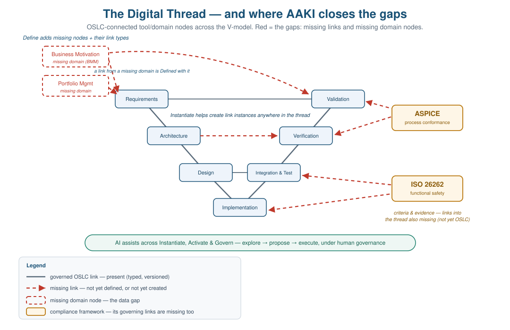
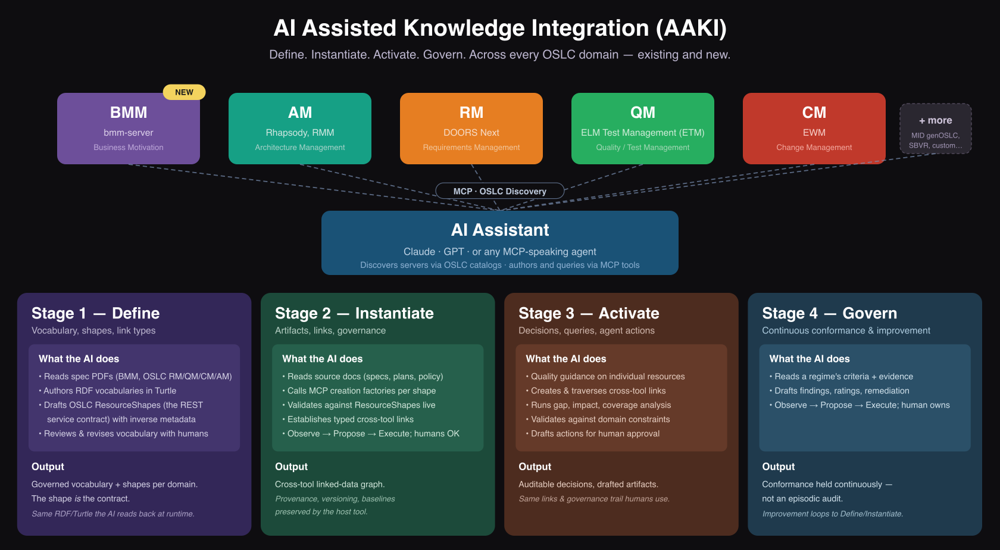
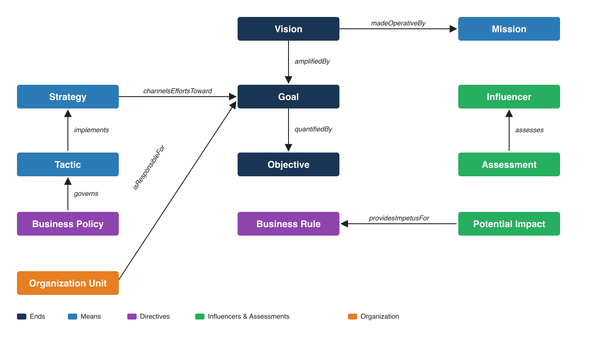
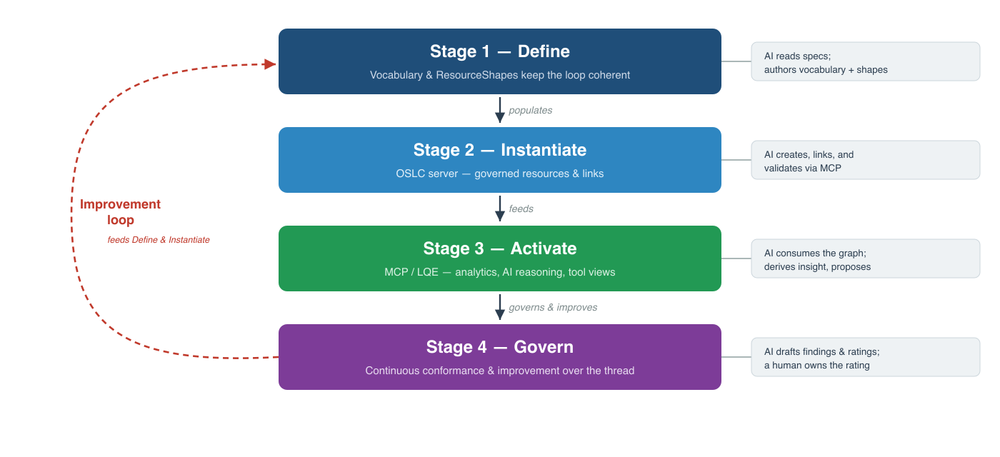
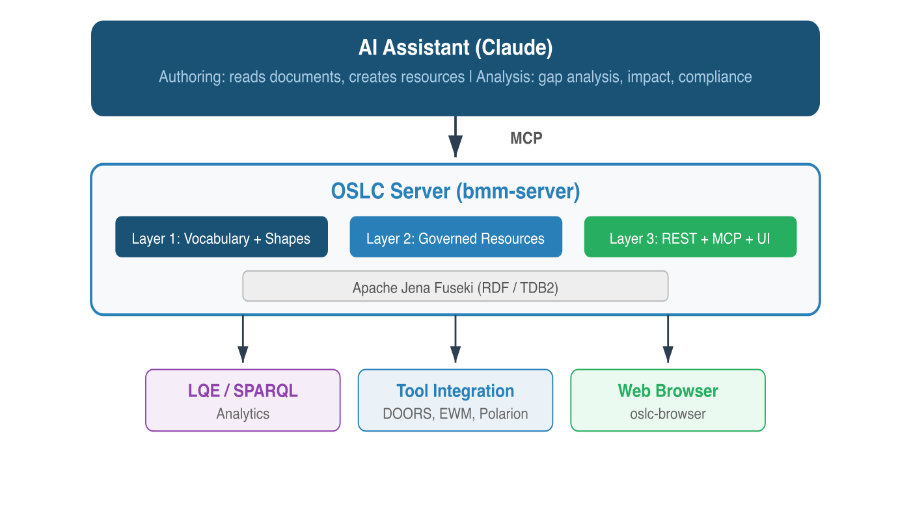

# AI Assisted Knowledge Integration

## Making the digital thread actionable — with AI assistants and OSLC

### Define — Instantiate — Activate — Govern

---

<!-- _class: toc -->

# Contents

- [The digital thread — and its challenges](#the-digital-thread--and-its-challenges)
  - [Challenges — a graph with holes and limited governance](#challenges--a-graph-with-holes-and-limited-governance)
  - [AAKI closes the gaps](#aaki-closes-the-gaps--ai-assistants--oslc)
  - [AAKI at a glance](#aaki-at-a-glance)
- [BMM Server: A Complete Working Example](#bmm-server-a-complete-working-example)
- [The four moves — Define / Instantiate / Activate / Govern](#define-instantiate-activate-govern--the-four-moves-that-close-the-gaps)
  - [Stage 1 — Define](#stage-1--define-add-the-missing-node)
  - [Stage 2 — Instantiate](#stage-2--instantiate-help-create-the-missing-links)
  - [Stage 3 — Activate](#stage-3--activate-make-the-thread-actionable)
  - [Stage 4 — Govern](#stage-4--govern-govern-the-threads-evolution)
- [The Integrated Architecture](#the-integrated-architecture)
- [Why now](#why-now) · [Key Takeaway](#key-takeaway) · [Authoring skills](#authoring-skills)
- [Backup](#backup)

---

# The digital thread — and its challenges

The Systems & Software Engineering / PLM lifecycle as the classic OSLC picture: tool and domain **nodes** (business motivation, requirements, architecture, design, implementation, verification, change & configuration management, …) connected by **links** that exchange and trace data across the whole **V-model** — a connected, traceable, queryable definition of the product across its lifecycle.

> Organizations have bought into the digital thread and want its value — tracing not just *how* the product was built but *why it was the right thing to build*. The challenge is **realizing** it; AAKI is how.

---

# Challenges — a graph with holes and limited governance

Organizations understand the digital thread and want its value; the challenge is realizing it. Seen as nodes and links, three challenges stand in the way:

- **Missing links between nodes — the connectivity/traceability gap.** The tools are islands. Even where a link is *possible*, creating it is manual, slow, expensive, and error-prone, so it mostly doesn't happen — and links that do exist decay as their endpoints change.
- **Missing domain nodes — the data gap.** Some information has no node at all. **Business motivation and portfolio management** — *Doing the Right Things Right* — are frequently absent entirely, so the thread traces *how* something was built but not *why it was the right thing to build*.

- **Ungoverned evolution — the governance & continuous-improvement gap.** Even a connected, populated thread only pays off if it's reachable, acted on, and governed as it evolves. Today it's often **hard to reach** (no federation → lossy data marts) and **inert** (exploiting it stays manual), and conformance lives *outside* the thread in episodic audits with no feedback loop — so it never drives the continuous conformance and improvement where the value is realized.

---

# AAKI closes the gaps — AI assistants + OSLC

**AI Assisted Knowledge Integration (AAKI)** puts AI assistants to work over an OSLC linked-data substrate to close those gaps while keeping the thread governed, semantic, and compliant.

- **Define adds the missing nodes — and defines the link *types*** — model an absent domain, stand it up as an OSLC server, and declare the vocabulary + shapes that make cross-tool links *expressible* as governed, versioned OSLC links.
- **OSLC + connectors expose the tools** — a standardized, discoverable interface (catalog → service providers → creation factories, query capabilities, vocabularies, shapes), discoverable by AI via **MCP**, so the links have somewhere to live.
- **Instantiate helps *create* the missing links** — populating nodes with resources and the typed links between them, moving the linking cost off the author.
- **Activate makes the thread actionable** — gap, coverage, and impact analysis, traceability, compliance reporting, drafted proposals.
- **Govern turns the connected thread into sustained value** — continuous conformance and improvement against whatever governance regimes apply.

> The missing-link gap has **one cause, two remedies**: a link is missing either because it was never *defined* in a machine-readable way (Define) or never *created* (Instantiate).

---

# AAKI at a glance

---

<!-- _class: small-text -->

# BMM Server: A Complete Working Example

The **running example throughout this deck** — one node of a digital thread, the business-motivation domain, a real *data-gap* fill.

**Why BMM?**

- A **non-trivial ontology** that has **no existing OSLC server** — so it genuinely exercises Define.
- Backed by a **well-crafted source document** (the OMG BMM 1.3 specification) for the AI to read.
- It may **fill an important gap in the V-model** — making sure the business is addressing the *right requirements* and delivering the *right products* (*Doing the Right Things Right*).

| Aspect | Implementation |
|--------|---------------|
| **Domain** | OMG Business Motivation Model 1.3 |
| **Stage 1 — Define** | 25 classes, 49 properties in BMM.ttl; 14 ResourceShapes (for concrete classes), created with AI assistance from the OMG BMM Specification |
| **Stage 2 — Instantiate** | RDF triple store (Jena Fuseki); EU-Rent example from BMM 1.3 spec, populated by AI |
| **Stage 3 — Activate** | OSLC REST API + MCP endpoint + oslc-browser UI |

> Real shapes. Real OSLC server. Real MCP endpoints. Not slide-ware. The next slides trace the four stages on this server.

---

# Define, Instantiate, Activate, Govern — the four moves that close the gaps

Turning a fragmented set of tools into a governed, semantic, actionable thread takes four distinct moves:

| Stage | The gap it closes | Answers |
|-------|-------------------|---------|
| **1. Define** | Adds a **missing node** — vocabulary + shapes (incl. link **types**), stood up as an OSLC server | What kinds of things exist? How do they relate? |
| **2. Instantiate** | Helps **create the missing links** — populates nodes with resources and typed links | What are the actual resources, and how do they connect? |
| **3. Activate** | Makes the thread **actionable** — analysis, traceability, decisions | What can we decide from this connected data? |
| **4. Govern** | Governs the thread's **evolution** — continuous conformance + process improvement against whatever governance regimes apply | Does it still conform, and where can it improve? |

The first three map onto the classic **schema / instance / use** distinction; **Govern** adds a fourth *evolution* layer over it — all realized over OSLC linked data and AI-addressable via MCP.

> Define the model, Instantiate the data and links, Activate for decisions, Govern its evolution. *(Each stage below: what it covers → how AI helps → example.)*

---

# Stage 1 — Define (add the missing node)

**What it covers — the meaning layer.** Establishes shared understanding before any data is created, turning an absent domain into a first-class, linkable node. Two complementary mechanisms:

- **Ontology governance** (e.g., TopBraid EDG) — stakeholder review workflows, change history, version control, multi-user authoring.
- **OSLC ResourceShapes** — formalize the vocabulary as a REST API contract: required properties, cardinality, allowed values, UI metadata for creation dialogs. *(The vocabulary validates rather than infers — an application vocabulary + API contract in the SHACL lineage, OWL-compatible but not OWL-required; see [Backup: A note on the "ontology"](#a-note-on-the-ontology).)*

**How AI helps.** The AI reads spec/policy PDFs, drafts the open RDF vocabulary in Turtle, and authors the ResourceShapes — *reusing* a shared concept space (SysML, PLM, OSLC RM/QM/CM/AM, BMM, FIBO) whenever one covers the domain (Define becomes configuration; most engineering domains land here), and *creating* a new vocabulary only for a genuine gap like business motivation, which `bmm-server` fills.

> Days or weeks, not months — and most of those days are configuration, not authoring.

---

# Stage 1 Example: Vocabulary and Constraints

An AI assistant (Claude), using the **aaki-define** skill, produced the **bmm-server**'s domain resources — the open RDF vocabulary and the OSLC ResourceShape constraints — from the OMG Business Motivation Model 1.3 specification:

**Ends** (what to achieve)
- Vision
- Goal
- Objective

**Means** (how to achieve it)
- Mission
- Strategy, Tactic
- Business Policy, Business Rule

**Influencers & Assessment**
- Influencer (External/Internal)
- Assessment (SWOT)
- Potential Impact (Risk/Reward)

**Organization**
- Organization Unit
- Business Process
- Asset

**25 classes, 49 properties, 14 ResourceShapes**

---

# Stage 1 Example: BMM Relationships

The ontology defines precisely how concepts connect. These typed relationships are what make queries, traceability, and AI analysis precise.

---

# Stage 2 — Instantiate (help create the missing links)

**What it covers — the artifact layer.** The transition from ontology experts to **subject matter experts**, populating the node with resources *and the typed links between them*:

- Actual resources — requirements, plans, assessments, strategies.
- Typed cross-resource and cross-domain links.
- Version history and governance state (draft, approved, baselined).

**Configuration management** (streams, baselines, change sets) gives this stage its temporal dimension — reasoning about "the system as of this baseline" rather than just today's snapshot.

> The linking cost moves off the author. The AI never delivers without approval. The incentive problem that kept the thread sparse dissolves.

---

<!-- _class: small-text -->

# AI Transforms Stage 2

**How AI helps.** Traditionally, Stage 2 was the bottleneck — entirely human-authored through forms and structured editors. With MCP (Model Context Protocol), AI becomes a first-class collaborator — and because everything flows in Turtle, the AI's authoring round-trips cleanly through the same governed system of record:

1. AI **learns the domain model** from MCP resources (vocabulary, shapes, catalog)
2. AI **reads source documents** (specifications, plans, policy documents)
3. AI **identifies instances** — Visions, Goals, Strategies, Assessments
4. AI **creates and links resources** directly via the OSLC server API
5. AI **validates** against ResourceShape constraints

> *"Read the BMM 1.3 specification and create all the EU-Rent example artifacts and relationships described in the document."*

---

<!-- _class: small-text -->

# Stage 2 Example: EU-Rent

*All examples from the actual OMG BMM 1.3 specification, populated by AI reading the PDF.*

| BMM Concept | EU-Rent Examples in Spec |
|-------------|------------------------|
| Vision | 1 — premium brand car rental |
| Goals | 4 — premium brand, customer service, well-maintained cars, availability |
| Objectives | 4 — A C Nielsen ratings, customer satisfaction, breakdown rate |
| Mission | 1 — car rental across Europe and North America |
| Strategies | 3+ — nationwide operation, car purchase/disposal, rewards scheme |
| Tactics | 5+ — encourage extensions, outsource maintenance, standard specs, etc. |
| Business Policies | 5+ — minimize depreciation, guarantee payments, no exports, etc. |
| Business Rules | 6+ — match spec, lowest mileage, driver's license, service scheduling, etc. |
| Influencers | 28+ — competitors, customers, regulations, technology, etc. |
| Assessments | 6+ — SWOT: strengths, weaknesses, opportunities, threats |
| Potential Impacts | 5+ — risks and rewards |

---

# Stage 3 — Activate (make the thread actionable)

**What it covers — the value layer.** Use the connected thread to drive decisions. Without it, Stages 1 and 2 produce a beautifully governed but unused knowledge graph.

**How AI helps.** Natural-language questions, cross-domain queries, "what-if" analyses, gap and coverage detection, impact analysis, compliance reports, traceability views — all over the same governed graph, with the same provenance, configuration context, and approval state. Three activation mechanisms:

| Mechanism | Use | Example |
|-----------|-----|---------|
| **LQE — SPARQL/SQL** | Analytical | Traceability reports, coverage metrics, validation |
| **MCP Endpoint** | Agentic | AI reasoning over live data, proposing changes |
| **Tool Integrations** | Operational | Engineers seeing linked data in DOORS Next, EWM, Polarion |

---

# Stage 3 Example: MCP Endpoint

The bmm-server's MCP endpoint at `/mcp` exposes dynamically generated **tools** an AI client can call:

**Per-type tools**
- **14 create tools** — one per BMM resource type
- **1 query capability** — across all BMM resource types

**Generic tools**
- CRUD / query: `get_resource` · `update_resource` · `delete_resource` · `query_resources`
- Discovery / setup: `read_catalog` · `read_service_provider` · `provision_service_provider` · `use_configuration`

Vocabulary, shapes, and catalog context — once separate MCP resources — are now discovered via the **`read_service_provider`** tool.

> *These reflect refinements in the generic-framework implementation; oslc4js will adopt them.*

---

# The Feedback Loop

The stages form a virtuous cycle that didn't exist before MCP: the AI helps **create** the data (Instantiate), **consumes** it to drive decisions (Activate), and **governs** its evolution (Govern) — surfacing improvements that feed back into Define and Instantiate.

> *Diagram note: `feedback-loop.png` predates the fourth stage — it should be regenerated to add the **Govern** stage and to label the cycle by **stage**, not layer.*

---

# Stage 4 — Govern (govern the thread's evolution)

**What it covers — the evolution layer.** Hold the assembled thread to the governance regimes that apply to it, *as it changes over time*.

- **Regimes are optional and plural.** Common examples are **ASPICE** and **ISO 26262**, but the model is **regime-agnostic** — IEC 61508, DO-178C, ISO 9001, internal quality gates. Each regime's criteria are captured as **governed OSLC data**, each criterion **linked** to the thread artifacts that are its evidence.
- **Continuous conformance, not episodic audit.** Because criteria *and* evidence are linked data, conformance is assessed continuously over the live thread — a continuously-held **state**, not a report reconstructed at audit time.
- **How AI helps — AI drafts, a human owns the rating.** Under **Observe-Propose-Execute**, the AI drafts findings, conformance ratings, and remediation; the **official rating stays with an accountable human**.
- **Closes the loop.** The same thread that shows conformance also surfaces **process-improvement** signals — where the process itself should get better.

> Distinct from the cross-cutting governance *discipline* (RACI, Observe-Propose-Execute, provenance) that runs through all four stages: Govern is the **stage** whose subject is conformance and improvement of the thread's evolution.

---

# Stage 4 — The V-model as the governed thread

The V-model *is* what's in the thread — a live, typed OSLC link graph, decomposition down the left and integration & verification up the right. Governance regimes attach from the side, each with its **own OSLC vocabulary**, linking *into* the artifacts that are their evidence:

> A regime criterion (an ASPICE process outcome, an ISO 26262 safety requirement) is a governed resource linked to the requirements, designs, and tests it attests to — so conformance is assessed continuously over the live thread.

---

# Stage 4 — Governance: Observe / Propose / Execute

Governance ensures intended outcomes with proper authority and approval traceability. The AI operates *within* OSLC access controls — it authenticates with the user's identity, and the same role-based permissions apply whether the request comes from a browser or from an AI through MCP.

| Level | AI Action | Approval | Example |
|-------|-----------|----------|---------|
| **Observe** | Query and report | None needed | LQE gap analysis, coverage reports |
| **Propose** | Draft artifacts in "Draft" state | Human review required | AI-generated test cases, requirement updates |
| **Execute** | Create links by policy | Pre-authorized | Mechanical linking: test case to requirement |

> Collaborator, not agent. The AI never bypasses governance. *(This is the cross-cutting governance discipline — RACI, provenance — applied at the Govern stage.)*

---

# Stage 4 — Traceability and Metrics

**Traceability of AI actions** — every AI action records provenance: what triggered it, what analysis justified it, what policy authorized it, what human approved it. TRS propagates these records to LQE. Because criteria and evidence are *versioned* linked data, this history yields **metrics over time**:

| Metric | What It Measures |
|--------|-----------------|
| Coverage ratio | Requirement-to-test traceability before and after |
| Gap closure rate | Gaps resolved per cycle |
| Change propagation completeness | Downstream artifacts updated within time window |
| Consistency scores | SHACL validation against V-model structural rules |
| Cycle time | Requirement change to verified traceability closure |

> These metrics measure the **engineering process**, not the AI. The AI makes the process faster and more complete — and the V-model feedback loop turns them into continuous improvement.

---

# The Integrated Architecture

---

# Why now

- **RDF was built for this.** Turtle expresses *meaning*, not just structure — AI assistants are unusually fluent in it.
- **OSLC was built for this.** Typed, governed, linked artifacts across tools is the substrate AI needs to reason reliably.
- **AI is the missing component.** A 6-month manual integration becomes a 6-week guided collaboration; a thread nobody queried becomes one everyone queries.

> Stages 1 and 2 used to be too expensive to justify Stage 3. AI changes that economics — the linking cost that kept the thread sparse moves off the author.

---

# Key Takeaway

**AAKI** positions ontologies and OSLC servers not as alternatives to AI, but as the infrastructure that makes AI-assisted work — and the digital thread itself — auditable, repeatable, governable, and interoperable.

- **Auditable** — every resource has provenance and version history
- **Repeatable** — deterministic queries on governed data, not statistical approximation
- **Governable** — review workflows, access controls, multi-stakeholder sign-off
- **Interoperable** — machine-consumable linked data across tools and organizations

> The OSLC server is the **system of record**.
> The AI is the most capable **authoring and analysis tool** that system of record has ever had.
> The shared vocabulary is what makes their collaboration **precise** rather than statistically approximate.
> RDF is the **lingua franca** that lets the AI and the system of record exchange knowledge without translation loss.

---

<!-- _class: small-text -->

# Authoring skills

This workspace ships three Claude Code skills under `.claude/skills/` — for the first three AAKI stages — so AI assistants helping with the codebase apply the same conventions consistently. (Govern is the fourth stage; a dedicated skill may follow.)

| Skill | Use when... |
|---|---|
| **aaki-define** | creating or extending an OSLC domain — vocabulary + shapes + HTML |
| **aaki-instantiate** | populating an OSLC server via MCP from a source document |
| **aaki-activate** | extracting value — gap / impact / coverage / Observe-Propose-Execute |

Picked up **automatically** when the description matches the user's request. To invoke explicitly: *"use the aaki-define / aaki-instantiate / aaki-activate skill"*.

> Each skill is self-contained with reusable prompt templates that work for any OSLC domain — and respects the user's RACI position (credentials, working context, no delivery / merge / promote on the user's behalf).

---

# Thank You

> *The digital thread's promise was traceability; its unmet need was action. AAKI uses AI assistants and OSLC to close the thread's missing links and missing nodes — then lets experts populate it and everyone query it — so the organization can Do the Right Things Right, and Govern the thread's evolution against whatever governance regimes apply (ASPICE, ISO 26262, and others) as a continuously-held state over trustworthy, connected data.*

**Resources:**

- oslc4js repository: [github.com/OSLC/oslc4js](https://github.com/OSLC/oslc4js)
- BMM Server: [oslc4js/bmm-server/](https://github.com/OSLC/oslc4js/tree/master/bmm-server)
- AAKI Overview: [oslc4js/docs/AAKI-Overview.md](https://github.com/OSLC/oslc4js/blob/master/docs/AAKI-Overview.md)
- AAKI framework: [oslc4js/docs/AAKI.md](https://github.com/OSLC/oslc4js/blob/master/docs/AAKI.md)
- AAKI BMM walkthrough: [oslc4js/docs/AAKI-Example.md](https://github.com/OSLC/oslc4js/blob/master/docs/AAKI-Example.md)
- OSLC specifications: [open-services.net](https://open-services.net)
- OMG BMM 1.3: [omg.org/spec/BMM/1.3](https://www.omg.org/spec/BMM/1.3)

---

# Backup

Supporting detail — good to cover, not fundamental to the storyline. Jump to a topic:

- [Why RDF, Why Turtle](#why-rdf-why-turtle)
- [The connectivity substrate — OSLC](#the-connectivity-substrate--oslc)
- [A note on the "ontology"](#a-note-on-the-ontology)
- [Why Not Just Use AI Alone?](#why-not-just-use-ai-alone)
- [Why the governed thread makes AI reliable](#why-the-governed-thread-makes-ai-reliable)
- [Collaborators, Not Agents on the RACI Chart](#collaborators-not-agents-on-the-raci-chart)
- [Three Layers of AI Assistance](#three-layers-of-ai-assistance)
- [Scenario: Requirements Change Impact](#scenario-requirements-change-impact)

---

# Why RDF, Why Turtle

AAKI's choice of RDF — and Turtle in particular — is no longer just an OSLC legacy. It's a deliberate fit with AI workflows.

- **RDF captures meaning, not structure** — typed entities, named relationships, inferable constraints
- **AI assistants produce and consume Turtle as fluently as prose** — Turtle expresses knowledge, not a schema-bound shape
- **Round-trippable through the system of record** — what the AI authors in Stage 2 is the same RDF the AI analyzes in Stage 3
- **Pairs with OSLC ResourceShapes** for shape-conformant authoring at speed

> Where data formats like JSON or SQL describe *structure*, RDF describes *meaning*. That's why an AI can author governed vocabulary, instances, and queries — all in the same notation.

---

# The connectivity substrate — OSLC

Closing the *connectivity* gap needs a standard way for tools to link and be discovered:

- **OSLC connectors** expose otherwise-unintegrated tools through a discoverable interface: catalog → service providers → creation factories, query capabilities, vocabularies, shapes — discoverable by AI via **MCP**.
- **Link ownership** gives every link a home and a queryable reverse direction.
- **Link validity** marks a link **suspect** when an endpoint changes — staleness made visible.
- **Configuration Management** answers "which baseline?" — traceability with version context.

> Without this substrate the AI has only text similarity — unsafe for engineering decisions. With it, the AI reasons over typed, governed, versioned links.

---

# A note on the "ontology"

Define produces an **application vocabulary + an API/validation contract** — in the lineage of W3C **SHACL** (OSLC's ResourceShape is one of its ancestors).

- It **validates**, it does not **infer** — like schema.org and most production knowledge graphs.
- **OWL-compatible, not OWL-required**: the vocabulary is plain RDF; layer OWL over it if you wish, but reasoning is never a precondition for interoperability.
- Where an authoritative formal ontology already exists (SysML v2, ISO 15926, IOF/BFO, FIBO), Define **reuses** it as the vocabulary layer.

> AAKI's contribution is closing the thread's connectivity and data gaps — which formal ontologies do not themselves address.

---

# Why Not Just Use AI Alone?

> *"Can't we just feed all our documents to an LLM and ask it questions?"*

**Yes — but AI outputs are ephemeral.** A conversation produces text, not governed artifacts — and no links across the thread.

| Concern | AI Alone | AI + OSLC Server |
|---------|----------|-------------------|
| **Audit trail** | "Claude said so" | Versioned artifact with provenance |
| **Persistence** | Different answer next month | Living model with change history |
| **Interoperability** | Prose output | Machine-consumable linked data (RDF) |
| **Governance** | Chat session | Review workflows, access controls, sign-off |
| **Precision** | Fluent non-answers | Visible, queryable gaps |
| **Repeatability** | Statistical approximation | Deterministic queries on governed data |

---

# Why the governed thread makes AI reliable

**AI needs structure to be trustworthy — the thread supplies it:**

- **The ontology gives the AI a map.** Without it, the AI is an expensive search engine producing fluent but structurally ungrounded answers.
- **Explicit gaps vs. hallucination.** A gap in the model is a *visible, queryable* gap — not a fluent non-answer.
- **Quantitative analytics.** Shape-governed data delivers precise, repeatable results for compliance reporting and impact analysis.

**And AI brings capability the system of record never had:**

- **Authoring acceleration** — SMEs who can't write RDF contribute conversationally; the AI translates intent into ontology-conformant resources.
- **Analytical depth** — the AI consumes the entire linked graph, finding gaps, contradictions, and inconsistencies across hundreds of interconnected resources.
- **Humans in the loop** — stakeholder viewpoints keep humans engaged and accountable for action and outcome.

---

# Collaborators, Not Agents on the RACI Chart

AI assistants in AAKI are **collaborators, not agents replacing people**.

They draft vocabulary, populate instances, traverse the graph for analysis, and propose actions — **but they do not appear on a RACI chart.**

- Humans remain **Responsible** and **Accountable** for every decision the system records.
- The AI accelerates the work; the **governance trail** (provenance, versioning, approval state, configuration context) proves the human owned the outcome.
- A conversation with an AI is not a decision; an **artifact in a governed repository, attributed to a named human**, is.

> AAKI's job is to make the gap between those two as small and as fast as possible — without erasing it.

---

# Three Layers of AI Assistance

> *These are Activate's three facets in an integrated tool chain — distinct from AAKI's Define / Instantiate / Activate / Govern stages. Activate keeps three facets; the fourth stage is Govern, not a fourth facet.*

An AI assistant connected via MCP to an integrated tool chain operates at three layers:

| Layer | Scope | MCP Access | Example |
|-------|-------|------------|---------|
| **1. Tool-Local** | Single tool | Tool's own MCP | DOORS Next AI improves requirement quality |
| **2. Integration** | Cross-tool | OSLC server MCP | "Which requirements lack test cases?" |
| **3. Analytics** | Lifecycle-wide | LQE/TRS MCP | Coverage ratios, compliance, impact analysis |

**Layer 1** improves authoring within each tool silo. **Layer 2** enables cross-tool reasoning over the OSLC link graph. **Layer 3** provides efficient read-only analytics across the entire lifecycle.

---

<!-- _class: small-text -->

# Scenario: Requirements Change Impact

*A talking point — and the guide for a future end-to-end demo: one change request, all four stages (including Govern), across a governed thread.*

**A change request lands** — tighten a safety-related performance threshold from **100 ms → 50 ms**. Its impact ripples across the whole digital thread — and into the governance assessments whose evidence it touches.

- **Impact discovery** *(Activate — analytics)* — AI queries the graph for full downstream impact: subsystem & component requirements, test cases (passing / draft / missing), work items — **and the conformance criteria whose evidence is affected**.
- **Triage & planning** *(Activate — integration)* — AI traverses live links, flags test cases needing updates, and surfaces pre-existing coverage gaps the change makes urgent.
- **Assisted authoring** *(Instantiate)* — the AI drafts revised requirements, test procedures, and linked change requests across ETM / DOORS Next / EWM; humans review and approve.
- **Governance re-assessment** *(Govern)* — because the change touches evidence for ASPICE / ISO 26262 (or whatever regime applies) criteria, those assessments are marked **suspect** and re-run over the updated thread; the AI drafts findings, a human owns the rating.
- **Verification** *(Activate — analytics)* — AI re-queries to confirm gaps closed, coverage restored, and conformance re-established.

> Every phase is an AAKI stage at work — and every action lands as a governed, attributed artifact, not a chat message.
