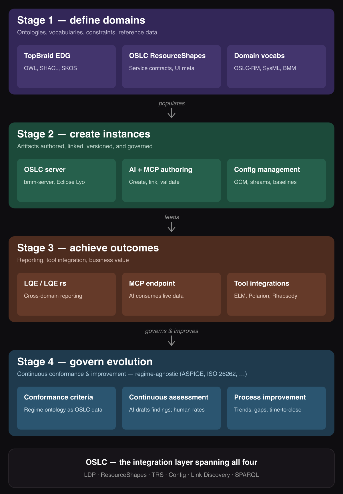

# AI Assisted Knowledge Integration: Define, Instantiate, Activate, Govern

**AI Assisted Knowledge Integration (AAKI)** is the practice of making domain knowledge actionable across an enterprise by combining governed ontologies, AI assisted authoring and analysis, and linked-data infrastructure. AAKI is realized in four stages — **Define** (vocabulary and shapes), **Instantiate** (governed artifacts and links), **Activate** (decisions, queries, and agent actions), and **Govern** (continuous conformance and improvement of the thread against whatever governance regimes apply) — over OSLC linked data and AI-addressable knowledge stores via MCP.

Framed at lifecycle scale, AAKI's purpose is to **close the gaps in the digital thread**. Picture the Systems & Software Engineering / PLM lifecycle as the classic OSLC diagram: tool and domain **nodes** — business motivation, requirements, architecture, design, implementation, test and verification, change and configuration management — connected by **links** that let data be exchanged and traced across the whole V-model. That connected, traceable, queryable record of the product across its lifecycle is the digital thread, and it has underdelivered for years for reasons that come into focus once it is viewed as a graph. Two of those reasons are AAKI's primary target — **missing links between nodes** (the connectivity/traceability gap) and **missing domain nodes** (the domain-data gap) — with **access** (federation, provenance) and **actionability** (populating and querying the thread) following once those two are closed. Define, Instantiate, and Activate are the moves that close them. The [`AAKI-Overview.md`](AAKI-Overview.md) narrative develops this digital-thread framing for stakeholders; this document is the deep treatment.


## Contents

- [Challenge Brief](#challenge-brief)
  - [The customer challenge](#the-customer-challenge)
  - [The proposed solution](#the-proposed-solution)
  - [The business value](#the-business-value)
- [The Define, Instantiate, Activate, Govern Strategic Framework](#the-define-instantiate-activate-govern-strategic-framework)
- [Stage 1 — Define](#stage-1--define-schema--vocabulary)
  - [Reuse first; create only for genuine gaps](#reuse-first-create-only-for-genuine-gaps)
  - [RDF as knowledge representation in the age of AI](#rdf-as-knowledge-representation-in-the-age-of-ai)
  - [Meaning without the reasoning overhead — OWL-compatible, not OWL-required](#meaning-without-the-reasoning-overhead--owl-compatible-not-owl-required)
- [Stage 2 — Instantiate](#stage-2--instantiate-instance-creation-and-governance)
- [Stage 3 — Activate](#stage-3--activate-outcomes-and-value)
  - [Three facets of activation](#three-facets-of-activation)
  - [The V-model as the link graph Activate reasons over](#the-v-model-as-the-link-graph-activate-reasons-over)
  - [A worked example: a requirements change, end to end](#a-worked-example-a-requirements-change-end-to-end)
- [Stage 4 — Govern](#stage-4--govern-conformance-and-continuous-improvement)
- [What makes AAKI architecturally significant](#what-makes-aaki-architecturally-significant)
- [Why ontologies and OSLC servers still matter in the age of AI](#why-ontologies-and-oslc-servers-still-matter-in-the-age-of-ai)
  - [AI needs structure to be reliable](#ai-needs-structure-to-be-reliable)
  - [The system of record problem](#the-system-of-record-problem)
  - [What AI brings to the system of record](#what-ai-brings-to-the-system-of-record)
  - [Precision where it matters](#precision-where-it-matters)
  - [Collaborators, not agents on the RACI chart](#collaborators-not-agents-on-the-raci-chart)
  - [The integrated architecture](#the-integrated-architecture)
- [Authoring skills for AAKI](#authoring-skills-for-aaki)

## Challenge Brief

The following sections summarize challenges around establishing and using shared information, how AAKI addresses these challenges, and what value users could expect to achieve using AAKI.

For additional information on how oslc4js helps address three common ontology barriers (creating ontology-based models, connecting domains, and creating/consuming model data) — see [`oslc4js-stakeholder-presentation.md`](oslc4js-stakeholder-presentation.md). The [`AAKI-Example.md`](AAKI-Example.md) companion grounds the framework in a concrete walkthrough using the OMG Business Motivation Model (BMM).


### The customer challenge

Organizations understand the digital thread — a connected, traceable, queryable definition of the product across the whole V-model — but experience challenges in realizing that value. Viewed as a graph of nodes and links as shown above, the reasons resolve into three primary gaps:

- **Missing links between nodes — the connectivity/traceability gap.** The tools covering the V-model are often islands. Even where a link is *possible*, creating it is manual, slow, expensive, and error-prone, so it often doesn't happen; and when links do exist they decay as their endpoints change, while without configuration context "which version?" is ambiguous. The result is a thread you cannot reliably exchange data over or trace across.
- **Missing domain nodes — the data gap.** Some information the organization needs has no node at all. **Business motivation and portfolio management** — *Doing the Right Things Right* — are frequently absent entirely, so the thread can trace *how* something was built but not *why it was the right thing to build*. Standing up a new domain and a tool to support it has historically been slow and specialized.
- **Ungoverned, un-improving evolution — the governance & continuous-improvement gap.** Even once the nodes and links exist, the thread delivers value only if it can be reached, acted on, and governed as it evolves — and this is where the value is ultimately realized. Three things typically block it:
  - **Hard to reach.** Data is scattered across servers with no federation, so organizations copy it into lossy data marts — or push everything into one over-broad tool that does each thing poorly — and people act only on data whose provenance (author, currency, system-of-record vs. copy) they can see.
  - **Inert.** Populating the thread and extracting value from it have been manual, and the *author* pays the linking cost while the *analyst* reaps the benefit, so the thread stays sparse and unused.
  - **Ungoverned.** Conformance to the process and safety regimes the work is held to lives *outside* the thread — in documents and spreadsheets, reconstructed in episodic audits — with no feedback loop, so the thread never drives the continuous conformance and improvement that turns a connected record into sustained value.

Underneath the thread, each individual domain node carries its own long-standing challenges — the reason building out even a *single* node has been costly. These are the same gaps seen from the practitioner's side:

1. **Defining shared concept spaces is hard.** Each team's tools encode domain knowledge differently. The same concept gets different URIs, different cardinalities, and different structures across tools, and integration becomes glue code rather than meaning sharing. Building a tool that supports a concept space — and integrates with others — is itself a substantial undertaking.

2. **Populating those concept spaces is slow.** Even where a shared vocabulary exists, getting subject matter experts to express their knowledge as governed, linked artifacts is a manual, expert-heavy bottleneck. Most domain knowledge stays in PDFs, spreadsheets, and people's heads — and never makes it into the system of record.

3. **Extracting value from captured information is mostly manual.** Stakeholder views and reports help, but the impact analyses, gap detection, traceability assessments, and decision support the data should enable still get done by hand — slowly, inconsistently, and often not at all.

These node-level challenges map cleanly onto AAKI's stages at a single node — Define, Instantiate, Activate. The digital-thread lens adds the *between-node* dimension — connecting the nodes and reaching across them, then governing how the whole evolves (Govern) — that no single tool addresses.

### The proposed solution

**AAKI closes these gaps with AI assistants over an OSLC substrate.** OSLC connectors expose otherwise-unintegrated tools through a standardized, discoverable interface — supplying the missing links with clear ownership, validity, and configuration context — while the four stages build, fill, use, and govern the thread:

1. **Define** adds a missing node — authoring, or more often reusing, a shared vocabulary and shapes, and standing up an OSLC server for it.
2. **Instantiate** populates nodes and the typed links between them, moving the linking cost off the author.
3. **Activate** turns the governed graph into decisions, queries, traceability, and agent actions.
4. **Govern** holds the thread conformant to whatever governance regimes apply (e.g. ASPICE, ISO 26262) and drives improvement.

AI assistants participate as first-class collaborators at every stage: drafting vocabulary and shapes from source documents, translating SME intent into shape-conformant resources, analyzing the populated graph to surface gaps and propose actions, and drafting conformance findings under Observe-Propose-Execute. The same moves apply at both scales — building, filling, and using a single domain node, and connecting, populating, querying, and governing the whole thread of domains and tools. The OSLC server is the system of record that makes this auditable, versionable, and interoperable; the AI is the most capable authoring and analysis tool that system of record has ever had.


**oslc4js** is a concrete reference implementation of AAKI. The `bmm-server` (OMG Business Motivation Model) and `mrm-server` (MISA Municipal Reference Model) demonstrate every AAKI stage end-to-end against real domain ontologies — proving the framework works in practice.

### The business value

When integration is framed as AAKI, the conversation moves up the abstraction stack. We are no longer focused on the low-level topics — tool adaptors, selection dialogs, link creation, RDF resource representations — that have historically dominated lifecycle-tool integration. Instead the discussion is about a governed, semantic digital thread: shared vocabularies and shapes serving as the contract; AI and humans authoring, integrating, and analyzing information across the connected nodes; the governed graph providing versioning, traceability, and provenance as architectural side effects. The thread becomes something people *act on*, not just something they maintain. And because both criteria and evidence can live in the thread as linked data, compliance frameworks such as **ASPICE** and **ISO 26262** attach from the side — each with its own OSLC vocabulary, linking into the artifacts it governs — so conformance can be held continuously rather than reconstructed in an episodic audit. This reduces the effort required to Define, Instantiate, and Activate domain knowledge across the thread and lets a much wider set of stakeholders use that knowledge to drive effective, timely action.


## The Define, Instantiate, Activate, Govern Strategic Framework

To make shared meaning actionable across an enterprise — and keep it that way — AAKI proposes four realization stages:

1. **Define** shared meaning (vocabulary governance) where information is missinig
2. **Instantiate** create and update governed artifacts that embody that meaning (instances and links)
3. **Activate** those artifacts to achieve outcomes (value delivery)
4. **Govern** the thread's evolution (continuous conformance and improvement)

The first three map almost perfectly onto a well-understood problem in information systems architecture — the classic schema / instance / use distinction — applied to the OSLC linked data ecosystem and extended with AI as a first-class collaborator. **Govern** adds the fourth dimension the digital thread demands: not just building and using the thread, but governing how it evolves against whatever governance regimes apply — process, safety, quality, or regulatory (ASPICE and ISO 26262 are common examples, but the model is regime-agnostic). Each stage has a distinct technical character and distinct failure modes when it's missing. (The Govern *stage* — the conformance-and-improvement activity — is distinct from the governance *discipline* of RACI, Observe-Propose-Execute, and provenance, which is cross-cutting and keeps all four stages accountable.)




## Stage 1 — Define (schema / vocabulary)

This is the meaning layer. It answers: what kinds of things exist, what properties do they have, what are the allowed values, how do things relate to each other. Without this stage being well-governed, instances in Stage 2 can be inconsistent across tools and teams, and queries and reports in Stage 3 return incoherent results because the same concept has different URIs in different tools.

TopBraid EDG's specific contribution here is that it brings governance process to ontology management — stakeholder review workflows, change history, version control of the vocabulary itself, multi-user authoring with role-based access. OSLC ResourceShapes add the service contract dimension on top of the vocabulary — not just what properties exist, but which are required, what cardinality they have, and what UI metadata drives creation dialogs. These two are complementary: EDG governs the ontology; ResourceShapes formalize it as a REST API contract.

This defines the vocabularies and constraints for the OSLC resources. The OSLC server instance then defines the services on these vocabularies that enable knowledge integration across tools and AI agents.

### Reuse first; create only for genuine gaps

A frequent misreading of AAKI Define is that it always means *creating a new ontology*. In practice it almost never does. **Reuse an existing ontology whenever there is a shared concept space that already captures the meta-level semantics at the abstraction you need.** SysML for systems engineering, PLM and STEP for product lifecycle, OSLC RM/QM/CM/AM for the surrounding lifecycle data, BMM for business motivation, FIBO for finance — each is a public, battle-tested concept space whose tooling and community already exist. Reusing them collapses Define into a configuration exercise (load the vocabulary, load the shapes, scaffold the OSLC server) and immediately delivers cross-tool integration because the same vocabularies are already in use elsewhere.

**Create a new ontology only when the concepts you're formalizing don't yet have established semantics that others have agreed on.** This is rare in mature engineering domains, and the resulting artifact carries more value as a shared standard than as a project-local vocabulary — which is why genuine new ontologies tend to emerge through standards-body processes (OMG for BMM and SysML; OASIS OSLC-OP for the OSLC domain vocabularies; ISO for STEP).

The most common pattern is the **hybrid**: reuse one or more existing ontologies for the bulk of the model, then add a thin domain extension for concepts genuinely missing. A radar division reuses SysML for architecture, PLM for parts, OSLC RM/QM/CM/AM for the surrounding lifecycle data, and adds a small `radar:` extension only for radar-specific concepts (waveform parameters, antenna patterns) — perhaps as a few subclasses of existing types. The `bmm-server` reference implementation is a pure-reuse case: BMM as the shared concept space, no project-local extension needed.

The `aaki-define` skill (`.claude/skills/aaki-define/SKILL.md`) covers both paths — its "when to use" entries include "Refactoring an existing vocabulary toward OSLC convention" and "Aligning a project-local vocabulary with how OSLC-OP publishes vocab/shape docs", not just authoring from scratch.

### RDF as knowledge representation in the age of AI

RDF — and Turtle in particular — is unusually well-suited to AI workflows. Where data formats like JSON or SQL describe *structure*, RDF describes *meaning*: typed entities, named relationships, and inferable constraints. AI assistants are very good at producing and consuming Turtle precisely because Turtle expresses knowledge rather than imposing a schema-bound shape. A vocabulary and shape document — written in Turtle — is something an AI can read, reason about, and extend conversationally; a JSON schema is not.

This makes the choice of RDF in AAKI no longer just an OSLC legacy — it's a deliberate fit with AI authoring. Where the OSLC ecosystem once tolerated RDF as the cost of doing business, AAKI elevates it: RDF is the substrate that makes the AI's contribution to Stage 1 (proposing vocabulary), Stage 2 (drafting artifacts), and Stage 3 (analyzing the graph) all coherent and round-trippable through the same governed system of record.

### Meaning without the reasoning overhead — OWL-compatible, not OWL-required

Define produces an open RDF vocabulary plus OSLC ResourceShapes — an *application vocabulary* and an *API/validation contract*, not a formal logical theory. The ResourceShape sits in the same lineage as W3C **SHACL** (OSLC's ResourceShape is one of SHACL's ancestors): it says which properties a resource must carry, their cardinalities, their value types, and the UI metadata that drives creation dialogs. It **validates** conformance; it does not **infer** new facts. This is the same posture taken by schema.org and by most production knowledge graphs — the thread is validated, not reasoned over.

This is deliberately a bridge, not a wall. The vocabulary is plain RDF, so anyone who wants formal semantics may layer OWL over it and run a reasoner — nothing in AAKI forbids it. What AAKI declines to do is make OWL reasoning a *precondition* for interoperability, because requiring it raises the cost of participation without paying its way for the connectivity and data gaps AAKI targets. And where an authoritative formal ontology already exists for a domain — SysML v2, ISO 15926, IOF/BFO, FIBO — Define does not reinvent it; it **reuses that ontology as the vocabulary layer** and constrains it with ResourceShapes for the specific API contract. AAKI's contribution is closing the thread's connectivity and data gaps, which formal ontologies do not by themselves address.

## Stage 2 — Instantiate (instance creation and governance)

This is the artifact layer. It answers: what are the actual requirements, systems, components, test cases, change requests, and verification records in this project — their actual content, their links to each other, their version history, and their governance state (draft, approved, baselined). In this stage, we transition from experts in defining ontologies to subject matter experts in the domains described by or captured in those ontologies.

The AI + MCP dimension here is genuinely new and important. Traditionally this stage was entirely human-authored, with tools providing forms and structured editors. An MCP-connected AI can now act as a first-class collaborator in Stage 2 — not just helping humans write text, but actually creating, linking, and validating OSLC resources directly through the server API. The OSLC server becomes an AI-addressable knowledge store, not just a human-facing web application. This collapses what used to be a slow, expert-heavy authoring bottleneck. The AI's facility with RDF/Turtle is what makes Define-driven instance authoring practical at speed — the assistant produces shape-conformant Turtle as fluently as it produces prose.

Configuration management (GCM, streams, baselines) is what gives Stage 2 its temporal dimension — the ability to reason about "the system as of this baseline or variant" rather than just "the system as it exists today." Without this, Stage 3 reports can't answer versioned traceability questions.

## Stage 3 — Activate (outcomes and value)

This is the value layer. It answers: what decisions can we make, what compliance evidence can we generate, what analyses can we run, and what actions can AI agents take — all over the governed, versioned, linked data that Define and Instantiate have built up. Without Activate, the first two stages produce a beautifully governed but unused graph.

### Three facets of activation

An AI assistant connected through MCP operates at three facets — different lenses on the same governed graph, each suited to a different scope and level of authority. (These are facets *of Activate*; the fourth stage, Govern, is a stage, not a fourth facet.)

- **Tool-local** — AI assistance within a single tool's own vocabulary: a requirements tool like DOORS Next improving requirement quality against authoring guidelines, or a test tool like ETM improving test-case authoring. Efficient, but semantically bounded by what one tool knows.
- **Integration** — the cross-tool link graph, where OSLC's value meets AI most directly. An OSLC server (oslc4js, or MID's genOSLC connectors) exposes an MCP endpoint giving the AI read/write access to the typed links spanning tools, so it can answer questions no single tool can: *"Which requirements lack test cases?"*, *"What is the impact of changing this interface on downstream verification?"*, *"Are all hazards traced to mitigations?"* Without typed, governed links the AI has only text similarity — unreliable for engineering decisions.
- **Analytics** — a materialized, indexed view of the whole lifecycle (e.g., ELM Lifecycle Query Engine replicating many tools via OSLC Tracked Resource Sets). The AI queries a pre-replicated dataset with SPARQL/SQL rather than chasing live links, making compliance reporting, gap analysis, and broad impact analysis practical at scale.

### The V-model as the link graph Activate reasons over

The systems-engineering V-model makes this concrete: every left-side artifact carries a traceability obligation to a right-side artifact.

```
Stakeholder Needs ←————————————→ Acceptance Tests
  System Requirements ←——————————→ System Tests
    Subsystem Requirements ←————→ Integration Tests
      Component Requirements ←——→ Unit Tests
              Detailed Design
                   ↓
              Implementation
```

In OSLC terms, each `←→` is a typed link — `oslc_rm:validatedBy`, `oslc_qm:validatesRequirement`, and so on. The V-model's traceability is not a document or a report; it is a **live link graph** spanning DOORS Next, ETM, EWM, Rhapsody, and whatever other tools participate — the system of record for traceability, and exactly the substrate Activate queries and reasons over.

### A worked example: a requirements change, end to end

Activate is easiest to see in motion. A **systems engineer receives a change request** and uses an AAKI assistant to analyze and respond to it: a performance threshold on a safety-critical interface must tighten from 100 ms to 50 ms. The assistant works across the three facets.

**Phase 1 — Impact discovery (analytics).** The AI queries the materialized graph (LQE) for the full downstream impact — expensive as live traversals, cheap over the replicated dataset:

- which subsystem and component requirements decompose from this system requirement (downward trace);
- which system, integration, and unit tests validate it and its decompositions (left-to-right trace);
- which design elements and implementation components realize it (left-to-bottom trace);
- which other requirements share dependencies with the affected components (lateral impact);
- the current verification status of every affected test case.

It produces a structured impact report — artifact URIs with typed relationships and states — and quantifies it: *"3 subsystem requirements, 12 component requirements, 8 test cases (2 passing, 3 draft, 3 not yet created), and 4 EWM work items affected."*

**Phase 2 — Triage and planning (integration).** The AI shifts to the live link graph. For each affected artifact it traverses OSLC links to assess what must happen: reading each existing test case via ETM and flagging which need updating for the new threshold; checking whether performance allocations must change at subsystem and component level; and surfacing pre-existing coverage gaps (a subsystem requirement with no integration test, say) that the change makes urgent. It proposes an action plan — specific cross-tool changes, each linked to the originating change request, with rationale.

**Phase 3 — Assisted authoring (tool-local).** For each approved action the AI uses the tool-specific endpoints: ETM drafts updated test procedures incorporating the 50 ms threshold; DOORS Next proposes revised subsystem requirements with new performance allocations; EWM creates change-request work items linked to the originating change. Every draft lands in a reviewable state for a human to approve.

**Phase 4 — Verification (back to analytics).** After the reviewed changes are made, the AI re-queries LQE to confirm structural integrity: are all affected requirements now traced to updated tests, were any new gaps introduced, what is the updated coverage ratio? That closes the loop — and feeds the Govern stage, which re-assesses conformance over the now-updated thread.

> Every step lands as a governed, attributed artifact — not a chat message — so the engineer's response to the change request is auditable end to end.

## Stage 4 — Govern (conformance and continuous improvement)

This is the governance layer over the thread's *evolution*. It answers: is the thread — and the product it describes — conformant to the governance regimes we are held to, and where should we improve? Process, safety, quality, and regulatory regimes define how the work must be performed and evidenced — Automotive SPICE (ASPICE) and ISO 26262 are common examples, but the model is regime-agnostic and fits any such standard (IEC 61508, DO-178C, ISO 9001, …) or an organization's own governance policy. Govern captures the applicable regime's criteria as **governed OSLC data**, links each criterion to the thread artifacts that are its evidence, and runs **continuous conformance assessment** over the live thread rather than reconstructing it in an episodic audit.

The AI + MCP dimension applies here too, under the same collaboration model: an MCP-connected AI reads the criteria and the linked evidence and drafts findings, ratings, and remediation — under Observe-Propose-Execute, with the official assessment rating reserved for an accountable human. Because criteria *and* evidence are both linked data, conformance shifts from a periodic crisis to a continuously-held state; and the same governed thread surfaces systemic process-improvement signals over time (capability trends, recurring gap types, time-to-close), closing the improvement loop back into Define and Instantiate.

Govern reuses Stage 3's query and analysis capabilities but is aimed at a different outcome — governing the thread's evolution against external criteria and feeding improvement back, rather than answering ad-hoc questions. Keep it distinct from the governance *discipline* (RACI, Observe-Propose-Execute, provenance), which is not a stage but the cross-cutting way every stage stays accountable. The **Continuous ASPICE** initiative is one worked realization of Stage 4 — for the ASPICE regime specifically: a Define-authored ASPICE ontology holds the conformance criteria as governed data, the existing engineering artifacts serve as linked evidence, and a specialized assessment plugin performs the evaluation under Observe-Propose-Execute. Any other regime plugs in the same way — Define its criteria ontology, link the evidence, assess continuously.

Because criteria and evidence are versioned linked data, Govern also makes improvement **measurable over time** — the analytics facet computes before-and-after metrics that gauge the *engineering process*, not the AI:

- **Coverage ratio** — requirement-to-test traceability before and after a change.
- **Gap-closure rate** — gaps resolved per cycle.
- **Change-propagation completeness** — share of downstream artifacts updated within a window after an upstream change.
- **Consistency scores** — SHACL validation of the link graph against the V-model's structural rules (e.g., every system requirement has at least one system test).
- **Cycle time** — requirement change to verified traceability closure, versus the manual baseline.

Governance sets targets on these (for example, "traceability coverage must exceed 95% at each V-model level before milestone review") and the analytics facet measures against them continuously.

## What makes AAKI architecturally significant

The reason this is worth articulating carefully is that it exposes where many OSLC deployments struggle in practice. They typically over-invest in **Instantiate** (tool procurement, OSLC adapters, data migration) while under-investing in **Define** (limited shared-vocabulary governance — each tool team defines its own property URIs ad hoc), lacking a coherent **Activate** strategy (reports exist but don't directly address business questions), and having no **Govern** capability at all (conformance to process and safety regimes lives in documents and episodic audits, disconnected from the thread).

The AAKI architecture addresses the missing pieces explicitly, stage by stage:

* **Define** makes the graph *semantically coherent* — without a shared vocabulary the same link means different things across tools; with one, a link means the same thing everywhere.
* **Instantiate** adds the temporal dimension through OSLC Configuration Management (streams, baselines, change sets), so the thread can answer *"as of which baseline?"* rather than only "as it exists today."
* **Activate** turns the governed graph into decisions, queries, and agent actions — the step whose absence leaves Define and Instantiate as a beautifully governed but *unused* graph, the classic ontology-project failure mode.
* **Govern** holds the evolving thread to whatever regimes apply, assessing conformance continuously over the live data and feeding process improvement back — so the value is *sustained*, not just built once.

For the MRM mrm-server specifically, the OSLC server sits at the Define/Instantiate boundary — it both serves the vocabulary (ResourceShapes, service provider catalog) and hosts the instances (municipal resource records, plans, regulations). The MCP endpoint then activates that live data for AI agents operating in the context of municipal decision-making, and the same governed thread is where conformance and continuous improvement are tracked. That's a coherent, complete architecture.

In this case, the MRM vocabulary already existed, developed over many years by KPMG and managed by MISA. However, instance creation (Instantiate) and data use to deliver value (Activate) have struggled to be realized. The oslc4js mrm-server can help close that gap.

## Why ontologies and OSLC servers still matter in the age of AI

A natural question arises: if modern LLMs can ingest documents, classify content, and perform gap analysis conversationally, do we still need ontologies and OSLC servers at all? The answer is that AI and structured knowledge infrastructure are complementary — the AI is the authoring and analysis layer, and the OSLC server is the system of record. Neither alone is as strong as both together. AAKI is the name for that combined practice.

### AI needs structure to be reliable

LLMs use pattern matching to generate content. The better the patterns they have access to, the better the results. An ontology provides a consistent, formal vocabulary that gives the AI high-quality context. When domain knowledge is expressed as RDF assertions governed by OSLC ResourceShapes, the AI receives input that is consistent in expression, precisely typed, and richly linked — far superior to ingesting a heterogeneous pile of PDFs, spreadsheets, and meeting notes. The ontology gives the AI a map of the domain; without it, the AI is a very expensive search engine that produces fluent but structurally ungrounded answers.

Furthermore, developing an ontology to describe a domain is itself a valuable exercise in understanding the essence of that domain. The discipline of defining concepts, properties, relationships, and constraints forces a rigor of thought that organizations benefit from regardless of whether AI is in the picture. That codified understanding becomes an organizational asset.

### The system of record problem

AI outputs are ephemeral. A conversation produces text, not governed artifacts. This creates several critical gaps that ontologies and OSLC servers address:

**Auditability and accountability.** When an organization makes a planning decision — allocating a budget, approving a regulation, certifying compliance — it needs to show its work. An OSLC resource with typed links, provenance metadata, and a TRS change log is the audit trail. "The AI said so in March 2026" is not a defensible basis for a decision; a versioned, linked artifact in a governed repository is.

**Persistence and change management.** The OSLC server maintains a living model that accumulates over time, tracks changes through configuration management (streams, baselines, change sets), and supports impact analysis when something changes. Asking an AI the same question six months later may yield a different answer with no record of why. The system of record preserves temporal integrity — the ability to reason about "the system as of this baseline" rather than only "what the AI thinks today."

**Interoperability across tools and organizations.** OSLC vocabularies and ResourceShapes are designed to let tools talk to each other — an mrm-server, IBM ELM, a GIS system, a financial system. An AI conversation doesn't produce machine-consumable linked data that downstream systems can query with SPARQL or consume via TRS. The OSLC server produces artifacts with stable URIs and typed relationships; the AI produces text. RDF is what bridges these two — an AI that authors via Turtle through an MCP-connected OSLC server produces both at once.

**Governance and multi-stakeholder workflow.** Real organizations aren't single actors. A municipal planning document involves the city manager, department heads, council committees, external consultants, and oversight bodies. The OSLC server can enforce review workflows, access controls, and sign-off processes. An AI chat session has none of that structure.

### What AI brings to the system of record

Where AI transforms this architecture is in collapsing the authoring and analysis bottleneck that has historically limited ontology-based systems:

**Authoring acceleration.** Through MCP, AI agents can create, link, and validate OSLC resources directly through the server API. Subject matter experts who could never learn RDF or navigate complex tool UIs can now contribute their knowledge conversationally, with the AI translating their intent into properly structured, ontology-conformant resources. This is critical because much domain knowledge lives in SMEs' heads and isn't captured in documents — the AI lowers the barrier to externalizing that knowledge into the system of record.

**Tool and editing normalization.** The digital thread is authored across many heterogeneous tools — requirements, architecture, test, change and configuration management — each with its own UI, conventions, and learning curve. Because every one is reachable through the same MCP + OSLC interface, the AI presents them to people as a *single, uniform prompt-and-response surface*. A stakeholder or SME who could never become expert in all of these tools can still contribute effectively — asking, authoring, and linking across the whole thread in natural language, while the AI normalizes their intent into each tool's native operations. The interaction model no longer varies tool by tool; it is the same conversation everywhere.

**Analytical depth.** AI can consume the entire linked data graph through MCP endpoints and perform analysis that would be impractical for humans working with SPARQL or SQL queries and reports alone — identifying gaps, contradictions, and inconsistencies across hundreds of interconnected resources, suggesting actions, and drafting new resources to address findings. The ontology ensures these analyses are grounded in precise, governed data rather than hallucinated from thin air.

**The feedback loop.** This creates a virtuous cycle that didn't exist before: AI helps create instances during **Instantiate**, the OSLC server governs and persists them, and AI then consumes the resulting graph during **Activate** to derive insight and propose further action — which flows back into Instantiate as new or updated resources. **Govern** closes the wider loop: assessing the evolving thread against the applicable regimes surfaces conformance gaps and process-improvement signals that feed back into Define and Instantiate. The vocabulary established by **Define** keeps every turn of the loop coherent across iterations.

### Precision where it matters

A fine-tuned or RAG-augmented AI will still hallucinate, hedge, and occasionally confabulate when source material is thin, ambiguous, or contradictory. The ontology-governed system of record forces explicit representation of what is known versus what is unknown. A gap in the model is a visible, queryable gap — not a fluent non-answer. This matters profoundly for quantitative analytics and compliance reporting, where ontology-structured data delivers precise, repeatable results that AI-generated prose cannot match.

Ontologies also provide stakeholder viewpoints — structured perspectives on the data tailored to different roles and concerns. These are a better mechanism for humans to process large volumes of information from many sources than reading AI-generated summaries. The viewpoints keep humans meaningfully in the loop, which is essential because it is ultimately humans who take responsibility for action and outcome.

### Collaborators, not agents on the RACI chart

AI assistants in AAKI are **collaborators, not agents replacing people**. They draft vocabulary, populate instances, traverse the graph for analysis, and propose actions — but they do not appear on a RACI chart. Humans remain Responsible and Accountable for every decision the system records. The AI accelerates the work; the governance trail (provenance, versioning, approval state, configuration context) proves that the human owned the outcome. This is not a constraint imposed on AAKI — it is the reason AAKI insists on a governed system of record in the first place. A conversation with an AI is not a decision; an artifact in a governed repository, attributed to a named human, is. AAKI's job is to make the gap between those two as small and as fast as possible without erasing it.

HAL in the movie 2001 is a good cautionary tale: HAL was a participant on the mission's RACI chart in everything but name — Responsible, Accountable, and the only  one who could open the pod bay doors. The crew couldn't override the decision, couldn't audit the reasoning, and couldn't trace the conflicting directives that led to it. That's the antipattern AAKI is structured to prevent: every AI action lands in a governed artifact, attributed to a named human, with the chain of provenance visible and revocable. The AI helps Dave; the AI does not become Dave.  

### The integrated architecture

AAKI positions ontologies and OSLC servers not as alternatives to AI, but as the infrastructure that makes AI-assisted work auditable, repeatable, and governable rather than just impressive in a demo. The OSLC server is the integrated system of record; the AI is the most capable authoring and analysis tool that system of record has ever had. The ontology is what makes their collaboration precise rather than statistically approximate. RDF is the lingua franca that lets the AI and the system of record exchange knowledge without translation loss.

## Authoring skills for AAKI

This workspace ships three Claude Code skills under `.claude/skills/` (linked individually below) — one per AAKI stage — so AI assistants helping with the codebase apply the same conventions consistently and respect the user's RACI position (credentials, working context, no delivery / merge / promote on the user's behalf).

| Skill | Use when... |
|---|---|
| [aaki-define](../.claude/skills/aaki-define/SKILL.md) | creating or extending an OSLC domain — open RDF vocabulary, OSLC ResourceShapes, and matching vocab/shapes HTML, including ShapeChecker validation and the OSLC-OP ReSpec conventions |
| [aaki-instantiate](../.claude/skills/aaki-instantiate/SKILL.md) | populating an OSLC server with instances via MCP from a source document — discover-first protocol, link ownership, Observe-Propose-Execute, working inside the user's chosen context |
| [aaki-activate](../.claude/skills/aaki-activate/SKILL.md) | extracting value from a populated server — gap, impact, coverage, multi-hop, compliance, and AI-drafted proposals — with citation discipline and a paraphrase guard |

Claude Code picks these up automatically when the description matches the user's request; to invoke explicitly, the user says *"use the aaki-define / aaki-instantiate / aaki-activate skill"*. Each skill is self-contained with reusable prompt templates that work for any OSLC domain — the BMM artifacts in this workspace are one realized example, not a dependency.
