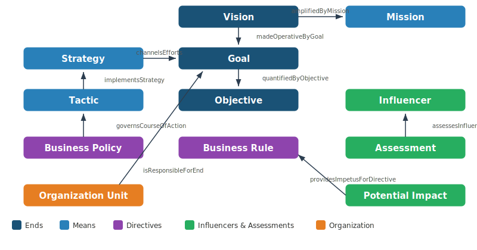
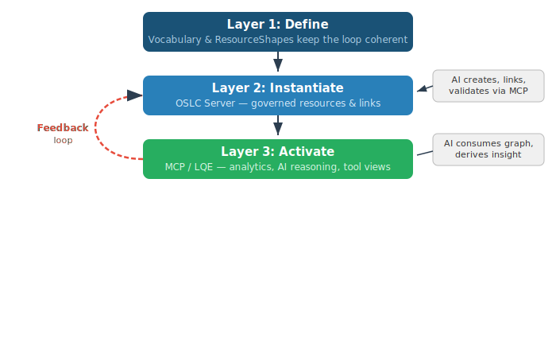
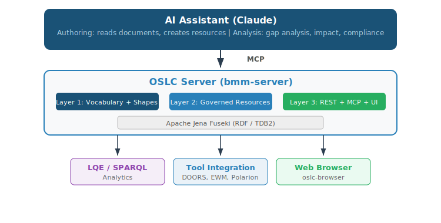
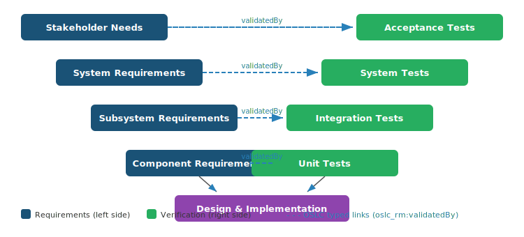
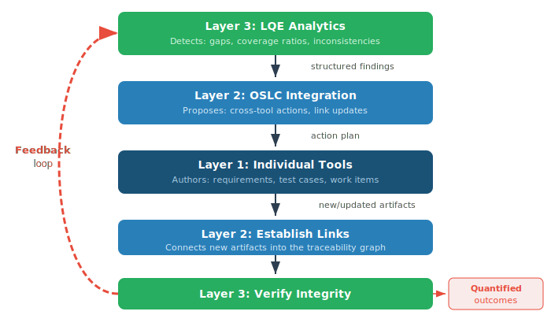

# Define — Instantiate — Activate

## A Semantic Value Chain for AI-Integrated Knowledge Management

### Using the OMG BMM Server as a Working Example

---

<!-- _class: toc -->

# Contents

- [The Problem](#the-problem)
- [The Three-Layer Framework](#the-three-layer-framework)
- [Layer 1 — Define](#layer-1--define)
- [Layer 1 Example: BMM Vocabulary](#layer-1-example-bmm-vocabulary)
- [Layer 1 Example: BMM Relationships](#layer-1-example-bmm-relationships)
- [Layer 2 — Instantiate](#layer-2--instantiate)
- [Layer 2 Example: EU-Rent](#layer-2-example-eu-rent)
- [AI Transforms Layer 2](#ai-transforms-layer-2)
- [Layer 3 — Activate](#layer-3--activate)
- [Layer 3 Example: MCP Endpoint](#layer-3-example-mcp-endpoint)
- [The Feedback Loop](#the-feedback-loop)
- [Why Not Just Use AI Alone?](#why-not-just-use-ai-alone)
- [AI Needs Structure to Be Reliable](#ai-needs-structure)
- [What AI Brings to the System of Record](#what-ai-brings)
- [The Integrated Architecture](#the-integrated-architecture)
- [BMM Server: Working Example](#bmm-server-working-example)
- [Key Takeaway](#key-takeaway)
- [AI-Assisted V-Model](#ai-assisted-v-model)
- [Three Layers of AI Assistance](#three-layers-of-ai-assistance)
- [Scenario: Requirements Change](#scenario-requirements-change)
- [The V-Model Feedback Loop](#the-v-model-feedback-loop)
- [Governance: Authority](#governance-authority)
- [Governance: Metrics](#governance-metrics)

---

# The Problem

Organizations invest heavily in tools and data — but struggle to turn that data into decisions.

**Common failure modes:**

- Tools are connected but use **different vocabularies** for the same concepts
- Data exists but has **no governance** — no versioning, no audit trail, no review process
- Beautiful knowledge graphs are built but **never activated** — no one queries them, no one acts on them

> The classic ontology project failure: a beautifully governed but unused knowledge graph.

---

# The Three-Layer Framework

A semantic value chain requires three distinct layers:

| Layer | Purpose | Answers |
|-------|---------|---------|
| **1. Define** | Vocabulary governance | What kinds of things exist? How do they relate? |
| **2. Instantiate** | Artifact creation & governance | What are the actual resources in this project? |
| **3. Activate** | Outcomes & value delivery | What decisions can we make from this data? |

This maps onto the classic **schema / instance / use** distinction from information architecture, applied to the OSLC linked data ecosystem.

---

# Layer 1 — Define

**The meaning layer.** It establishes shared understanding before any data is created.

**Two complementary mechanisms:**

- **Ontology governance** (e.g., TopBraid EDG) — stakeholder review workflows, change history, version control of the vocabulary, multi-user authoring
- **OSLC ResourceShapes** — formalize the vocabulary as a REST API contract: required properties, cardinality, allowed values, UI metadata for creation dialogs

**Without Layer 1:** Layer 2 produces a connected but semantically incoherent graph — links exist but mean different things in different tools.

---

# Layer 1 Example: BMM Vocabulary

The **bmm-server** defines the OMG Business Motivation Model 1.3 as an RDF ontology:

**Ends** (what to achieve)
- Vision
- Goal
- Objective

**Means** (how to achieve it)
- Mission
- Strategy, Tactic
- Business Policy, Business Rule

**Influencers & Assessment**
- Influencer (External/Internal)
- Assessment (SWOT)
- Potential Impact (Risk/Reward)

**Organization**
- Organization Unit
- Business Process
- Asset

**25 classes, 49 properties, 14 ResourceShapes**

---

# Layer 1 Example: BMM Relationships

The ontology defines precisely how concepts connect. These typed relationships are what make queries, traceability, and AI analysis precise.

---

# Layer 2 — Instantiate

**The artifact layer.** Here we transition from ontology experts to **subject matter experts** in the domain.

**What it produces:**
- Actual resources — requirements, plans, assessments, strategies
- Typed links between resources
- Version history and governance state (draft, approved, baselined)

**Configuration management** (streams, baselines, change sets) gives this layer its temporal dimension — reasoning about "the system as of this baseline" rather than just today's snapshot.

**Without Layer 2 governance:** Layer 3 can't answer versioned questions.

---

<!-- _class: small-text -->

# Layer 2 Example: EU-Rent

**EU-Rent** is a fictitious European car rental company used as the running example throughout the OMG BMM 1.3 specification:

| BMM Concept | EU-Rent Examples in Spec |
|-------------|------------------------|
| Vision | 1 — premium brand car rental |
| Goals | 4 — premium brand, customer service, well-maintained cars, availability |
| Objectives | 4 — A C Nielsen ratings, customer satisfaction, breakdown rate |
| Mission | 1 — car rental across Europe and North America |
| Strategies | 3+ — nationwide operation, car purchase/disposal, rewards scheme |
| Tactics | 5+ — encourage extensions, outsource maintenance, standard specs, etc. |
| Business Policies | 5+ — minimize depreciation, guarantee payments, no exports, etc. |
| Business Rules | 6+ — match spec, lowest mileage, driver's license, service scheduling, etc. |
| Influencers | 28+ — competitors, customers, regulations, technology, etc. |
| Assessments | 6+ — SWOT: strengths, weaknesses, opportunities, threats |
| Potential Impacts | 5+ — risks and rewards |

All examples from the actual OMG specification, populated by AI reading the PDF.

---

# AI Transforms Layer 2

Traditionally, Layer 2 was the bottleneck — entirely human-authored through forms and structured editors.

**With MCP (Model Context Protocol), AI becomes a first-class participant:**

1. AI **learns the domain model** from MCP resources (vocabulary, shapes, catalog)
2. AI **reads source documents** (specifications, plans, policy documents)
3. AI **identifies instances** — Visions, Goals, Strategies, Assessments
4. AI **creates and links resources** directly via the OSLC server API
5. AI **validates** against ResourceShape constraints

> *"Read the BMM 1.3 specification and create all the EU-Rent example artifacts and relationships described in the document."*

---

# Layer 3 — Activate

**The value layer.** Without it, Layers 1 and 2 produce a beautifully governed but unused knowledge graph.

**Three activation mechanisms:**

| Mechanism | Use | Example |
|-----------|-----|---------|
| **LQE - SPARQL/SQL** | Analytical | Traceability reports, coverage metrics, validation |
| **MCP Endpoint** | Agentic | AI agents reasoning over live data, proposing changes |
| **Tool Integrations** | Operational | Engineers seeing linked data in DOORS Next, EWM, Polarion |

---

# Layer 3 Example: MCP Endpoint

The bmm-server exposes an MCP endpoint at `/mcp` with **34 dynamically generated tools:**

**14 create tools**
- one per BMM resource type

**14 query tools**
- one per BMM resource type

**6 generic tools**
- create_service_provider
- get_resource, update_resource
- delete_resource
- list_resource_types, query_resources

**3 MCP resources (for AI learning)**
- oslc://vocabulary
- oslc://shapes
- oslc://catalog

---

# The Feedback Loop

This creates a virtuous cycle that didn't exist before MCP:

---

# Why Not Just Use AI Alone?

> *"Can't we just feed all our documents to an LLM and ask it questions?"*

**Yes — but AI outputs are ephemeral.** A conversation produces text, not governed artifacts.

| Concern | AI Alone | AI + OSLC Server |
|---------|----------|-------------------|
| **Audit trail** | "Claude said so" | Versioned artifact with provenance |
| **Persistence** | Different answer next month | Living model with change history |
| **Interoperability** | Prose output | Machine-consumable linked data (RDF) |
| **Governance** | Chat session | Review workflows, access controls, sign-off |
| **Precision** | Fluent non-answers | Visible, queryable gaps |
| **Repeatability** | Statistical approximation | Deterministic queries on governed data |

---

# AI Needs Structure to Be Reliable

- **Better patterns, better results.** RDF assertions governed by ResourceShapes are consistent in expression, precisely typed, and richly linked.

- **The ontology gives the AI a map.** Without it, the AI is a very expensive search engine that produces fluent but structurally ungrounded answers.

- **Explicit gaps vs. hallucination.** The system of record forces explicit representation of what is known vs. unknown. A gap in the model is a visible, queryable gap — not a fluent non-answer.

- **Quantitative analytics.** Ontology-structured data delivers precise, repeatable results for compliance reporting and impact analysis.

---

# What AI Brings to the System of Record

**Authoring acceleration**
SMEs who can't write RDF or navigate complex tool UIs can now contribute their knowledge conversationally. The AI translates intent into ontology-conformant resources.

**Analytical depth**
AI can consume the entire linked data graph and perform analysis impractical for humans with queries and reports alone — identifying gaps, contradictions, and inconsistencies across hundreds of interconnected resources.

**Humans in the loop**
Ontologies provide stakeholder viewpoints — structured perspectives tailored to different roles. These keep humans meaningfully engaged, which matters because humans take responsibility for action and outcome.

---

# The Integrated Architecture

---

<!-- _class: small-text -->

# BMM Server: A Complete Working Example

| Aspect | Implementation |
|--------|---------------|
| **Domain** | OMG Business Motivation Model 1.3 |
| **Layer 1** | 25 classes, 49 properties in BMM.ttl; 14 ResourceShapes |
| **Layer 2** | RDF triple store (Jena Fuseki); EU-Rent example from BMM 1.3 spec, populated by AI |
| **Layer 3** | OSLC REST API + MCP endpoint (34 tools) + oslc-browser UI |
| **AI Integration** | MCP endpoint exposes vocabulary/shapes for learning; tools for CRUD |
| **Port** | localhost:3005 |

**Try it:** Start Fuseki, then `cd bmm-server && npm start`

AI prompt: *"Read docs/BMM-formal-15-05-19.pdf and create all the EU-Rent example artifacts and relationships from the spec."*

---

# Key Takeaway

The **Define-Instantiate-Activate** framing positions ontologies and OSLC servers not as alternatives to AI, but as the infrastructure that makes AI-assisted work:

- **Auditable** — every resource has provenance and version history
- **Repeatable** — deterministic queries on governed data, not statistical approximation
- **Governable** — review workflows, access controls, multi-stakeholder sign-off
- **Interoperable** — machine-consumable linked data across tools and organizations

> The OSLC server is the **system of record**.
> The AI is the most capable **authoring and analysis tool** that system of record has ever had.
> The ontology is what makes their collaboration **semantically precise** rather than statistically approximate.

---

# Applying Define-Instantiate-Activate to an AI-Assisted V-Model

The framework applies not just to individual OSLC servers, but to the **entire systems engineering lifecycle**.

In OSLC terms, each traceability link is **typed** — the V-model's traceability is a **live link graph** spanning tools.

---

# Three Layers of AI Assistance

An AI assistant connected via MCP to an integrated tool chain operates at three layers:

| Layer | Scope | MCP Access | Example |
|-------|-------|------------|---------|
| **1. Tool-Local** | Single tool | Tool's own MCP | DOORS Next AI improves requirement quality |
| **2. Integration** | Cross-tool | OSLC server MCP | "Which requirements lack test cases?" |
| **3. Analytics** | Lifecycle-wide | LQE/TRS MCP | Coverage ratios, compliance, impact analysis |

**Layer 1** improves authoring within each tool silo.
**Layer 2** enables cross-tool reasoning over the OSLC link graph.
**Layer 3** provides efficient read-only analytics across the entire lifecycle.

---

<!-- _class: small-text -->

# Scenario: Requirements Change Impact

An engineer changes a system requirement: performance threshold from 100ms to 50ms.

**Phase 1 — Impact Discovery (Layer 3, LQE)**
AI queries the materialized graph for full downstream impact.
Result: "3 subsystem requirements, 12 component requirements, 8 test cases (2 passing, 3 draft, 3 missing), 4 work items affected"

**Phase 2 — Triage and Planning (Layer 2, OSLC)**
AI traverses live links to assess each affected artifact. Flags test cases needing updates. Identifies pre-existing coverage gaps made urgent by the change.

**Phase 3 — Assisted Authoring (Layer 1, Tools)**
ETM: drafts updated test procedures. DOORS Next: proposes revised subsystem allocations. EWM: creates linked change requests.

**Phase 4 — Verification (Layer 3, LQE)**
AI re-queries to confirm all gaps closed, coverage restored.

---

# The V-Model Feedback Loop

This is **Define-Instantiate-Activate applied to the lifecycle**: vocabularies define valid traceability, tools instantiate artifacts and links, analytics activate the data — feeding back into new instantiation.

---

# Governance: Authority and Approval

| Level | AI Action | Approval | Example |
|-------|-----------|----------|---------|
| **Observe** | Query and report | None needed | LQE gap analysis, coverage reports |
| **Propose** | Draft artifacts in "Draft" state | Human review required | AI-generated test cases, requirement updates |
| **Execute** | Create links by policy | Pre-authorized | Mechanical linking: test case to requirement |

The AI operates within OSLC access controls — it does not bypass governance. The AI authenticates with the user's identity; the same role-based permissions apply whether the request comes from a browser or from an AI through MCP.

---

# Governance: Traceability and Metrics

**Traceability of AI actions** — Every AI action records provenance: what triggered it, what analysis justified it, what policy authorized it, what human approved it. TRS propagates these records to LQE.

**Quantifiable outcomes:**

| Metric | What It Measures |
|--------|-----------------|
| Coverage ratio | Requirement-to-test traceability before and after |
| Gap closure rate | Gaps resolved per cycle |
| Change propagation completeness | Downstream artifacts updated within time window |
| Consistency scores | SHACL validation against V-model structural rules |
| Cycle time | Requirement change to verified traceability closure |

> These metrics measure the **engineering process**, not the AI. The AI makes the process faster and more complete.

---

# Thank You

**Resources:**

- oslc4js repository: github.com/jamsden/oslc4js
- BMM Server: oslc4js/bmm-server/
- Define-Instantiate-Activate: oslc4js/docs/Define-Instantiate-Activate.md
- OSLC specifications: open-services.net
- OMG BMM 1.3: omg.org/spec/BMM/1.3
