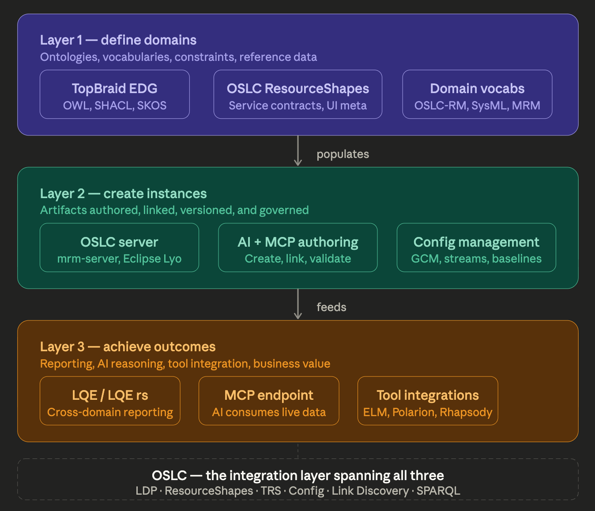

To enable a semantic value chain, organizations need is a framework that is fundamentally about making shared meaning actionable across an enterprise. That's the core value proposition. The three layers that need to be addressed are:
    1. Define shared meaning (vocabulary governance)
    2. Create governed artifacts that embody that meaning (instances)
    3. Use those artifacts to achieve outcomes (value delivery)

The oslc4js oslc-server envisions a three-layer framing that maps almost perfectly onto a well-understood problem in information systems architecture — the distinction between schema, instance, and use. It maps onto the classic schema / instance / use distinction from information architecture, but applied specifically to the OSLC linked data ecosystem. Each layer has a distinct technical character and distinct failure modes when it's missing.

## Layer 1 — define (schema / vocabulary)

This is the meaning layer. It answers: what kinds of things exist, what properties do they have, what are the allowed values, how do things relate to each other. Without this layer being well-governed, instances in Layer 2 can be inconsistent across tools and teams, and queries and reports in Layer 3 return incoherent results because the same concept has different URIs in different tools.

TopBraid EDG's specific contribution here is that it brings governance process to ontology management — stakeholder review workflows, change history, version control of the vocabulary itself, multi-user authoring with role-based access. OSLC ResourceShapes add the service contract dimension on top of the vocabulary — not just what properties exist, but which are required, what cardinality they have, and what UI metadata drives creation dialogs. These two are complementary: EDG governs the ontology; ResourceShapes formalize it as a REST API contract.

This defines the vocabularies and constraints for the OSLC resources. The oslc-server instance then defines the services on these vocabularies that enable tool integration. 

## Layer 2 — instantiate (instance creation and governance)

This is the artifact layer. It answers: what are the actual requirements, systems, components, test cases, change requests, and verification records in this project — their actual content, their links to each other, their version history, and their governance state (draft, approved, baselined). In this layer, we transition from experts in defining ontologies to subject matter experts in the domains described by or captured in those ontologies.

The AI + MCP dimension here is genuinely new and important. Traditionally this layer was entirely human-authored, with tools providing forms and structured editors. An MCP-connected AI can now act as a first-class participant in Layer 2 — not just helping humans write text, but actually creating, linking, and validating OSLC resources directly through the server API. The OSLC server becomes an AI-addressable structured knowledge store, not just a human-facing web application. This collapses what used to be a slow, expert-heavy authoring bottleneck.

Configuration management (GCM, streams, baselines) is what gives Layer 2 its temporal dimension — the ability to reason about "the system as of this baseline or variant" rather than just "the system as it exists today." Without this, Layer 3 reports can't answer versioned traceability questions.

## Layer 3 — use (outcomes and value)

This is the value layer. It answers: what decisions can we make, what compliance evidence can we generate, what analyses can we run, and what actions can AI agents take — all based on the governed, versioned, linked data that Layers 1 and 2 have built up.

The three mechanisms cover the full spectrum of how this layer manifests:
LQE/LQE rs handles analytical use — cross-domain SPARQL or SQL queries that answer traceability questions, compliance reports, coverage metrics, impact analysis, and SHACL that assesses data validation. This is fundamentally a read-only, human-interpreted output.

The MCP endpoint handles agentic use — AI tools consuming live structured data to reason, draft, propose changes, or execute multi-step workflows. This closes a loop: AI helps create instances in Layer 2, and then AI consumes the resulting data graph in Layer 3 to derive insight and propose further action. That's a feedback loop that didn't exist before MCP.

Tool integrations handle operational use — engineers in DOORS Next, Rhapsody, EWM, or Polarion seeing linked data from other tools inline in their native environment. The V-model traceability (left side requirements → right side verification) is realized here through the OSLC link ecosystem and OSLC-OP LDM-based incoming link discovery.

## What makes this framing architecturally significant

The reason this is worth articulating carefully is that it exposes where most OSLC deployments fail in practice. They typically invest heavily in Layer 2 (tool procurement, OSLC adapters, data migration) without adequately investing in Layer 1 (limited shared vocabulary governance — each tool team defines their own property URIs ad hoc) and without a coherent Layer 3 strategy (reports exist but aren't driven by business questions anyone actually has).

The oslc4js architecture attempts to address the missing pieces explicitly:
    • Without Layer 1, Layer 2 produces a connected but semantically incoherent graph — links exist but mean different things in different tools.
    • Without Layer 2 governance (config management, versioning), Layer 3 can't answer versioned questions — all you get is a snapshot of today's state.
    • Without Layer 3 activation (LQE, MCP, integrations), Layers 1 and 2 produce a beautifully governed but unused knowledge graph — the classic ontology project failure mode.

For the MRM mrm-server specifically, the OSLC server sits at the Layer 1/2 boundary — it both serves the vocabulary (ResourceShapes, service provider catalog) and hosts the instances (municipal resource records, plans, regulations). The MCP endpoint then directly activates Layer 3 by making all of that live data available to AI agents operating in the context of municipal decision-making. That's a genuinely coherent and complete architecture.

In  this case, the MRM vocabulary already existed, having been developed for many years by KPMG and managed by MISA. However, the instance creation at layer 2, and the data use at layer 3 to deliver value have struggled to be realized. The oslc4js mrm-server can help close this gap.

