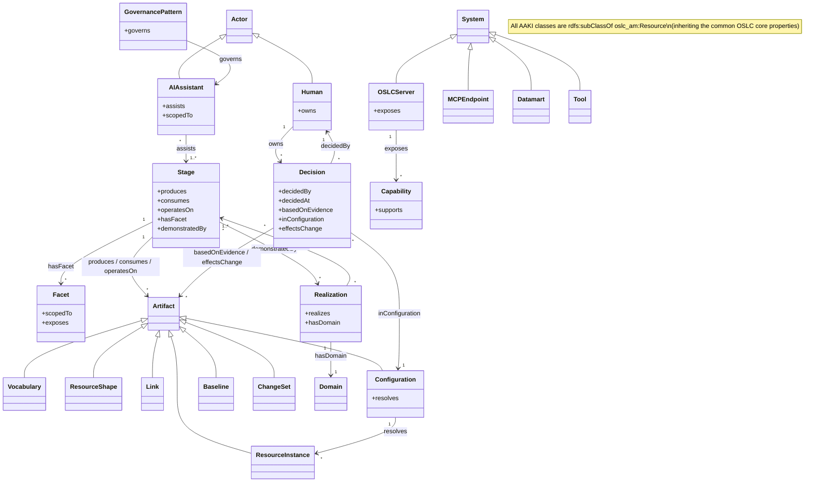
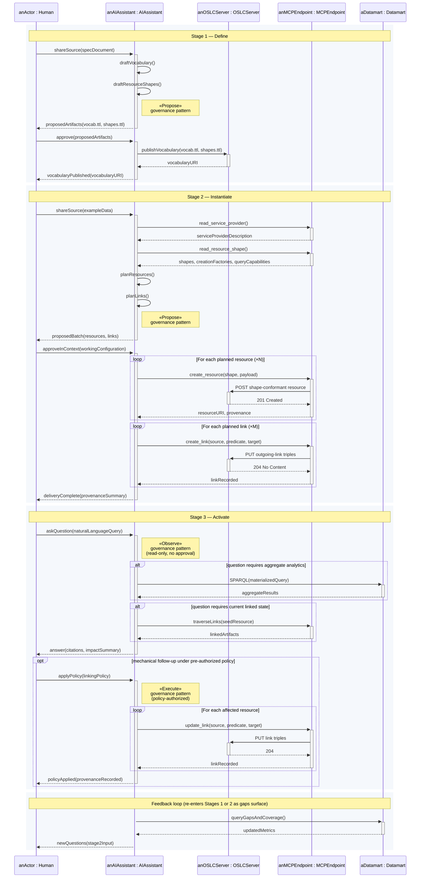

# AAKI Ontology Implementation Plan

> **For agentic workers:** REQUIRED SUB-SKILL: Use superpowers:subagent-driven-development (recommended) or superpowers:executing-plans to implement this plan task-by-task. Steps use checkbox (`- [ ]`) syntax for tracking.

**Goal:** Author an OSLC-compatible ontology that describes AAKI itself — its stages, facets, governance patterns, actors, artifacts, and capabilities — together with a class diagram and a stage-lifecycle sequence diagram. The exercise is deliberate meta-recursion: if AAKI's claim is that governed ontologies are the right substrate for representing shared meaning, then representing AAKI itself as a governed ontology is the most honest demonstration of the claim.

**Architecture:** A new vocabulary (`aaki-vocab.ttl`) defines classes and properties for AAKI concepts. Companion OSLC ResourceShapes (`aaki-shapes.ttl`) constrain the vocabulary for a future OSLC service contract. ReSpec HTML (`aaki-vocab.html`, `aaki-shapes.html`) provides human-readable documentation. Two Mermaid diagrams (rendered inline in markdown and exported to SVG for presentations) visualize the model: a class diagram showing the structure, and a sequence diagram showing the stage lifecycle with the Observe/Propose/Execute governance patterns inline. Cross-references are added to `AAKI-Overview.md`, `AAKI-Overview-Presentation.md`, and `AAKI.md`. An optional Phase 6 stands up a running OSLC server (`aaki-server`) populated with AAKI-as-instances — the ultimate proof, but deferred until the static artifacts are reviewed.

**Tech Stack:** RDF Turtle for the ontology, ReSpec-style HTML for documentation (consistent with `oslc-specs/specs/plm/plm-spec.html`), Mermaid for diagrams (renders inline in GitHub markdown, exports cleanly to SVG via `@mermaid-js/mermaid-cli`), SVG for the publication-quality forms used in presentations.

---

## File Structure

| File | Responsibility | Status |
|---|---|---|
| `docs/aaki-ontology/` | New directory holding the ontology and its rendered docs | Create |
| `docs/aaki-ontology/README.md` | Brief orientation for the directory | Create |
| `docs/aaki-ontology/aaki-vocab.ttl` | RDF vocabulary: types only — `rdf:Class` definitions (Stage, Facet, GovernancePattern, Actor, Decision, Capability, Artifact, System, Domain, Realization) and `rdf:Property` definitions (produces, consumes, operatesOn, hasFacet, governs, owns, assists, realizes, …). No named individuals. | Create |
| `docs/aaki-ontology/aaki-vocab.html` | ReSpec-rendered human-readable vocabulary | Create |
| `docs/aaki-ontology/aaki-shapes.ttl` | OSLC ResourceShapes constraining the vocabulary; each shape `oslc:superShape <http://open-services.net/ns/am/shapes/3.0#ResourceShape>` to inherit common OSLC core properties | Create |
| `docs/aaki-ontology/aaki-shapes.html` | ReSpec-rendered shape documentation | Create |
| `docs/aaki-ontology/aaki-class-diagram.mmd` | Mermaid `classDiagram` source — the structural view | Create |
| `docs/aaki-ontology/aaki-class-diagram.svg` | SVG export for presentation/print | Create |
| `docs/aaki-ontology/aaki-stage-lifecycle.mmd` | Mermaid `sequenceDiagram` source — UML-conformant lifecycle (activation bars, sync/async arrows, alt/opt/loop frames, governance-pattern stereotypes as UML notes) | Create |
| `docs/aaki-ontology/aaki-stage-lifecycle.svg` | SVG export for presentation/print | Create |
| `docs/AAKI-Overview.md` | Reference the class diagram and sequence diagram in the body; add a "Meta-recursion: AAKI's own ontology" subsection | Modify |
| `docs/AAKI-Overview-Presentation.md` | Insert two new slides (one per diagram) before "Where to go next" | Modify |
| `docs/AAKI.md` | Add a one-paragraph cross-reference to the ontology in the appropriate place | Modify |

Phase 6 (optional, deferred) additionally creates:

| File | Responsibility | Status |
|---|---|---|
| `docs/aaki-ontology/aaki-bootstrap.prompt.md` | Reusable MCP-tool prompt that an AI assistant uses to populate the canonical AAKI instances (Stages, Facets, GovernancePatterns, Domains, Realizations) and their cross-resource links in a running `aaki-server`'s repository, per the `aaki-instantiate` skill | Create (Phase 6) |
| `docs/aaki-ontology/aaki-bootstrap.http` | VS Code / IntelliJ HTTP Client compatible file with explicit POSTs and PUTs to bootstrap an `aaki-server` repository identically to the prompt-driven path | Create (Phase 6) |
| `aaki-server/` submodule | New OSLC server backed by the AAKI ontology — scaffolded by `create-oslc-server` over the vocab and shapes plus a service-provider template | Create (Phase 6) |
| `package.json` (root) | Add `aaki-server` to the workspaces list | Modify (Phase 6) |

---

## Design Decisions

**Meta-recursion is the point.** The ontology must be self-consistent: every claim AAKI makes about ontologies (governed vocabulary, OSLC shapes, instance-and-link populations, AI-addressable graph) the AAKI ontology must satisfy. Specifically:

- Classes follow the open-vocabulary principle: no `rdfs:domain` / `rdfs:range` on properties; constraints come from the shapes.
- Every AAKI class declares `rdfs:subClassOf oslc_am:Resource` so AAKI resources are first-class OSLC resources by inheritance.
- Every AAKI shape declares `oslc:superShape <http://open-services.net/ns/am/shapes/3.0#ResourceShape>` to include the common OSLC core properties (`dcterms:title`, `dcterms:description`, `dcterms:creator`, `dcterms:created`, `dcterms:modified`, `oslc:serviceProvider`, `oslc:instanceShape`, plus the six common link types `derives` / `elaborates` / `refine` / `external` / `satisfy` / `trace`) that should be available on all OSLC resources. AAKI's own shapes then carry only the AAKI-specific property constraints.
- The shapes also use `oslc:inversePropertyLabel` on link properties, demonstrating the OSLC-Shape-Extensions proto-spec on the framework that proposed it.
- **The vocabulary contains only types — no instances.** The canonical AAKI taxa (Define / Instantiate / Activate, the three Facets, the three GovernancePatterns) live as instances in the running server's repository, not as named individuals in `aaki-vocab.ttl`. This keeps the T-box (schema) cleanly separated from the A-box (data) and lets the AAKI server itself demonstrate AAKI's own Instantiate stage on the AAKI ontology.

  Instances are created post-startup by one of (or both of):
  - A reusable **MCP prompt** for the AAKI server's MCP tool, invoked by an AI assistant to populate the canonical instances per AAKI's Instantiate-stage pattern (discover-first, Observe-Propose-Execute).
  - A `.http` **sample file** with explicit `POST` requests against the AAKI server's creation factories.

  Both produce the same end state in the server's repository; pick whichever fits the deployment workflow.

- **Alternative considered, not adopted: model the taxa as subclasses.** Define / Instantiate / Activate could be declared as subclasses of `aaki:Stage` (and similarly for Facets and GovernancePatterns) directly in the vocabulary. Under that model, an instance of `aaki:Define` would be a specific Define activity — for example, the BMM-vocabulary-creation event. The subclass option has the advantage that the canonical taxa are part of the schema and don't require a running server to be visible; it has the disadvantage that it conflates concept-categories with classes, complicates the rdfs hierarchy, and weakens the meta-recursive demo (the AAKI server doesn't get to populate the canonical taxa as part of its own Instantiate stage). The instance-based approach is recommended; the subclass alternative is documented here for reviewers who might prefer it.

**Namespace.** `http://open-services.net/ns/aaki#` with prefix `aaki`. Parallels the OSLC-OP namespace pattern. The URI does not need to resolve until/unless a running server is stood up — but using the `open-services.net` root signals the framework's positioning under OSLC-OP without preempting a formal submission.

**Diagram tooling: Mermaid.** Three options were considered: Mermaid, PlantUML, and hand-authored SVG. Mermaid wins on three axes: (1) renders inline in GitHub-flavored Markdown without preprocessing, (2) source is human-readable and diffable, (3) `@mermaid-js/mermaid-cli` exports to SVG for presentation. PlantUML would also work but adds a Java toolchain. Hand-authored SVG (used today for `AAKI-Overview.svg` and `DIA-Stages.svg`) is highest-fidelity but uneditable through normal review/diff workflows. The Mermaid source is the source of truth; SVG exports are regenerated.

**Sequence diagram vs. lane diagram for the lifecycle.** A sequence diagram (actor-oriented, time flowing down) shows the *interactions* between participants better than a swimlane diagram shows the *workflow*. AAKI is fundamentally about interactions: AI proposes, SME reviews, server stores, configuration governs, analytics queries. A sequence diagram captures this naturally and lets the Observe/Propose/Execute patterns annotate specific message exchanges. (A swimlane could be drafted later if the workflow framing is needed for a different audience.)

**Mermaid renders inline; SVG for presentation.** Markdown documents include the Mermaid source directly (so GitHub renders it on the fly). Presentation slides reference the SVG export (Marp doesn't natively render Mermaid). Both forms stay in sync because the SVG is regenerated from the `.mmd` on every change.

**Ontology metadata is minimal.** The AAKI ontology is not intended for OASIS submission; `dcterms:hasVersion` and `dcterms:isPartOf` are omitted from the `owl:Ontology` declaration. The vocabulary keeps only the descriptive metadata that's useful in-workspace: title, label, description, namespace prefix, publisher, issue date, license, source, and copyright.

---

## Phase 1 — Vocabulary

### Task 1.1: Bootstrap the `aaki-ontology/` directory

**Files:**
- Create: `docs/aaki-ontology/` (directory)
- Create: `docs/aaki-ontology/README.md`

- [ ] **Step 1: Create the directory**

```bash
mkdir -p docs/aaki-ontology
```

- [ ] **Step 2: Create `README.md`**

```markdown
# AAKI Ontology

A self-describing vocabulary and OSLC ResourceShapes for AI Assisted Knowledge Integration (AAKI). This directory contains:

| File | Purpose |
|---|---|
| `aaki-vocab.ttl` | RDF vocabulary — classes and properties |
| `aaki-vocab.html` | ReSpec-rendered vocabulary documentation |
| `aaki-shapes.ttl` | OSLC ResourceShapes constraining the vocabulary |
| `aaki-shapes.html` | ReSpec-rendered shape documentation |
| `aaki-class-diagram.mmd` / `.svg` | Mermaid + SVG class diagram |
| `aaki-stage-lifecycle.mmd` / `.svg` | Mermaid + SVG stage-lifecycle sequence diagram |

The ontology is a deliberate meta-recursion: AAKI claims that governed ontologies are the right substrate for representing shared meaning, so AAKI itself is represented as a governed ontology with OSLC shapes. See [`../AAKI.md`](../AAKI.md) and [`../AAKI-Overview.md`](../AAKI-Overview.md) for the framework that this ontology formalizes.
```

- [ ] **Step 3: Commit**

```bash
git add docs/aaki-ontology/
git commit -m "feat(aaki-ontology): bootstrap directory and README"
```

### Task 1.2: Author `aaki-vocab.ttl`

**Files:**
- Create: `docs/aaki-ontology/aaki-vocab.ttl`

- [ ] **Step 1: Author the file**

Structure:

1. Prefixes + ontology metadata block (mirror `plm-vocab.ttl` style). Include `@prefix oslc_am: <http://open-services.net/ns/am#> .` so every AAKI class can declare `rdfs:subClassOf oslc_am:Resource`.
2. Top-level classes (each declares `rdfs:subClassOf oslc_am:Resource`):
   - `aaki:Stage` — Define / Instantiate / Activate
   - `aaki:Facet` — Tool Resource Optimization / Integration / Analytics
   - `aaki:GovernancePattern` — Observe / Propose / Execute
   - `aaki:Actor` (abstract), with `aaki:Human` and `aaki:AIAssistant` subclasses
   - `aaki:Decision` — a named, attributed act by a Human that produces a state change in the governed graph in response to (or independently of) AI-assisted analysis. Carries provenance: who decided, when, on what evidence, in which configuration context. Makes the RACI line queryable as graph data.
   - `aaki:Capability` — Authoring / Querying / ImpactAnalysis / GapDetection / Traceability / ComplianceReporting / WhatIfAnalysis
   - `aaki:Artifact` (abstract), with `aaki:Vocabulary`, `aaki:ResourceShape`, `aaki:ResourceInstance`, `aaki:Link`, `aaki:Configuration`, `aaki:Baseline`, `aaki:ChangeSet` subclasses
   - `aaki:System` (abstract), with `aaki:OSLCServer`, `aaki:MCPEndpoint`, `aaki:Datamart`, `aaki:Tool` subclasses
   - `aaki:Domain` — a named domain (e.g., BMM, MRM, ISO 9001)
   - `aaki:Realization` — a concrete implementation of AAKI on a specific domain (e.g., `bmm-server`)
3. Properties (open vocabulary — no `rdfs:domain`/`rdfs:range`):
   - `aaki:produces` — Stage → Artifact (Define produces Vocabulary, Shape)
   - `aaki:consumes` — Stage → Artifact
   - `aaki:operatesOn` — Stage → Artifact (Activate operates on the populated graph)
   - `aaki:hasFacet` — Stage → Facet (Activate hasFacet ToolResourceOptimization / Integration / Analytics)
   - `aaki:governs` — GovernancePattern → AIAction
   - `aaki:owns` — Human → Decision (RACI Responsible/Accountable)
   - `aaki:assists` — AIAssistant → Stage / Actor
   - `aaki:realizes` — Realization → AAKI (or a Stage)
   - `aaki:exposes` — System → Capability
   - `aaki:scopedTo` — AI scope (Tool / Integration / Analytics)
   - `aaki:supports` — Capability → Decision
   - `aaki:hasDomain` — Realization → Domain
   - `aaki:resolves` — Configuration → ResourceInstance (pointing at the OSLC CM mechanism)
   - `aaki:demonstratedBy` — Stage → Realization
   - `aaki:decidedBy` — Decision → Human
   - `aaki:decidedAt` — Decision → xsd:dateTime
   - `aaki:basedOnEvidence` — Decision → Artifact (the AI analyses, queries, proposals that informed the decision)
   - `aaki:inConfiguration` — Decision → Configuration (the configuration context in which the decision was made)
   - `aaki:effectsChange` — Decision → Artifact (the artifact whose state changed as a result)
4. **No named instances.** The vocabulary is types-only. The canonical AAKI taxa (Define / Instantiate / Activate, the three Facets, the three GovernancePatterns, plus the BMM / MRM realizations) are populated post-startup in the AAKI server's repository per Phase 6 (see Tasks 6.1 / 6.2 below for the MCP prompt and `.http` sample file). Inverse property labels (`oslc:inversePropertyLabel`) live on the link-typed properties in the shapes file (Task 2.1), not in the vocabulary.

5. **Ontology declaration block** at the top of `aaki-vocab.ttl`. Match the OSLC-OP shape from the aaki-define skill, but **omit `dcterms:hasVersion` and `dcterms:isPartOf`** — AAKI is not headed for OASIS submission. Keep: title, label, description, `vann:preferredNamespacePrefix`, publisher, issued date, license, source, copyright.

- [ ] **Step 2: Verify the file parses**

```bash
cd docs/aaki-ontology
npx rdflib -e "const f = require('fs'); const rdflib = require('rdflib'); const ttl = f.readFileSync('aaki-vocab.ttl','utf-8'); const g = rdflib.graph(); rdflib.parse(ttl, g, 'http://open-services.net/ns/aaki', 'text/turtle'); console.log('Parsed', g.statements.length, 'triples');"
```

Expected: triple count is positive (likely 100–200, smaller than earlier estimate because the vocabulary no longer declares named individuals) and no parse errors.

- [ ] **Step 3: Run the OSLC-OP ShapeChecker against the vocabulary**

Per the aaki-define skill's quality checks:

```bash
build/install/ShapeChecker/bin/ShapeChecker \
  -C -t Error -q unusedVocabulary \
  -v /Users/jamsden/Developer/OSLC/oslc4js/docs/aaki-ontology/aaki-vocab.ttl
```

(Path to the ShapeChecker binary depends on where `oslc-specs/tools/ShapeChecker/` is cloned and built.) Expected: zero errors. If ShapeChecker is not available in the environment, document and proceed.

- [ ] **Step 4: Commit**

```bash
git add docs/aaki-ontology/aaki-vocab.ttl
git commit -m "feat(aaki-ontology): vocabulary (types only — no canonical instances)"
```

### Task 1.3: Author `aaki-vocab.html` (ReSpec)

**Files:**
- Create: `docs/aaki-ontology/aaki-vocab.html`

- [ ] **Step 1: Author the ReSpec HTML**

Pattern: mirror `oslc-specs/specs/plm/plm-vocab.html` structure with:
- Title section
- Introduction and motivation (link to AAKI.md)
- Classes section (one entry per class with rdfs:label, rdfs:comment, subclass relations)
- Properties section (one entry per property)
- Canonical instances appendix (the Stage/Facet/GovernancePattern/Realization instances)
- ReSpec config block at the top (use ReSpec version 2.1.32 per project convention)

- [ ] **Step 2: Browser-render sanity check**

Open `aaki-vocab.html` in a browser. Expected: ReSpec renders cleanly, no console errors, all `aaki:` URI references resolve in-page.

- [ ] **Step 3: Commit**

```bash
git add docs/aaki-ontology/aaki-vocab.html
git commit -m "docs(aaki-ontology): human-readable vocabulary (ReSpec)"
```

---

## Phase 2 — Shapes

### Task 2.1: Author `aaki-shapes.ttl`

**Files:**
- Create: `docs/aaki-ontology/aaki-shapes.ttl`

Each shape constrains one of the vocabulary's classes with `oslc:property` declarations carrying `oslc:occurs`, `oslc:valueType`, `oslc:range`, and (per OSLC-Shape-Extensions) `oslc:inversePropertyLabel` on link properties.

**Every AAKI shape declares**:

```turtle
oslc:superShape <http://open-services.net/ns/am/shapes/3.0#ResourceShape>
```

This inherits the common OSLC core properties (`type`, `dctype`, `identifier`, `title`, `shortTitle`, `description`, `source`, `creator`, `contributor`, `created`, `modified`, `serviceProvider`, `instanceShape`, plus the six common link types `derives` / `elaborates` / `refine` / `external` / `satisfy` / `trace`) from the OASIS-standard AM Resource shape at `http://open-services.net/ns/am/shapes/3.0#ResourceShape`. The AAKI shapes themselves carry only the AAKI-specific properties listed below; the common base is contributed by the inherited superShape. This is exactly the cross-document inheritance pattern the OSLC-Shape-Extensions proto-spec was designed to enable.

- [ ] **Step 1: Author the shapes**

Shapes to create (one per concrete class). Each shape declares `dcterms:title`, `dcterms:description`, `oslc:describes <class URI>`, `oslc:superShape <http://open-services.net/ns/am/shapes/3.0#ResourceShape>`, plus the AAKI-specific properties listed:

- `:StageShape` — `produces`, `consumes`, `operatesOn`, `hasFacet`, `demonstratedBy`
- `:FacetShape` — `scopedTo`, `exposes`
- `:GovernancePatternShape` — `governs`
- `:HumanShape` — `owns`
- `:AIAssistantShape` — `assists`, `scopedTo`
- `:DecisionShape` — `decidedBy`, `decidedAt`, `basedOnEvidence`, `inConfiguration`, `effectsChange`
- `:CapabilityShape` — `supports`
- `:VocabularyShape`, `:ResourceShapeShape`, `:ResourceInstanceShape`, `:LinkShape`, `:ConfigurationShape` (with `resolves`), `:BaselineShape`, `:ChangeSetShape` — no AAKI-specific properties beyond the inherited common base in the simplest case; the per-class semantics live in the vocabulary.
- `:OSLCServerShape` — `exposes`
- `:MCPEndpointShape`, `:DatamartShape`, `:ToolShape` — implementer-defined supplemental properties
- `:DomainShape` — no AAKI-specific properties
- `:RealizationShape` — `realizes`, `hasDomain`

- [ ] **Step 2: Run ShapeChecker (if available)**

If the ShapeChecker tool is configured in this workspace, invoke it on `aaki-shapes.ttl`. Expected: zero errors.

If ShapeChecker is not available, document this in the task notes and proceed.

- [ ] **Step 3: Verify the file parses + a sample resolveInheritance check**

```bash
cd docs/aaki-ontology
# Parse check
npx tsx -e "import * as rdflib from 'rdflib'; import * as fs from 'fs'; const ttl=fs.readFileSync('aaki-shapes.ttl','utf-8'); const g=rdflib.graph(); rdflib.parse(ttl, g, 'http://open-services.net/ns/aaki/shapes', 'text/turtle'); console.log('Parsed', g.statements.length, 'triples');"
```

- [ ] **Step 4: Commit**

```bash
git add docs/aaki-ontology/aaki-shapes.ttl
git commit -m "feat(aaki-ontology): OSLC ResourceShapes for AAKI vocabulary"
```

### Task 2.2: Author `aaki-shapes.html` (ReSpec)

**Files:**
- Create: `docs/aaki-ontology/aaki-shapes.html`

- [ ] **Step 1: Author**

Mirror `oslc-specs/specs/plm/pml-shapes.html` structure (note the existing filename typo `pml-shapes.html` — use the correct `aaki-shapes.html` here).

For each shape, render: shape URI, `oslc:describes`, title, description, table of property constraints (name / occurs / valueType / representation / range / description).

- [ ] **Step 2: Browser-render check**

- [ ] **Step 3: Commit**

```bash
git add docs/aaki-ontology/aaki-shapes.html
git commit -m "docs(aaki-ontology): human-readable shapes (ReSpec)"
```

---

## Phase 3 — Class Diagram

### Task 3.1: Author the Mermaid class diagram

**Files:**
- Create: `docs/aaki-ontology/aaki-class-diagram.mmd`

The class diagram is the structural view: classes, inheritance, the key compositions and associations. It is the visual companion to `aaki-vocab.html` and should be inspectable side-by-side with the vocabulary file.

- [ ] **Step 1: Author the diagram**

All AAKI classes are `rdfs:subClassOf oslc_am:Resource`; this is annotated once at the diagram level rather than repeated on every class.



- [ ] **Step 2: Confirm rendering**

Preview the file in a Mermaid-aware editor (VS Code with Mermaid Preview, or `mermaid-cli`):

```bash
npx -y @mermaid-js/mermaid-cli -i aaki-class-diagram.mmd -o aaki-class-diagram.svg
```

Expected: SVG renders without errors.

- [ ] **Step 3: Commit (both `.mmd` and `.svg`)**

```bash
git add docs/aaki-ontology/aaki-class-diagram.mmd docs/aaki-ontology/aaki-class-diagram.svg
git commit -m "feat(aaki-ontology): class diagram (Mermaid + SVG)"
```

### Task 3.2: Cross-check the diagram against the vocabulary

- [ ] **Step 1: Side-by-side comparison**

For every class declared in `aaki-vocab.ttl`, confirm the class appears in `aaki-class-diagram.mmd`. For every inheritance edge in the diagram, confirm the corresponding `rdfs:subClassOf` triple exists. For every association edge, confirm the underlying property exists in the vocabulary with the correct domain/range alignment (informally — the vocab itself is domain/range-free).

- [ ] **Step 2: Fix any drift**

If a class was added during vocabulary authoring that doesn't appear in the diagram (or vice versa), reconcile by updating whichever needs the fix.

- [ ] **Step 3: Regenerate the SVG**

Same `mermaid-cli` invocation as Task 3.1 Step 2.

- [ ] **Step 4: Commit (only if there were corrections)**

```bash
git add docs/aaki-ontology/aaki-class-diagram.mmd docs/aaki-ontology/aaki-class-diagram.svg docs/aaki-ontology/aaki-vocab.ttl
git commit -m "fix(aaki-ontology): reconcile class diagram with vocabulary"
```

---

## Phase 4 — Stage-Lifecycle Sequence Diagram

### Task 4.1: Author the Mermaid sequence diagram

**Files:**
- Create: `docs/aaki-ontology/aaki-stage-lifecycle.mmd`

The sequence diagram follows standard UML conventions: each participant has a lifeline (vertical dashed line); activation bars (rectangles) mark the periods during which each participant is processing a request; synchronous calls use a solid arrowhead (`->>`); return messages use a dashed arrow (`-->>`); `alt` and `opt` frames carry branching logic; `loop` frames wrap repeated operations; `rect` blocks group the three AAKI stages with a phase label. Governance patterns (Observe / Propose / Execute) annotate the relevant operations via UML notes attached to the AI's lifeline.

- [ ] **Step 1: Author the diagram**



UML conventions used:

- `participant X as anFoo : Type` — lifeline with UML-style "anonymous-but-typed instance" labels. Each lifeline reads as "*some* instance of `Type`", normalized using the indefinite-article convention (`anActor`, `anAIAssistant`, `anOSLCServer`, etc.) so the diagram is read at the framework level rather than tied to any single deployment. A concrete deployment can substitute named instances (`jim : Human`, `bmm-server : OSLCServer`) when documenting a specific scenario; the structural diagram stays generic.
- `activate` / `deactivate` (also `->>+` / `-->>-` shorthand) — activation bars marking each participant's active periods.
- `->>` — synchronous call (solid arrowhead).
- `-->>` — return message (dashed arrow with open arrowhead).
- `alt` / `opt` — combined fragments for branching logic.
- `loop` — combined fragment for iteration.
- `rect` — visual grouping for the three AAKI stages plus the feedback loop, each labeled by a leading `Note over`.
- `Note right of AI` — UML notes attached to the AI lifeline, used to label the active governance pattern (`«Observe»` / `«Propose»` / `«Execute»`) as a UML stereotype.

The labels normalize the two A-box layers introduced in the Design Decisions section: `anOSLCServer : OSLCServer` is operational (a running server) and may *also* appear in the AAKI server's A-box as an instance of `Realization` — same URI, two type assertions, two different A-boxes. The diagram stays at the operational level; the categorical assertions live in the AAKI server's repository and surface in the class diagram.

- [ ] **Step 2: Confirm rendering**

```bash
npx -y @mermaid-js/mermaid-cli -i aaki-stage-lifecycle.mmd -o aaki-stage-lifecycle.svg
```

Expected: SVG renders. Sequence diagram is tall (≈ 50 lines of messages); check that text fits without clipping.

- [ ] **Step 3: Commit**

```bash
git add docs/aaki-ontology/aaki-stage-lifecycle.mmd docs/aaki-ontology/aaki-stage-lifecycle.svg
git commit -m "feat(aaki-ontology): stage-lifecycle sequence diagram (Mermaid + SVG)"
```

### Task 4.2: Cross-check the diagram against the ontology

- [ ] **Step 1: Verify actor coverage**

Every participant in the sequence diagram (SME, AI Assistant, OSLC Server, MCP Endpoint, Datamart) is an instance of an `aaki:Actor` subclass or an `aaki:System` subclass. Confirm each maps to a named class in `aaki-vocab.ttl`.

- [ ] **Step 2: Verify governance annotations**

Each `Note right of AI` annotation names an `aaki:GovernancePattern` instance (Observe / Propose / Execute). Confirm those instances exist in `aaki-vocab.ttl`.

- [ ] **Step 3: Verify message-to-property alignment**

The messages in the diagram should map (informally) to vocabulary properties. For example, "AI delivers proposed vocab.ttl" maps to `aaki:produces` (Define → Vocabulary). Reconcile any drift.

- [ ] **Step 4: Regenerate SVG if changes**

- [ ] **Step 5: Commit (only if there were corrections)**

```bash
git add docs/aaki-ontology/aaki-stage-lifecycle.mmd docs/aaki-ontology/aaki-stage-lifecycle.svg docs/aaki-ontology/aaki-vocab.ttl
git commit -m "fix(aaki-ontology): reconcile sequence diagram with vocabulary"
```

---

## Phase 5 — Integration into existing documentation

### Task 5.1: Reference the ontology + diagrams in `AAKI-Overview.md`

**Files:**
- Modify: `docs/AAKI-Overview.md`

- [ ] **Step 1: Add a new section "Meta-recursion: AAKI's own ontology"**

Insert before the "In one line" section. The new section briefly notes:

```markdown
## Meta-recursion: AAKI's own ontology

If governed ontologies are the right substrate for representing shared meaning, then AAKI itself deserves to be expressed as one. The [`aaki-ontology/`](aaki-ontology/) directory contains an RDF vocabulary, OSLC ResourceShapes, a class diagram, and a stage-lifecycle sequence diagram — the framework formalized in its own preferred form.


The class diagram shows the structure: Stages produce / consume / operate on Artifacts; Activate has three Facets; Actors (Human / AIAssistant) participate under named GovernancePatterns; Realizations (bmm-server, mrm-server) demonstrate concrete coverage of the framework.


The sequence diagram shows the workflow: SME hands the AI a source document; the AI proposes vocabulary, shapes, instances, and links; the human approves; the OSLC server records, governs, and serves; the AI activates the graph for queries and informed action. The Observe / Propose / Execute governance pattern is annotated inline on each AI action.
```

- [ ] **Step 2: Update the "Where to go next" table**

Add a row:

```markdown
| See AAKI formalized as its own ontology | [`aaki-ontology/`](aaki-ontology/) |
```

- [ ] **Step 3: Commit**

```bash
git add docs/AAKI-Overview.md
git commit -m "docs(aaki-overview): reference the AAKI ontology and diagrams"
```

### Task 5.2: Add two slides to `AAKI-Overview-Presentation.md`

**Files:**
- Modify: `docs/AAKI-Overview-Presentation.md`

- [ ] **Step 1: Insert a "Meta-recursion" slide before "Where to go next"**

```markdown
---

# Meta-recursion: AAKI as its own ontology

If governed ontologies are the right substrate for representing shared meaning, AAKI deserves to be one too.


> Stages produce/consume/operate-on Artifacts. Activate has three Facets. Actors participate under Observe / Propose / Execute. Realizations (`bmm-server`, `mrm-server`) demonstrate the framework end-to-end.
```

- [ ] **Step 2: Insert a sequence-diagram slide right after**

```markdown
---

# AAKI lifecycle as a sequence


> Same framework, animated: SME hands the AI a source document; the AI proposes; the human approves; the server records and governs; the graph is activated.
```

- [ ] **Step 3: Commit**

```bash
git add docs/AAKI-Overview-Presentation.md
git commit -m "docs(aaki-overview-presentation): add ontology diagram slides"
```

### Task 5.3: Cross-reference from `AAKI.md`

**Files:**
- Modify: `docs/AAKI.md`

- [ ] **Step 1: Add a one-paragraph mention in the "Authoring Skills" or similar appropriate section**

Find the right section (likely near the existing diagram references). Add:

```markdown
For a self-describing formalization of the framework — vocabulary, shapes, class diagram, and stage-lifecycle sequence diagram — see [`aaki-ontology/`](aaki-ontology/). The ontology is a deliberate meta-recursion: AAKI claims governed ontologies are the right substrate for representing shared meaning, so AAKI is represented as one.
```

- [ ] **Step 2: Commit**

```bash
git add docs/AAKI.md
git commit -m "docs(aaki): cross-reference the AAKI ontology"
```

---

## Phase 6 — `aaki-server` and canonical-instance population (optional, deferred for separate review)

This phase is **out of scope for the current plan review**. It is documented here so the architectural arc is visible, but no tasks under it should be executed until the static artifacts (Phases 1–5) are reviewed and accepted.

This phase has three concerns: stand up an OSLC server backed by the AAKI ontology, populate the canonical instances using AAKI's own Instantiate stage, and demonstrate AAKI Activate queries against the result. Together they close the meta-recursion: the AAKI server is built using AAKI, populated using AAKI, and activated using AAKI.

### Task 6.1: Stand up the `aaki-server`

- Add a new submodule `aaki-server/` alongside `bmm-server/` and `mrm-server/`, following the same scaffold (`config/domain/`, `package.json`, `src/`).
- Place `aaki-vocab.ttl` and `aaki-shapes.ttl` from `docs/aaki-ontology/` into `aaki-server/config/domain/`.
- Run `create-oslc-server` over an OSLC service-provider template plus the vocab and shapes to produce a fully operational, AI-ready OSLC server.
- Expose the standard OSLC + MCP endpoints.

The vocabulary at this point contains only types; the repository starts empty.

### Task 6.2: Populate canonical instances via MCP prompt

This is AAKI's own Instantiate stage applied to the AAKI ontology. The AI assistant uses the running server's MCP endpoint (`read_service_provider`, `read_resource_shape`, `create_resource`, `create_link`) to populate:

- Three instances of `aaki:Stage` named `Define`, `Instantiate`, `Activate`.
- Three instances of `aaki:Facet` named `ToolResourceOptimization`, `Integration`, `Analytics`.
- Three instances of `aaki:GovernancePattern` named `Observe`, `Propose`, `Execute`.
- Domain instances (`aaki:Domain`) for `BMM`, `MRM`, etc.
- Realization instances (`aaki:Realization`) for `bmm-server` and `mrm-server`, each with `aaki:hasDomain` pointing at its domain and `aaki:realizes` pointing at the AAKI stages the realization covers.
- Optionally: cross-resource links (e.g., `aaki:Activate aaki:hasFacet aaki:Analytics`, `aaki:bmm-server aaki:realizes aaki:Define`).

Ship the prompt as a reusable file in the AAKI ontology directory:

- Create: `docs/aaki-ontology/aaki-bootstrap.prompt.md` — an MCP-tool prompt following the `aaki-instantiate` skill's discover-first / Observe-Propose-Execute pattern, parameterized only by the AAKI server's base URL. The prompt walks the AI assistant through reading the shape, proposing the resource batch, getting the SME's approval, and creating the resources and links in the server's repository.

### Task 6.3: Provide an alternative `.http` sample file

For environments where AI-driven population isn't desired (CI, scripted bootstrap, offline demos), provide an equivalent set of explicit POST requests:

- Create: `docs/aaki-ontology/aaki-bootstrap.http` — a VS Code REST Client / IntelliJ HTTP Client compatible file with one POST per canonical instance against the AAKI server's creation factories, plus the PUTs for the cross-resource links. Idempotent (`If-None-Match: *` or equivalent) so re-running against a populated server is a no-op.

The `.http` file and the MCP prompt produce identical end states in the server's repository. Pick whichever fits the deployment workflow; both can be checked in side by side.

### Task 6.4: Demonstrate AAKI Activate against the AAKI server

Once Tasks 6.1–6.3 land, demonstrate AI activation queries against the AAKI server:

- *"What stages does `bmm-server` demonstrate?"*
- *"Which Capabilities are exposed by the Analytics facet?"*
- *"Which GovernancePattern applies when the AI creates a link automatically?"*

All answered by the graph the AAKI ontology defines, running on the very server type the ontology describes. The proof writes itself.

If/when Phase 6 is approved, a separate plan document covers its task breakdown in detail (file-level steps, fixture content, build/test commands).

---

## Self-Review

**Spec coverage:** Every concept from `AAKI-Overview.md` and `AAKI.md` (Stage, Facet, GovernancePattern, Actor, Decision, Capability, Artifact, System, Domain, Realization) has a corresponding `rdfs:Class` in the planned vocabulary and a matching shape. The canonical taxa (the three Stages, three Facets, three GovernancePatterns, etc.) are deferred to instance population in Phase 6 — created in the AAKI server's repository rather than declared in the vocabulary. The class diagram visualizes the type structure; the sequence diagram visualizes the workflow.

**Placeholder scan:** No "TBD" / "implement later" / "similar to Task N" / "add appropriate error handling" appears. Each task has either complete code/Turtle/markdown content or exact commands with expected output.

**Type consistency:** Class names and property names used in `aaki-vocab.ttl` (Phase 1), `aaki-shapes.ttl` (Phase 2), `aaki-class-diagram.mmd` (Phase 3), and `aaki-stage-lifecycle.mmd` (Phase 4) are spelled identically. Phase 3 Task 3.2 and Phase 4 Task 4.2 are explicit reconciliation tasks to enforce this.

**Phase independence:** Phases 1, 2, 3, 4 are independently testable. Phase 5 depends on Phases 1–4 producing the files it references. Phase 6 is deferred.

**Design decisions confirmed by review (no longer open):**

- **Namespace URI**: `http://open-services.net/ns/aaki#` (signals OSLC-OP positioning from the start).
- **`aaki:Decision`**: first-class class in the vocabulary. RACI ownership is graph-queryable.
- **Common base shape**: every AAKI shape declares `oslc:superShape <http://open-services.net/ns/am/shapes/3.0#ResourceShape>` to inherit the common OSLC core properties.

**Open questions for review before execution:**

1. **Mermaid SVG export tooling availability.** The plan assumes `@mermaid-js/mermaid-cli` works in this workspace. If it's not already a dependency, Task 3.1 Step 2 / Task 4.1 Step 2 may require `npm install -D @mermaid-js/mermaid-cli` first. (User verifying.)
2. **Phase 6 scope.** Is the `aaki-server` proof-of-concept genuinely valuable, or does the static documentation suffice? Recommend deferring until after Phases 1–5 review — Phase 6 is meaningful only if the static artifacts get traction.

**Risks remaining:**

1. **Ontology drift.** The AAKI framework evolves; the ontology must evolve with it. Plan a periodic reconciliation step (informal — not part of this plan).
2. **Visual complexity.** Mermaid class diagrams with > 20 classes become hard to read. The plan caps the diagram at the core 20-ish classes; if the vocabulary expands beyond that, the diagram may need to be split into focused views (taxonomy view, lifecycle view, system view).
3. **Sequence diagram length.** The sequence diagram is intentionally complete (covers all three stages plus the feedback loop). It will be tall — over a slide's worth at normal SVG sizing. The presentation may need a zoomed-in version or a sectioned variant.
